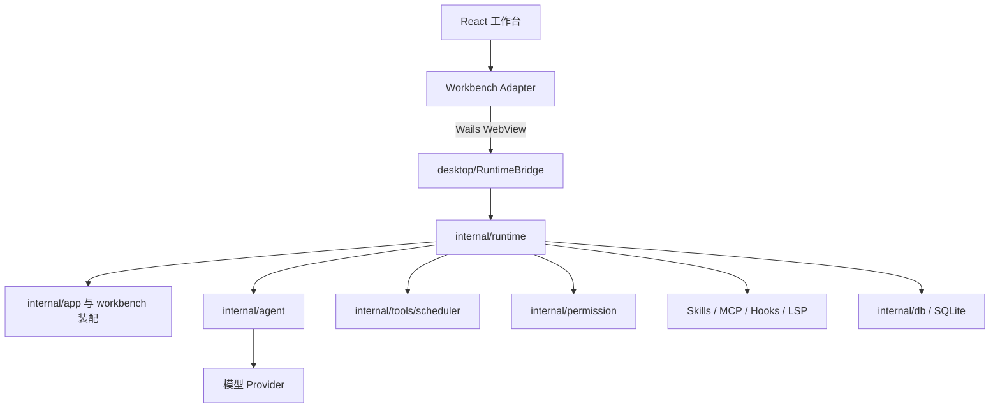

# 系统架构

## 总体结构



## 进程与入口

项目有两个 Go 入口：

- `desktop/main.go` 创建 Wails 应用、注册 `RuntimeBridge`、嵌入 `desktop/frontend/dist` 并打开主窗口。
- 根 `main.go` 调用 `internal/cmd`，提供现有命令行和服务能力，可选开启 pprof。

桌面构建先构建共享的 `client/`，再把产物同步到 Wails 资源目录。桌面运行时与前端处于同一应用进程，但仍通过明确 DTO 和桥接方法通信。

## 分层职责

### React 客户端

负责工作台壳、侧栏、会话时间线、输入区、工具/权限卡片、设置、插件和诊断视图。它把 runtime DTO 转换为视图模型，通过事件和快照刷新界面。

### 桌面适配层

`desktop/runtime_bridge.go` 暴露 RuntimeService 能力。桥接层主要做类型转发、生命周期连接和 Wails 事件适配，不应复制权限、会话或调度逻辑。

### RuntimeService

`internal/runtime` 是面向客户端的应用服务边界，聚合：

- 项目、会话、消息、Turn、Run 与输出投影；
- 工具调用、调度、权限、沙箱、Hooks 和审计；
- 模型与 provider 配置；
- Skills、MCP、上下文来源、项目记忆和文件读取状态；
- 子任务、worktree、终端、恢复和事件流。

Runtime 只通过 Wails bindings 和 Wails events 暴露给 React 客户端，避免维护重复传输语义。

### Agent 与工具层

`internal/agent` 负责模型调用循环、Prompt 装配、历史卫生、压缩、工具发现、工具结果保护和恢复。`internal/tools/scheduler` 负责工具调用状态与调度；具体内置工具位于 `internal/agent/tools`。

### 持久化与基础能力

`internal/db` 保存核心实体和运行时记录。配置、Skills、Hooks、MCP、LSP、项目记忆等由各自包实现，RuntimeService 对其进行装配和投影。

## 依赖方向

推荐依赖方向为：

```text
UI -> Transport DTO -> Runtime application service -> Domain capability -> Storage/provider
```

不得让领域逻辑反向依赖 React、Wails 窗口或浏览器 API。前端也不得绕过 RuntimeService 直接读写 SQLite 或 Go 内部存储。
