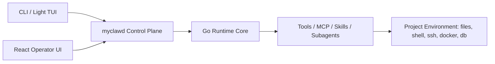

# Runtime Target Architecture

## Objective

Build `myclaw` into a Claude Code-aligned agent runtime that can actually control a real software project, while avoiding the cost trap of a Go-first TUI product rewrite.

The target architecture is:

1. `Go Runtime Core`
2. `myclawd Control Plane`
3. `React Operator UI`

## Layer 1: Go Runtime Core

The Go runtime remains the system of record for agent execution semantics.

It owns:

- QueryEngine turn loop
- tool registry and tool lifecycle
- permission policy and approval flow
- session state and recovery
- subagent spawn/wait/resume/stop
- MCP discovery and invocation
- skills discovery and injection
- shell execution
- future ssh / docker / database execution tools

Primary code areas today:

- `internal/queryengine`
- `internal/runtime`
- `internal/tools`
- `internal/permissions`
- `internal/approval`
- `internal/session`
- `internal/gateway`

## Layer 2: myclawd Control Plane

`myclawd` becomes the stable control-plane surface that serves both terminal clients and the future React frontend.

It should expose:

- session lifecycle APIs
- conversation message streaming
- tool progress streaming
- approval request and continue/reject APIs
- subagent/task APIs
- runtime status APIs
- MCP and skills inventory APIs
- future execution APIs for ssh / docker / db

The control plane is the contract boundary between runtime and product surfaces.

This means:

- CLI/TUI should not talk to runtime internals differently than the web UI does
- the React UI should not bypass `myclawd`
- protocol stability matters more than any single frontend implementation

## Layer 3: React Operator UI

The complex product interaction surface should move out of the Go TUI and into a dedicated React frontend.

This layer should own:

- rich conversation interface
- task and subagent panels
- approval center
- tool execution detail views
- diff / file previews
- MCP / skills / runtime inventory views
- future docker / db / ssh operation surfaces

The React UI is not the source of truth for runtime behavior. It is the operator console on top of the control plane.

## Role Of The Go TUI

The Go TUI remains useful, but only as a lightweight operator shell.

It should keep:

- simple prompt input
- basic message display
- basic tool progress
- approval handling
- runtime debugging access
- minimal slash-command control

It should not be treated as the primary path for product-level parity with Claude Code.

## Architecture Flow

## Design Implications

- runtime correctness comes first
- transport and event protocol come before frontend polish
- tool abstractions for external control are first-class runtime work
- UI work should consume control-plane contracts instead of inventing parallel logic

## Success Criteria

This architecture is successful when:

- the same session and tool lifecycle can be driven from terminal or web UI
- project control tasks do not depend on TUI-specific behavior
- React UI can be added without rewriting runtime semantics
- new execution surfaces like ssh / docker / db land as runtime capabilities first

