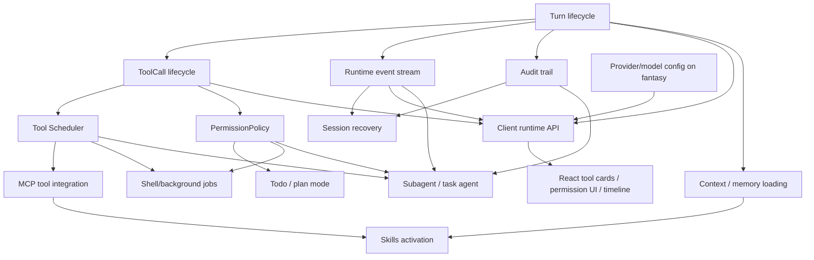

# Claude Code Alignment Module Priority

本文基于当前 active docs、历史 gap analysis、Claude Code reference analysis，以及当前代码目录状态，定义 Agent Builder 下一阶段的模块优先级和实施顺序。

本阶段只做规划，不实现功能代码。后续实现必须继续遵守：

- 不恢复 TUI/CLI 作为主产品路径。
- React 是 presentation/client surface，不是业务状态源。
- Go runtime 是 session、turn、tool、permission、event、audit、recovery 的 source of truth。
- `charm.land/fantasy` 已经提供 provider/model/tool stream abstraction，不重复实现 provider adapter、model-facing message protocol 或 LLM streaming engine。

## 1. 当前能力基线

### 1.1 Crush runtime 已有能力

当前 Crush/Agent Builder 已经具备适合作为客户端优先 runtime 的底座：

- Go agent loop：`internal/agent/agent.go`、`internal/agent/coordinator.go`、`internal/backend/agent.go`。
- session/message 持久化：`internal/session`、`internal/message`、`internal/db`。
- built-in tools：`internal/agent/tools`，包括 shell、文件读写、grep/glob、web、LSP、todos、MCP resource/tool 等。
- MCP 基础：`internal/agent/tools/mcp`、`internal/runtime/runtime_mcp*.go`、`internal/proto/mcp.go`。
- skills 基础：`internal/skills`、`internal/runtime/runtime_skills.go`、`client/src/features/skills/RuntimeSkillPanel.tsx`。
- hooks 基础：`internal/hooks`、`internal/agent/hooked_tool.go`。
- permission approval 基础：`internal/permission`、`internal/backend/permission.go`。
- runtime API 基础：`internal/runtime`、`internal/runtimeapi`、`desktop/runtime_bridge.go`。
- runtime audit 基础：`internal/runtime/runtime_audit*.go`、`internal/db/migrations/20260518000000_add_runtime_audit_events.sql`。
- React desktop client 基础：`client/src/app/AssistantClient.tsx`、`client/src/features/chat`、`client/src/runtime`。

当前已有 `internal/runtime/runtime_turns.go`、`internal/runtime/runtime_tool_calls.go`、`internal/tools/scheduler` 和 `internal/permission/policy.go`，说明项目已经开始抽出 runtime primitives。但这些基础仍以过渡实现为主，例如 active turn 仍主要来自内存 request state，ToolCall 仍可能从 message part 反推，scheduler 还没有完整包住实际 tool execution。

### 1.2 fantasy 已提供的 provider/model abstraction

`charm.land/fantasy` 已承担这些底层职责：

- provider/model 统一抽象。
- model stream loop。
- model-facing message、tool call、tool result representation。
- provider-specific options、usage、metadata、error shape。
- tool schema/function-call 基础。

Agent Builder 后续只在其上方实现 runtime orchestration：

- turn lifecycle。
- tool lifecycle。
- permission policy。
- event/audit/recovery。
- capability inventory。
- provider/model configuration ownership、redaction、health check、UI display。

### 1.3 当前 Agent Builder 已完成的客户端/runtime 能力

当前客户端化方向已经确认：

- React 通过 `client/src/runtime/types.ts` 的 `AgentRuntime` facade 消费 runtime。
- Wails bridge 仍存在，但应只是 adapter。
- HTTP + SSE local runtime API 已经作为长期边界方向确认。
- 客户端启动会拉取 status、sessions、messages、permissions、skills、MCP、capabilities、events。
- permissions、audit、skills、MCP、capabilities 已有可见 UI 面板或基础入口。
- runtime event schema 已有基础事件名，但 cursor/recovery 语义仍需补齐。

### 1.4 已删除或不再作为主路径的 TUI/CLI 能力

当前主路径不再是 Bubble Tea/TUI 或 CLI command loop：

- 不恢复 terminal prompt、keybinding、slash command UI 作为产品主路径。
- 不把 `tea.Msg` 或 stdout/stderr 文本协议作为 runtime/client contract。
- CLI/TUI 如果存在，只能作为 legacy 或 future adapter，不是业务边界。
- Wails 也不是业务边界，只是 desktop shell/adapter。

## 2. 与 Claude Code 的核心差距

### QueryEngine / turn orchestration

Claude Code 的 `QueryEngine` 是可被 TUI、SDK、remote、headless 复用的 conversation runtime。Agent Builder 当前仍有不少逻辑沿用 `SessionAgent.Run` 和 runtime bridge request state。缺口是 durable `Turn` 一等对象、turn status state machine、cancel/resume/recovery API、usage delta、latest message/tool/permission 聚合。

### Tool lifecycle

Claude Code 把 tool 视为 execution protocol。Agent Builder 当前已有 scheduler 雏形，但仍未完整负责 validation、policy、permission gate、execution、output normalization、diff/artifact、audit、cancellation、progress event。

### PermissionPolicy

当前 permission service 和 `policy.go` 是好基础，但距离 Claude Code 的 mode/rule/risk/headless/plan/shell safety 仍有差距。缺少持久化 policy decision、rule scope、decision audit、secret redaction enforcement、mode-aware UI/API contract。

### Plan/todo

Crush 已有 todos tool，但 plan mode 还不是 runtime policy 状态。Claude Code 的 plan mode 会改变可执行动作边界。Agent Builder 需要将 plan/todo 做成 runtime-owned mode + turn/task visible state，而不是 React 本地 UI 状态。

### Subagent/task

Crush 已有 `agent` tool 和子 session 基础，但 subagent 尚未成为可观察、可取消、可恢复、可审计的 `AgentTask`。缺少 role/model/tool scope/cwd/worktree/background/progress/artifact。

### Memory/context

当前有 prompt template、context paths、skills XML、MCP instructions，但缺少 Claude Code 风格分层 instruction/memory：managed/user/project/local、AGENTS.md/CLAUDE.md/rules、include、frontmatter path scope、read-file state、compaction lifecycle。

### Event/audit/recovery

已有 runtime events 和 audit store，但仍需要 event sequence/cursor、snapshot-required reconnect、runtime restart scan、interrupted turn marking、pending permission recovery、tool/audit detail API。

### Client interaction model

React 已是 conversation-first 客户端，但 tool cards、permission review、session timeline、audit/debug view 仍需要改为完全消费 runtime objects。客户端不应从 message/event 自己拼业务事实。

## 3. 模块优先级总览

| Priority | 模块 | 结论 |
| --- | --- | --- |
| P0 | Turn lifecycle | 所有后续能力的聚合根，必须先稳定。 |
| P0 | ToolCall lifecycle | tool、permission、audit、UI timeline 的共同锚点，必须与 Turn 一起做。 |
| P0 | Runtime event stream | 客户端恢复和多 adapter 共享依赖 stable event schema/cursor。 |
| P0 | Audit trail | permission/tool/turn 不能只靠 logs 或 message parts 反推。 |
| P0 | Client runtime API | Wails/HTTP/React 必须共享同一 runtime contract。 |
| P1 | Tool Scheduler | 客户端可见体验和权限治理的核心，依赖 Turn/ToolCall 基础。 |
| P1 | PermissionPolicy | plan/default/auto-read/headless 等模式影响核心安全体验。 |
| P1 | Session recovery | 桌面客户端刷新/重启后必须恢复 active turn、tool、permission。 |
| P1 | React tool cards / permission UI / session timeline | 用户直接感知的 runtime state 展示层，不能早于 API 稳定。 |
| P1 | Provider/model configuration on top of fantasy | 已有 fantasy provider，重点是 runtime-owned config、redaction、verify、capability display。 |
| P2 | Context / memory loading | 提升 Claude Code 对齐度，但应在 turn/context injection 边界清晰后做。 |
| P2 | Todo / plan mode | 依赖 PermissionPolicy 和 Turn lifecycle，可先做 plan policy，再做丰富 todo UI。 |
| P2 | Subagent / task agent | 依赖 Turn/ToolCall/Task/Event/Audit，先做 persisted AgentTask，再做 teams。 |
| P2 | Skills activation | 已有 discovery，后续补 metadata、allowed tools、activation/audit。 |
| P2 | MCP tool/resource/prompt integration | 已有基础，后续统一走 capability、scheduler、policy、audit。 |
| P2 | Shell/background job management | 依赖 scheduler、policy、task/recovery；安全边界必须先有。 |
| P3 | Plugin/capability package | 等 primitives 稳定后再做 package/marketplace/governance。 |
| P3 | Worktree/remote/sandbox expansion | 重要但风险高，必须等 scheduler/policy/task 稳定。 |
| P3 | Advanced telemetry/evals | 建议后续加入，但不阻塞 runtime spine。 |

## 4. 模块依赖关系



必须先做：

- Turn lifecycle。
- ToolCall lifecycle。
- Runtime event stream。
- Audit trail。
- Client runtime API contract。

可以并行：

- Provider/model configuration 与 Turn/ToolCall 基础模型可并行，但不得重写 fantasy。
- Audit trail 与 event schema 可并行设计，但实现时要统一 event/audit id 和 turn/tool references。
- React tool cards 可以在 API schema 冻结后并行实现。

必须等 runtime API 稳定后再做：

- React session timeline 深化。
- Plan mode UI。
- Subagent task detail UI。
- MCP resource/prompt rich UI。
- Shell/background job management UI。
- Plugin/capability package UI。

## 5. 模块实现边界

### 5.1 Turn lifecycle

目标：把一次用户输入到 agent 完成响应的过程建成 runtime 一等对象。

不做什么：不实现 full Run/operation workflow；不改变 fantasy provider loop；不恢复 TUI turn UI。

Go 涉及文件/包：`internal/runtime/runtime_turns.go`、`internal/runtime/runtime_service.go`、`internal/runtime/runtime_contract_types.go`、`internal/agent/agent.go`、`internal/backend/agent.go`、`internal/db` migrations。

React 涉及文件/包：`client/src/runtime/types.ts`、`client/src/runtime/api.ts`、`client/src/features/chat/useAssistantClient.tsx`、`client/src/features/chat/ChatWorkspace.tsx`。

runtime API / event schema：`POST /v1/sessions/{session_id}/turns`、`GET /v1/turns/{turn_id}`、`GET /v1/turns?status=active`、`POST /v1/turns/{turn_id}/cancel`；events: `turn.started`、`turn.progress`、`turn.waiting_permission`、`turn.completed`、`turn.failed`、`turn.cancelled`、`turn.interrupted`。

数据模型变化：`runtime_turns` 持久化 id、session_id、status、provider、model、message refs、usage、timestamps、error。

测试要求：Go unit tests for state transition；runtime API smoke tests；cancel behavior tests；restart/recovery marking tests。

验收标准：active/running/waiting/completed/failed/cancelled/interrupted turn 可查询；cancel 以 turn 为单位；客户端刷新后能恢复 active turn 摘要。

风险点：一次性改动 agent loop blast radius 大；初期可保留 `requestID == turnID` 过渡，但必须把事实状态落到 runtime store。

### 5.2 ToolCall lifecycle

目标：让每次 tool invocation 独立于 message part 可查询、可审计、可关联 permission。

不做什么：不在第一步重写所有 tool implementation；不替代 fantasy 的 model-facing tool protocol。

Go 涉及文件/包：`internal/runtime/runtime_tool_calls.go`、`internal/tools/scheduler`、`internal/agent/tools`、`internal/runtime/runtime_mapping.go`、`internal/db` migrations。

React 涉及文件/包：`client/src/runtime/types.ts`、`client/src/features/chat/MessageItem.tsx`、未来 tool card components。

runtime API / event schema：`GET /v1/turns/{turn_id}/tool-calls`、`GET /v1/tool-calls/{tool_call_id}`、`POST /v1/tool-calls/{tool_call_id}/cancel`；events: `tool.call.started`、`tool.call.output`、`tool.call.completed`、`tool.call.failed`、`tool.call.cancelled`。

数据模型变化：`runtime_tool_calls` 持久化 id、turn_id、session_id、message_id、source、status、input/output summary、stdout/stderr refs、diff/artifact refs、timestamps、error。

测试要求：scheduler store tests；message-part backfill tests；tool result failure tests；API contract tests。

验收标准：一个 turn 下所有 tool call 可查；tool status 不再只能从 message parts 反推；permission/audit 能稳定引用 tool_call_id。

风险点：从 message part 反推和 scheduler 写入可能短期并存，需要明确去重与 idempotent upsert。

### 5.3 Tool Scheduler

目标：统一 tool execution lifecycle、permission gate、output normalization、cancellation、audit/event emission。

不做什么：不先做复杂 DAG、retry policy、enterprise RBAC、完整 sandbox。

Go 涉及文件/包：`internal/tools/scheduler`、`internal/agent/hooked_tool.go`、`internal/agent/tools`、`internal/permission`、`internal/runtime/runtime_tool_calls.go`。

React 涉及文件/包：tool cards、audit drawer、permission modal。

runtime API / event schema：ToolCall APIs；`tool.call.*`、`permission.*`、`audit.recorded`。

数据模型变化：扩展 `runtime_tool_calls`，可能增加 output artifact/diff reference tables。

测试要求：scheduler state machine tests；permission ask/deny/allow integration tests；cancel tests；MCP/builtin source tests。

验收标准：新 tool calls 通过 scheduler 创建 lifecycle record；permission request 与 tool_call_id 绑定；tool output 有 model-visible content 和 client/audit visible summary。

风险点：直接包住所有 tool execution 可能影响广；建议先 wrapper 关键工具和 MCP，再迁移全部工具。

### 5.4 PermissionPolicy

目标：从 approval service 升级为 runtime policy engine，支持 mode/risk/rule/decision/audit。

不做什么：不做企业 RBAC、外部审批系统、复杂 classifier。

Go 涉及文件/包：`internal/permission/permission.go`、`internal/permission/policy.go`、`internal/runtime/runtime_permissions.go`、`internal/proto/permission.go`。

React 涉及文件/包：`client/src/features/permissions/PermissionReviewModal.tsx`、settings/policy UI。

runtime API / event schema：`GET /v1/permissions`、`GET /v1/permissions/{id}`、`POST /v1/permissions/{id}/decision`、`GET/PUT /v1/policy`；events: `permission.requested`、`permission.decided`、`audit.recorded`。

数据模型变化：permission request 增加 turn_id、tool_call_id、risk、status、policy_reason、target summary、expires_at、decided_at、decision。

测试要求：mode tests for ask/auto_read/plan/deny_all/headless；secret redaction tests；decision audit tests。

验收标准：UI 只提交 decision；risk/policy reason 由 runtime 计算；pending permission 可恢复；plan mode 阻止写入/执行类工具。

风险点：shell risk classification 容易不完整；第一阶段应 fail conservative，并把 classifier 局限声明清楚。

### 5.5 Runtime event stream

目标：稳定 machine-readable event stream，支持 sequence/cursor/reconnect/snapshot-required。

不做什么：不引入 WebSocket/JSON-RPC；不让事件成为唯一事实来源。

Go 涉及文件/包：`internal/runtime/runtime_events.go`、`internal/runtime/runtime_sse.go`、`internal/runtimeapi/contract.go`。

React 涉及文件/包：`client/src/runtime/events.ts`、`client/src/runtime/useRuntimeEventSubscription.ts`。

runtime API / event schema：`GET /v1/events?after={sequence}`；所有 events 包含 id、sequence、created_at、type、session_id、turn_id、message_id、tool_call_id、payload。

数据模型变化：event sequence cursor store/ring buffer；必要时 append-only event table。

测试要求：SSE reconnect tests；after cursor tests；snapshot-required tests；redaction tests。

验收标准：断线重连不丢关键 turn/tool/permission 状态；过旧 cursor 触发 snapshot refresh。

风险点：event payload 过大或含 secret；原则是事件带摘要，完整事实通过 API 拉取。

### 5.6 Audit trail

目标：为 turn/tool/permission/model/capability 提供 append-only structured audit。

不做什么：不做完整 telemetry pipeline；不上传外部服务；不把 console log 当产品 contract。

Go 涉及文件/包：`internal/runtime/runtime_audit*.go`、`internal/db/migrations/20260518000000_add_runtime_audit_events.sql`、`internal/db`。

React 涉及文件/包：`client/src/features/audit/RuntimeAuditDrawer.tsx`。

runtime API / event schema：`GET /v1/audit/turns/{turn_id}`；events: `audit.recorded`。

数据模型变化：强化 `runtime_audit_events` payload schema，保证 turn_id/tool_call_id/permission_id 可索引。

测试要求：audit write/read tests；redaction tests；permission decision audit tests。

验收标准：一个 turn 的 model、usage、tool calls、permission decisions、errors、capabilities 可从 audit API 复盘。

风险点：audit payload 可能泄露 prompt/tool input secrets；需要统一 redaction。

### 5.7 Session recovery

目标：客户端刷新、SSE 断线、runtime 重启后恢复 active turn、pending permission、tool/audit 状态。

不做什么：不保证所有 model stream 可继续；不可恢复时应标记 interrupted。

Go 涉及文件/包：`internal/runtime/runtime_lifecycle.go`、`internal/runtime/runtime_status.go`、`internal/runtime/runtime_turns.go`、`internal/runtime/runtime_permissions.go`。

React 涉及文件/包：`client/src/features/chat/useAssistantClient.tsx`、`client/src/runtime/useRuntimeEventSubscription.ts`。

runtime API / event schema：`GET /v1/recovery/status`、`GET /v1/turns?status=active`、`GET /v1/permissions`、`GET /v1/events?after=`。

数据模型变化：durable turn/tool/permission status；runtime_started_at 和 last_event_sequence。

测试要求：restart scan tests；pending permission recovery tests；client hook unit tests where practical。

验收标准：重启后 running/waiting/cancelling turn 被恢复或标记 interrupted；pending permission 不会在 UI 永久丢失。

风险点：当前部分状态在内存 map 中，必须先做 Turn/ToolCall persistence。

### 5.8 Context / memory loading

目标：分层加载 managed/user/project/local instructions，并为后续 memory/compact 铺路。

不做什么：不先实现完整 memory sync、team memory、复杂 compact。

Go 涉及文件/包：`internal/agent/prompts.go`、`internal/agent/prompt`、`internal/skills`、`internal/config`。

React 涉及文件/包：capability/context diagnostics panel，后续可在 settings 中展示 loaded context summary。

runtime API / event schema：context inventory/readiness 可进入 `GET /v1/capabilities` 或 future `GET /v1/context`; events: `context.loaded`、`context.failed` 可后续添加。

数据模型变化：context source summary、read-file state、compact boundary 可后续持久化。

测试要求：AGENTS.md/CLAUDE.md precedence tests；redaction/path traversal tests；prompt assembly tests。

验收标准：runtime 能解释本 turn 使用了哪些 instruction/context sources；React 不直接读取并注入 context。

风险点：instruction precedence 容易造成行为漂移；先文档化顺序再实现。

### 5.9 Todo / plan mode

目标：把 plan mode 作为 runtime permission mode，把 todos/plan 作为 turn/task 可见状态。

不做什么：不做复杂 project management；不让 React 本地维护权威 todo 状态。

Go 涉及文件/包：`internal/agent/tools/todos.go`、`internal/permission/policy.go`、`internal/runtime`、`internal/session`。

React 涉及文件/包：chat timeline plan/todo rendering，policy mode selector。

runtime API / event schema：`GET/PUT /v1/policy`、future `GET /v1/turns/{id}/todos`; events: `todo.updated`、`policy.updated`。

数据模型变化：turn/task-scoped todo state 或 session todo linkage。

测试要求：plan blocks write/execute tests；todo persistence tests。

验收标准：plan mode 下 mutating tool 不执行；todo/plan 状态可刷新恢复。

风险点：plan mode 如果只是 UI 标签会破坏安全边界；必须由 runtime enforcement。

### 5.10 Subagent / task agent

目标：把 `agent` tool 子调用升级为 persisted AgentTask。

不做什么：不做 agent teams、swarm、remote agent、marketplace agents。

Go 涉及文件/包：`internal/agent/agent_tool.go`、`internal/agent/agentic_fetch_tool.go`、future `internal/runtime/runtime_tasks.go`、`internal/session`。

React 涉及文件/包：future task panel/session timeline child task card。

runtime API / event schema：`GET /v1/tasks/{task_id}`、`GET /v1/turns/{turn_id}/tasks`、`POST /v1/tasks/{task_id}/cancel`; events: `task.started`、`task.progress`、`task.completed`、`task.failed`、`task.cancelled`。

数据模型变化：`runtime_agent_tasks` with parent_turn_id、child_session_id、role、model、allowed_tools、cwd/worktree、status、progress、result_summary、artifact refs。

测试要求：child session linkage tests；cancel tests；permission scope tests；recursion/concurrency limit tests。

验收标准：subagent 可见、可取消、可审计，结果能回写 parent turn。

风险点：无界递归和并发；必须先有 policy/scheduler/event/audit。

### 5.11 Skills activation

目标：让 skills 从 discovery/display 走向 runtime activation metadata 和 audit。

不做什么：不做公开 marketplace；不让前端注入 skill prompt。

Go 涉及文件/包：`internal/skills`、`internal/runtime/runtime_skills.go`、`internal/config`。

React 涉及文件/包：`client/src/features/skills/RuntimeSkillPanel.tsx`。

runtime API / event schema：`GET /v1/skills`、`POST /v1/skills/refresh`、enable/disable APIs；events: `skill.discovery.*`、`skill.enabled`、`skill.disabled`。

数据模型变化：skill source、enabled/disabled、diagnostics、activation reason、allowed tools metadata 后续持久化。

测试要求：discovery diagnostics tests；disable persists tests；prompt excludes disabled skills tests。

验收标准：runtime 能说明某 turn 可用/激活了哪些 skills；禁用状态来自 config/runtime。

风险点：skill metadata 影响 tool permissions 时必须经过 PermissionPolicy。

### 5.12 MCP tool/resource/prompt integration

目标：MCP servers/tools/resources/prompts 统一进入 capability、scheduler、policy、audit。

不做什么：不做 OAuth、marketplace、远程 MCP 管理。

Go 涉及文件/包：`internal/agent/tools/mcp`、`internal/runtime/runtime_mcp*.go`、`internal/config`。

React 涉及文件/包：`client/src/features/mcp/RuntimeMcpPanel.tsx`、capabilities panel、tool cards。

runtime API / event schema：`GET /v1/mcp/servers`、`GET /v1/mcp/servers/{name}/tools/resources/prompts`、`GET /v1/capabilities`; events: `mcp.server.*`、`mcp.tools.updated`、`tool.call.*`。

数据模型变化：capability source metadata、MCP config redaction、tool_call source=mcp。

测试要求：redaction tests；server state tests；MCP tool call lifecycle tests。

验收标准：MCP tool call 与 builtin tool 走同一 ToolCall/Permission/Audit 轨道。

风险点：MCP config/env/header secrets 必须默认 redact。

### 5.13 Shell/background job management

目标：把 shell 和 background job 变成 scheduler/policy/task 管理的可见工作。

不做什么：不先实现完整 OS sandbox；不承诺系统 Bash/PowerShell/cmd 可用。

Go 涉及文件/包：`internal/agent/tools/bash.go`、`internal/agent/tools/job_output.go`、`internal/agent/tools/job_kill.go`、`internal/shell`、`internal/permission/policy.go`。

React 涉及文件/包：tool card stdout/stderr view、background task panel。

runtime API / event schema：ToolCall APIs、Task APIs；events: `tool.call.output`、`task.progress`。

数据模型变化：stdout/stderr refs、process/job id mapping、risk classification metadata。

测试要求：dangerous command classification tests；background job lifecycle tests；cancel/kill tests。

验收标准：shell execution has visible status, cancellable job, policy decision, audit record, redacted output summary。

风险点：shell safety 是高风险区域；必须 conservative，并且先局限于 runtime-managed portable shell semantics。

### 5.14 Client runtime API

目标：冻结 transport-neutral runtime contract，Wails/HTTP 共用 Go RuntimeService。

不做什么：不让 Wails method shape 成为长期业务协议；不让 React 直连 Go internals。

Go 涉及文件/包：`internal/runtime`、`internal/runtimeapi`、`desktop/runtime_bridge.go`、future `internal/adapters`。

React 涉及文件/包：`client/src/runtime/types.ts`、`client/src/runtime/httpRuntime.ts`、`client/src/runtime/wailsRuntime.ts`。

runtime API / event schema：Phase 2 minimal APIs plus turn/tool/audit/recovery additions。

数据模型变化：无单独模型，但所有 runtime DTO 需稳定且与 Go contract test 对齐。

测试要求：`internal/runtimeapi/contract_test.go`、HTTP smoke tests、TS type compatibility/build。

验收标准：同一 UI 能通过 AgentRuntime facade 消费 Wails 或 HTTP adapter；业务状态只来自 runtime。

风险点：如果 DTO 漂移，React 会重新拼状态；需要 contract tests。

### 5.15 React tool cards / permission UI / session timeline

目标：把客户端呈现升级为 runtime objects 的 thin rendering。

不做什么：不在 React 中推断 permission risk、tool status、turn final state。

Go 涉及文件/包：仅依赖 runtime API，不直接改 Go 业务逻辑。

React 涉及文件/包：`client/src/features/chat/MessageItem.tsx`、`ChatWorkspace.tsx`、`PermissionReviewModal.tsx`、`RuntimeAuditDrawer.tsx`、future tool card/timeline components。

runtime API / event schema：消费 Turn、ToolCall、Permission、Audit、Event APIs。

数据模型变化：无，除非需要扩展 DTO。

测试要求：frontend build；component tests where available；Playwright/manual smoke for active turn, permission, tool detail。

验收标准：刷新后 UI 与 runtime API 状态一致；permission modal 可恢复；tool card 能打开 detail/audit。

风险点：过早做 UI 会倒逼错误 contract；必须等 API shape 冻结。

### 5.16 Provider/model configuration on top of fantasy

目标：在 fantasy 上方提供 runtime-owned config、verify、redaction、capability display。

不做什么：不重新实现 OpenAI/Anthropic/Gemini provider clients；不重写 streaming abstraction。

Go 涉及文件/包：`internal/runtime/runtime_model*.go`、`internal/config`、fantasy integration points。

React 涉及文件/包：`client/src/features/settings/ModelSettingsDrawer.tsx`、status/usage readout。

runtime API / event schema：`GET/PUT /v1/config/model`、`POST /v1/config/model/verify`、`GET /v1/runtime/status`; events: `runtime.started`、`runtime.failed`、`usage.updated`。

数据模型变化：model config redaction, provider health metadata, optional model capability cache。

测试要求：config redaction tests；verify failure shape tests；frontend save/load build。

验收标准：API key/proxy secret 不出现在 responses/events/logs；runtime status 能展示 provider/model；turn audit 记录 provider/model/usage。

风险点：provider policy 层不要越界成第二套 provider abstraction。

## 6. 推荐实施顺序

### Phase 0: 文档确认与 contract freeze

交付：本文档审阅通过；确认 active docs 引用；确认 `docs/implementation-roadmap.md` 已归档为 `docs/archive/implementation-roadmap.md` 历史参考。

验收标准：后续 session 可直接按第一个模块边界开工。

可独立 commit/push：是，docs-only。

### Phase 1: Turn lifecycle + ToolCall lifecycle runtime 基础模型

交付：durable Turn 和 ToolCall state/API/event/audit 最小闭环。

验收标准：

- `GET /v1/turns/{turn_id}` 查询 durable turn。
- `GET /v1/turns/{turn_id}/tool-calls` 查询 tool calls。
- cancel、completed、failed、interrupted 状态有明确事件和 audit。
- 现有 React 不成为业务状态源。

可独立 commit/push：是，建议一个 commit 聚焦模型/API/store/tests。

为什么第一个模块应该先做：后续 Tool Scheduler、PermissionPolicy、Recovery、React tool cards、Subagent、Plan mode 都需要稳定的 `turn_id` 和 `tool_call_id` 作为锚点。如果先做 UI、policy 或 subagent，会继续从 message/event 反推事实状态，后续迁移成本更高。

### Phase 2: Runtime event cursor + Audit trail hardening

交付：event sequence/cursor、snapshot-required、audit turn detail。

验收标准：SSE 断线可按 cursor 续订；过旧 cursor 触发全量 refresh；turn audit 可复盘。

可独立 commit/push：是。

### Phase 3: Tool Scheduler integration

交付：scheduler 包住关键 tool execution，permission gate 和 output normalization 接入。

验收标准：至少 builtin 文件工具、shell/MCP 关键路径生成 ToolCall lifecycle、permission/audit/event。

可独立 commit/push：是，可按工具来源拆分多个 commit。

### Phase 4: PermissionPolicy mode/risk/audit

交付：policy mode、risk tags、allow/ask/deny、headless/plan baseline、decision audit。

验收标准：plan/auto_read/ask/deny_all 行为由 runtime enforcement；UI 只提交 decision。

可独立 commit/push：是。

### Phase 5: Recovery and client runtime API cleanup

交付：active turn/pending permission recovery、runtime restart scan、Wails/HTTP shared service contract tests。

验收标准：客户端刷新/重启后 active/waiting/interrupted 状态恢复；AgentRuntime facade 不依赖 Wails-specific business shape。

可独立 commit/push：是。

### Phase 6: React runtime state surfaces

交付：tool cards、permission lifecycle UI、session timeline、audit detail 消费稳定 API。

验收标准：UI 刷新后与 runtime API 一致；无 React-only tool/permission事实状态。

可独立 commit/push：是。

### Phase 7: Context/memory, plan/todo, subagent/task, skills/MCP depth

交付顺序建议：

1. Context / memory loading baseline。
2. Plan/todo runtime mode/state。
3. Subagent / AgentTask persistence。
4. Skills activation metadata。
5. MCP resource/prompt rich integration。
6. Shell/background job management。

验收标准：每项都有独立 API、event、audit、recovery path。

可独立 commit/push：是，必须拆阶段。

### Phase 8: P3 extensions

交付：plugin/capability package、worktree/remote/sandbox expansion、telemetry/evals。

验收标准：不破坏 runtime spine；所有新能力可审计、可恢复、可禁用。

可独立 commit/push：是。

## 7. 第一个推荐实现模块

推荐第一个实现模块为：

```text
Turn lifecycle + ToolCall lifecycle 的 runtime 基础模型
```

范围：

- 明确并持久化 Turn 最小模型。
- 明确并持久化 ToolCall 最小模型。
- 保留 `requestID == turnID` 作为过渡兼容，但不再只依赖内存 map。
- 建立 turn/tool APIs 和 events 的最小 contract。
- 将 permission/audit/event 先统一绑定到 turn_id/tool_call_id。
- 保持现有 fantasy provider/model/tool stream 不变。
- 不实现 Tool Scheduler 全量接管。
- 不修改 React 为复杂新 UI，只补必要 DTO/状态消费。

验收标准：

- 一个用户消息创建 durable turn。
- turn 生命周期可查询、可取消、可完成/失败。
- tool calls 可按 turn 查询，且能与 message part 兼容过渡。
- audit 能按 turn 聚合基础 provider/model/usage/tool/permission 信息。
- 客户端刷新能查询到 active/completed turn 基础状态。
- 相关 Go tests 和 runtime API contract tests 通过。

风险控制：

- 小步迁移，不一次性重写 `SessionAgent.Run`。
- 先持久化和暴露状态，再迁移实际 tool execution。
- 对 message-part backfill 做 idempotent upsert，避免重复 tool call。
- API/event payload 只包含摘要，完整事实走查询 API。

## 8. 文档引用检查

本文依赖的 active docs：

- `docs/client-runtime-architecture-review.md`
- `docs/client-architecture-and-core-flow.md`
- `docs/desktop-runtime-boundary.md`
- `docs/phase-2-runtime-api-boundary.md`
- `docs/tool-scheduler-design.md`
- `docs/permission-policy-model.md`
- `docs/turn-task-run-model.md`
- `docs/client-state-recovery.md`
- `docs/architecture-decisions.md`

历史参考 docs：

- `docs/archive/implementation-roadmap.md`
- `docs/archive/crush-claude-code-gap-analysis.md`
- `docs/archive/reference-analysis/claude-code.md`
- `docs/archive/reference-analysis/comparison.md`

注意：当前工作树不存在 `docs/implementation-roadmap.md`，旧 roadmap 已归档在 `docs/archive/implementation-roadmap.md`，引用时应按归档路径处理。
