# Claude Code Alignment Next Roadmap

This roadmap supersedes the previous post-scheduler plan. It is based on the
current Agent Builder runtime on `main` and the latest parity audit:

- [`docs/claude-code-runtime-parity-audit.md`](./claude-code-runtime-parity-audit.md)
- [`docs/claude-code-next-implementation-plan.md`](./claude-code-next-implementation-plan.md)
- [`docs/claude-client-inspired-ui-plan.md`](./claude-client-inspired-ui-plan.md)

Related boundary references:

- [`docs/claude-code-alignment-module-priority.md`](./claude-code-alignment-module-priority.md)
- [`docs/client-runtime-architecture-review.md`](./client-runtime-architecture-review.md)
- [`docs/turn-task-run-model.md`](./turn-task-run-model.md)
- [`docs/tool-scheduler-design.md`](./tool-scheduler-design.md)
- [`docs/permission-policy-model.md`](./permission-policy-model.md)
- [`docs/client-state-recovery.md`](./client-state-recovery.md)
- [`docs/archive/phase-2-runtime-api-boundary.md`](./archive/phase-2-runtime-api-boundary.md)
- [`docs/client-architecture-and-core-flow.md`](./client-architecture-and-core-flow.md)
- [`docs/client-information-architecture.md`](./client-information-architecture.md)

## Fixed Principles

- Do not modify `charm.land/fantasy`. Fantasy remains the provider/model/tool
  protocol abstraction.
- Do not recreate provider clients, provider streaming, model-facing message
  formats, or tool-call protocol outside fantasy.
- Provider/model configuration belongs in Agent Builder as a policy/config layer
  above fantasy, not as a second provider abstraction.
- Go runtime is the source of truth for sessions, turns, tools, permissions,
  capabilities, events, audit, recovery, tasks, and context.
- React is presentation and local UI state only. It must not own business state.
- Wails and HTTP are adapters, not business boundaries.
- Do not restore TUI/CLI as the product main path.
- Compact is a runtime lifecycle, not a UI operation.
- Tool search and deadlock avoidance are scheduler/runtime responsibilities,
  not React responsibilities.
- Agent communication and coordinator behavior are runtime primitives, not UI
  event stitching.
- Model-assisted permission can only be advisory. The model must never approve
  its own high-risk action.
- Claude Code remains the runtime primitive reference. The React client should
  reference Claude's web/desktop chat client product experience, not Claude
  Code CLI/TUI.
- Claude-client-inspired UI means information architecture, layout,
  interaction flow, status presentation, and detail surfaces. It must not copy
  Claude branding, logos, trademarks, proprietary visual assets, or product
  surfaces.

## Current Baseline

The current baseline is ahead of the older "PermissionPolicy is next" state:

| Area | Status | Evidence |
| --- | --- | --- |
| Durable turn lifecycle | Completed foundation | `internal/runtime/runtime_turns.go`, `runtime_turn_store.go` |
| Durable ToolCall lifecycle | Completed foundation | `internal/tools/scheduler/*`, `internal/agent/scheduler_tool.go`, `runtime_tool_call_store.go` |
| Runtime event cursor | Completed foundation | `runtime_events.go`, `runtime_sse.go`, `client/src/runtime/types.ts` |
| Runtime audit | Completed foundation | `runtime_audit.go`, `runtime_audit_writer.go` |
| Session recovery | Completed foundation | `runtime_recovery.go`, `GET /v1/recovery/status` |
| PermissionPolicy baseline | Partial foundation | `internal/permission/policy.go`, `runtime_policy.go`, `runtime_permission_store.go` |
| Plan mode | Partial foundation | `PolicyModePlan` blocks non-read tool calls |
| Capability states/refresh | Partial foundation | `runtime_capabilities.go`, `capability.loading/loaded/failed` |
| Context source audit | Partial foundation | `internal/agent/prompt/prompt.go`, `runtime_context.go` |
| Skills/MCP panels and APIs | Partial foundation | `runtime_skills.go`, `runtime_mcp.go`, React feature panels |
| AgentTask persistence | Partial foundation | `runtime_agent_tasks.go`, `runtime_agent_task_store.go` |
| Provider/model config | Partial foundation | `runtime_model*.go`, `ModelSettingsDrawer.tsx` |
| React runtime surfaces | Partial foundation | `client/src/runtime/*`, `features/chat`, `features/audit`, `features/permissions` |

The next phase should govern long-running execution. It should not rebuild the
runtime spine, restore terminal UI, or create a second provider layer.

## Reordered Priority

This order intentionally does not follow the older roadmap inertia. It is ranked
by Claude Code runtime gap size, current Agent Builder foundations, dependency
weight, and blast radius.

| Phase | Module | Status | Why this position |
| --- | --- | --- | --- |
| P0 | Runtime spine: Turn, ToolCall, Event, Audit, Recovery | Completed | Already present; keep stable while adding lifecycle modules. |
| P0 | Deterministic PermissionPolicy baseline | Partial completed | Existing ask/auto_read/plan/deny_all modes are enough for compact and budget foundations. |
| P0 | Capability registry states and refresh | Partial completed | Existing inventory is enough to start budget/search metadata. |
| P1 Next | Claude-client-inspired React shell / information architecture | Next | Existing sessions, messages, turns, permissions, settings, skills, MCP, capabilities, audit, and recovery APIs are enough to align the core product shell without inventing runtime facts. |
| P1 Parallel | Compact / context budget lifecycle foundation | Runtime parallel | Largest missing runtime primitive; unlocks long sessions, prompt budget, auto compact, replay, and safer AgentTasks. |
| P1 Parallel | Tool search / discovery / deadlock avoidance | Parallel after compact boundary starts | Needed before plugin/tool surface growth; depends on capability metadata and budget accounting. |
| P1 Parallel | Scoped policy rules and shell safety | Parallel after compact boundary starts | Needed to enforce tools/MCP/skills/subagents/cwd/shell deterministically. |
| P1 Parallel | Observability / evals / replay harness | Parallel safety net | Should begin early as a local scenario harness for compact, policy, tool, MCP, and recovery regressions. |
| P2 | AgentTask scope, role definitions, parent/child messaging | Blocked by policy scopes and budget | AgentTask records exist, but safe subagents need scope enforcement and compact-aware transcripts. |
| P2 | Provider/model configuration on fantasy | Later P2 | Useful product policy layer, but not blocking long-session governance and must stay above fantasy. |
| P2 | MCP/skills scoped activation enforcement | Blocked by policy scopes and tool search | Metadata exists; enforcement needs scopes and discovery budget. |
| P2 | Worktree isolation | Blocked by task scopes and shell policy | CWD/worktree fields exist, but lifecycle and cleanup need policy and task boundaries. |
| P2 | React diagnostics/audit deepening | After runtime APIs | React should expose compact/task/policy diagnostics only after runtime contracts exist. |
| P3 Later | Capability package / plugin governance | Later | Requires registry, scopes, skills/MCP lifecycle, and trust state; marketplace-first is not needed. |
| P3 Later | Adaptive/model-assisted permission advisor | Later advisory only | Useful after deterministic scopes and evals; cannot approve actions. |
| P3 Later | Advanced context/memory lifecycle beyond baseline | Later | Session memory compact, memory taxonomy, and advanced reinjection follow baseline compact. |
| P3 Later | Sandbox / remote isolation | Later | Depends on shell policy, worktree API, and local isolation semantics. |
| Not needed | TUI/CLI UI, slash-command UI, provider rewrites, marketplace-first distribution | Not needed | Excluded product surfaces or duplicate abstractions. |

## First Recommended Implementation Module

Implement `Claude-client-inspired React shell / information architecture` next,
while starting `Compact / context budget lifecycle foundation` as the first
runtime parallel track.

The product reason is simple: Agent Builder already has enough runtime API to
support a conversation-first desktop client that feels like a modern Claude
web/desktop client rather than a terminal tool. The runtime reason is equally
strict: the UI can only render facts that already come from Go. Any UI surface
that needs missing compact, task messaging, policy-scope, worktree, replay, or
artifact APIs must be marked `Blocked by runtime API`.

Existing runtime API enough for the first UI shell:

- Sessions and active session messages.
- Turn creation, active turn status, cancellation, and recovery status.
- Permission list and decision submission.
- Runtime model settings and policy mode.
- Skills, MCP servers/resources/prompts/tools, and capability inventory.
- AgentTask summaries and cancellation.
- Audit by turn/session.
- SSE/event subscription with refresh-from-API behavior.

Blocked UI capabilities:

- Compact/context budget warnings and compact boundary history.
- Tool search/discovery selection details and scheduler deadlock diagnostics.
- Structured parent/child agent communication, task messages, and task
  artifacts.
- Durable artifact/detail drawer beyond current tool/task summaries.
- Scoped policy rule editor and policy precedence diagnostics.
- Worktree/sandbox/remote isolation controls and cleanup states.
- Replay/export views beyond current audit/event foundations.

First UI implementation boundary:

- First screen: conversation-first chat workspace, not settings or a marketing
  page.
- Navigation: left session/project/sidebar with search/new/resume and runtime
  feature entries for capabilities, skills, MCP, diagnostics, and settings.
- Center: chat timeline with message, turn, tool, permission, task, plan/todo,
  recovery, and status presentation from runtime DTOs.
- Composer: attachment/model/status affordances shaped like a desktop chat
  client; attachments and unavailable actions stay disabled or hidden until
  runtime APIs exist.
- Right drawer/panel: reusable detail surface for audit, tool/task details,
  artifacts, model/settings, MCP/skills/capability diagnostics, and permission
  review. Missing data is displayed as blocked, not fabricated.
- Settings: provider/model/policy configuration over fantasy; no provider
  rewrite and no fantasy changes.

Detailed UI planning is in
[`docs/claude-client-inspired-ui-plan.md`](./claude-client-inspired-ui-plan.md).

## First Runtime Module

Start with durable compact boundaries and budget accounting, then add micro
compact. Do not begin with full summarization or auto compact. The first pass
should prove the runtime can record a compact boundary, preserve message and
ToolCall invariants, emit compact events/audit, and expose budget diagnostics.

Why compact remains the first runtime module:

- The runtime already has turns, ToolCalls, audit, recovery, context source
  audit, read-file state, and AgentTask persistence as foundations.
- Claude Code's largest remaining runtime advantage is long-session context
  economy: micro compact, full compact, session-memory compact, auto triggers,
  and post-compact reinjection.
- Tool search needs budget data to decide when to keep tool schemas out of the
  prompt.
- AgentTask communication needs compact-aware parent/child transcripts before
  long-running subagents become reliable.
- Recovery and replay need compact boundaries to explain why transcript content
  was summarized, replaced, or reinjected.

Why not the other runtime candidates first:

- Tool search is high priority, but without budget accounting it cannot explain
  prompt pressure or prove selection savings.
- Agent coordinator/communication is important, but it increases context volume
  and recursion risk before compact and scoped policy are ready.
- Provider/model configuration is already a partial foundation on fantasy; more
  product policy there does not close the largest runtime parity gap.
- Worktree/sandbox/remote isolation needs shell policy and AgentTask scope first.
- Observability/evals should start in parallel, but it validates primitives; it
  does not replace the missing compact primitive.
- Capability package/plugin governance should wait until tool search and scoped
  policy can handle larger capability surfaces.
- Adaptive/model-assisted permission advisor must wait for deterministic scopes
  and policy eval fixtures because it is advisory only.

Why UI shell can move first:

- It is mostly presentation, information architecture, and interaction flow over
  existing runtime facts.
- It clarifies which runtime APIs are actually blocking the Claude-client-style
  product experience.
- It does not increase runtime autonomy or permission risk.
- It gives compact, policy, tool search, and AgentTask work explicit client
  surfaces to target.

## Candidate Comparison

| Candidate | Priority | Decision |
| --- | --- | --- |
| Claude-client-inspired React shell / information architecture | P1 Next | First product module. Align shell, sidebar, timeline, composer, drawers, settings, and recovery surfaces with Claude-client-style chat UX using existing runtime APIs only. |
| Compact / context budget lifecycle | P1 Parallel runtime | First runtime module. Add boundary, budget, events, audit, micro compact, then full/auto/reinjection. |
| Tool search / discovery / deadlock avoidance | P1 Parallel | Start after compact boundary and budget DTOs are drafted; keep in scheduler/runtime. |
| Agent coordinator / agent communication | P2 | Wait for compact, policy scopes, and task role enforcement. |
| Provider/model configuration on fantasy | P2 | Keep above fantasy; add health/capability diagnostics later. |
| Worktree/sandbox/remote isolation | P2/P3 | Worktree P2 after task scopes/shell policy; sandbox/remote P3. |
| Observability/evals/replay | P1 Parallel | Start as scenario harness while P1 modules land. |
| Capability package/plugin governance | P3 | Local governance later; marketplace-first not needed. |
| Adaptive/model-assisted permission advisor | P3 | Advisory only after deterministic scopes and evals. |

## Dependency Graph

```mermaid
graph TD
  SP["Completed: Runtime spine"] --> UI["Next P1: Claude-client-inspired React shell"]
  SP --> CB["Parallel P1 runtime: Compact boundary"]
  SP --> PS["Parallel P1: Scoped policy"]
  SP --> EV["Parallel P1: Scenario eval/replay"]
  SP --> TS["Parallel P1: Tool search"]
  BASEUI["Completed/Partial: current chat, settings, permissions, audit, skills, MCP panels"] --> UI

  CTX["Completed/Partial: Context sources + read-file state"] --> CB
  AUD["Completed: Audit + event cursor"] --> CB
  AUD --> UI
  CAP --> UI
  PS --> UI
  UI --> UIDETAIL["Parallel: detail drawers/panels"]
  TC["Completed: ToolCall store/output summaries"] --> MC["Next P1: Micro compact"]
  CB --> BUD["Next P1: Context + prompt/tool budget"]
  CB --> MC
  BUD --> TS
  BUD --> AC["Later P2: Auto compact trigger"]
  CB --> FC["Later P2: Full compact"]
  FC --> RI["Later P2: Post-compact reinjection"]
  FC --> SM["Later P3: Session memory compact"]

  CAP["Completed/Partial: Capability registry"] --> TS
  CAP --> PS
  PS --> SH["Parallel P1: Shell safety hardening"]
  PS --> MS["P2: MCP/skills scoped activation"]
  PS --> AT["P2: AgentTask scopes/roles"]
  TS --> DL["Parallel P1: Deadlock/recursion limits"]

  AT --> MSG["P2: Parent/child messaging"]
  MSG --> COORD["P2: Coordinator communication"]
  AT --> WT["P2: Worktree isolation"]
  SH --> WT
  WT --> SB["Later P3: Sandbox/remote runtime"]

  MS --> PKG["Later P3: Capability package/plugin governance"]
  PS --> ADV["Later P3: Model-assisted permission advisor"]
  EV --> DIAG["P2: React diagnostics/audit deepening"]
  CB --> UICB["Blocked UI: budget/compact warnings"]
  TS --> UITS["Blocked UI: tool search details"]
  AT --> UITASK["Blocked UI: task communication panel"]
  CB --> EV
  PS --> EV
  TS --> EV
  AT --> EV

  TUI["Not needed: TUI/CLI UI"]:::notneeded
  MARKET["Not needed now: marketplace-first plugins"]:::notneeded
  FANTASY["Not needed: modify fantasy/provider rewrite"]:::notneeded

  classDef notneeded fill:#eee,stroke:#999,color:#555;
```

## Module Boundary Index

Detailed implementation boundaries, API/event schema notes, data-model impact,
test requirements, risks, dependencies, and acceptance criteria are in
[`docs/claude-code-next-implementation-plan.md`](./claude-code-next-implementation-plan.md).
Claude-client-inspired React IA and UI boundaries are in
[`docs/claude-client-inspired-ui-plan.md`](./claude-client-inspired-ui-plan.md).

The implementation plan covers:

- Claude-client-inspired React shell and blocked-by-runtime UI surfaces.
- Compact / context budget lifecycle.
- Tool search / discovery / deadlock avoidance.
- Agent coordinator / agent communication.
- Provider/model configuration on fantasy.
- Worktree/sandbox/remote isolation.
- Observability / evals / replay.
- Capability package / plugin governance.
- Adaptive/model-assisted permission advisor.
- Advanced context/memory lifecycle beyond baseline.
- React diagnostics/audit deepening.

## Commit-by-Commit Phase Plan

Recommended future implementation commits:

1. `client: align shell with Claude-client-style chat IA`
   - Scope: app shell, sidebar/session/project navigation, chat timeline
     grouping, composer affordance layout, drawer routing, settings entry
     points. Consume existing runtime DTOs only.
   - Main tests: client build/type checks and smoke checks for session load,
     send/cancel, permission review, settings, capabilities, and audit drawer.

2. `runtime: record compact boundaries`
   - Scope: compact DTO/store, event names, audit records, read APIs.
   - Main tests: compact store tests, event/audit redaction tests, no-op
     boundary recovery tests.

3. `runtime: add context and prompt budget accounting`
   - Scope: count context sources, messages, tool schemas, skills, MCP, and
     tool outputs.
   - Main tests: deterministic budget table tests and turn audit summaries.

4. `runtime: add micro compact output replacement`
   - Scope: replace old high-cost tool outputs with summaries/refs while
     preserving model protocol invariants.
   - Main tests: ToolCall/message invariant tests and compact audit tests.

5. `runtime: expose tool search metadata`
   - Scope: searchable tool/capability descriptions, discovery API/tool shape,
     selection audit.
   - Main tests: budget-driven omission/selection tests and policy-denied search
     tests.

6. `runtime: add scheduler deadlock limits`
   - Scope: recursion, nested tool, agent recursion, and concurrency guardrails.
   - Main tests: scheduler scenario tests for recursion and cancellation.

7. `runtime: add scoped permission rules`
   - Scope: deterministic rules for tool, MCP, skill, subagent, cwd, and shell
     prefix/regex.
   - Main tests: policy table tests and runtime permission scenarios.

8. `runtime: harden shell policy classification`
   - Scope: Bash/PowerShell high-risk parsing beyond regex-only destructive
     detection.
   - Main tests: shell read/write/destructive regression fixtures.

9. `runtime: enforce agent task scopes and messaging`
   - Scope: role definitions, model/tool/cwd/capability scope enforcement,
     structured progress/result/artifact protocol, and parent notification
     channel.
   - Main tests: scope denial, cancellation, child session linkage, task audit,
     parent/child transcript, and artifact reference scenarios.

10. `runtime: add scenario eval replay harness`
    - Scope: local golden scenarios for compact, policy, MCP, skills, tasks,
      recovery, and audit replay.
    - Main tests: fixture runner in CI-friendly unit/integration form.

Follow-up after these commits:

- `runtime: add full compact and reinjection`
- `runtime: add worktree isolation`
- `runtime: add auto compact trigger`
- `runtime: add local capability package governance`
- `runtime: add advisory permission advisor`
- `client: expose compact and task diagnostics from runtime APIs`

## Not Needed / Later

Not needed:

- Terminal UI / Ink components.
- Keybindings, Vim input state, terminal layout, slash-command UI.
- CLI argument UX as a product flow.
- Subscription, pass, Claude.ai OAuth, provider-specific growth/product UI.
- First-party analytics sinks and GrowthBook rollout semantics.
- Marketplace-first plugin installation.
- Modifying fantasy or recreating provider abstractions.

Later/P3:

- Session memory compact beyond baseline full compact.
- Advanced memory taxonomy and managed memory compaction.
- Sandbox and remote runtime after local worktree/shell policy.
- Plugin package trust/signing after scoped policy and capability governance.
- Model-assisted permission advisor after deterministic policy scopes and evals.

## Roadmap Conclusion

The next phase should begin with compact/context budget because it is the
highest-leverage missing runtime lifecycle. It fits the current Go runtime
foundation, avoids React ownership of business state, and unlocks tool search,
long-running AgentTasks, replay diagnostics, and later auto compact.
