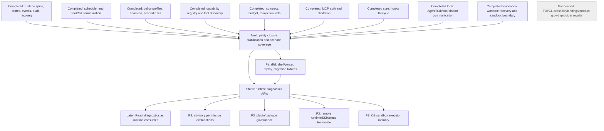

# Claude Code Alignment Next Roadmap

Status: refreshed on 2026-05-27 from current `main`.

Agent Builder baseline: `d51590b76a680e683b9d5335797c7076c16a5b05`

Primary audit reference:

- [`docs/claude-code-runtime-parity-closure-review.md`](./claude-code-runtime-parity-closure-review.md)

Supporting summaries:

- [`docs/claude-code-full-parity-review.md`](./claude-code-full-parity-review.md)
- [`docs/claude-code-runtime-parity-audit.md`](./claude-code-runtime-parity-audit.md)
- [`docs/claude-code-next-implementation-plan.md`](./claude-code-next-implementation-plan.md)
- [`docs/claude-code-alignment-module-priority.md`](./claude-code-alignment-module-priority.md)

## Current Baseline

Older roadmap conclusions are superseded. Current `main` includes runtime
foundations for compact/reinjection, persisted replay, tool discovery
guardrails, policy profiles/headless semantics, output/artifact refs, MCP
auth/elicitation, worktree recovery, sandbox boundary records,
context/memory/read-file loading hardening, hooks lifecycle/policy integration,
and local AgentTask/coordinator communication.

| Area | Status | Evidence |
| --- | --- | --- |
| Runtime spine: turns, ToolCalls, events, audit, recovery | Completed | `internal/runtime/runtime_turns.go`; `internal/runtime/runtime_tool_call_store.go`; `internal/runtime/runtime_event_store.go`; `internal/runtime/runtime_audit.go`; `internal/runtime/runtime_recovery.go` |
| Tool scheduler integration | Completed | `internal/tools/scheduler/`; `internal/agent/scheduler_tool.go`; `internal/runtime/runtime_scheduler_recorder.go` |
| Permission policy profiles, headless, scoped rules | Completed | `internal/permission/policy.go`; `internal/runtime/runtime_policy.go`; `internal/runtime/runtime_permissions.go` |
| Compact, budget, reinjection | Completed | `internal/runtime/runtime_compact.go`; `internal/runtime/runtime_compact_store.go`; `internal/runtime/runtime_budget.go`; `internal/runtime/runtime_context.go` |
| Tool discovery/search guardrails | Completed | `internal/agent/tool_search.go`; `internal/runtime/runtime_tool_search.go`; `internal/runtime/runtime_capabilities.go` |
| MCP lifecycle, auth, elicitation | Completed | `internal/runtime/runtime_mcp.go`; `internal/runtime/runtime_mcp_requests.go`; `internal/agent/tools/mcp/` |
| Skills activation metadata | Partial | `internal/skills/`; `internal/runtime/runtime_skills.go`; `internal/runtime/runtime_skill_activation.go` |
| AgentTask/coordinator local communication | Completed | `internal/runtime/runtime_agent_tasks.go`; `internal/runtime/runtime_agent_task_tools.go`; `internal/runtime/runtime_agent_task_comm_store.go`; `internal/agent/task_tools.go`; `internal/agent/coordinator.go` |
| Worktree recovery and sandbox boundary | Partial hardening | `internal/runtime/runtime_worktrees.go`; `internal/runtime/runtime_worktree_store.go`; `internal/runtime/runtime_sandbox.go` |
| Hooks lifecycle and policy integration | Completed core | `internal/hooks/`; `internal/agent/hooked_tool.go`; `internal/runtime/runtime_hooks.go` |
| Replay export and scenario harness | Completed foundation | `internal/runtime/runtime_replay_export.go`; `internal/runtime/runtime_scenario_harness_test.go` |
| React runtime boundary | Partial diagnostics | `client/src/runtime/types.ts`; `client/src/features/`; `desktop/` |

## Reordered Roadmap

| Bucket | Module | Status | Why |
| --- | --- | --- | --- |
| Completed | Runtime spine, stores, events, audit, replay, recovery | Closed | Runtime facts are durable and replayable. |
| Completed | Scheduler, ToolCall normalization, output/artifact refs | Closed | Runtime records tool lifecycle and references. |
| Completed | Deterministic policy profiles, headless, scoped rules | Closed | Runtime can fail closed and explain decisions. |
| Completed | Compact, budget, reinjection | Closed | Boundaries and reinjected refs are persisted and replayed. |
| Completed | MCP auth/elicitation and capability discovery | Closed foundation | Lifecycle and request state are runtime-owned. |
| Completed | Hooks lifecycle core | Closed foundation | Runtime owns pre/post/failure hooks with audit/replay/recovery. |
| Completed | Local AgentTask/coordinator communication | Closed foundation | Runtime owns task tools, messages, delivery, stop, output, refs, replay, and recovery. |
| Next | Runtime parity closure stabilization and scenario coverage | Next | Cross-boundary fixture proof is the closure gate. |
| Parallel | Shell parser fixture expansion and diagnostics DTO checks | Parallel | Hardens deterministic policy and adapter contracts. |
| Blocked | React deep diagnostics | Blocked by closure confidence | React must render runtime-owned facts only. |
| Later | Advisory permission advisor, plugin governance, advanced memory, OS sandbox executor maturity | P3/hardening | Product or hardening work after closure. |
| Later | Remote runtime, remote agents, SSH/cloud teammate | P3/product optimization | No current local runtime dependency. |
| Not needed | TUI/CLI UI, slash UI, keybindings, provider rewrite, marketplace-first, product telemetry/growth | Excluded | Not part of desktop runtime parity. |

## Dependency Graph



## First Recommended Module

```text
runtime: run parity closure stabilization and scenario coverage
```

This remains first because there is no core runtime blocker left, but the
implemented primitives cross authority boundaries. Closure scenarios should
prove that hooks cannot bypass deterministic deny/headless/scope/sandbox/MCP
gates, AgentTask communication remains ordered and recoverable, compact/replay
preserves refs, and restart recovery explains state from persisted data.

React diagnostics can start only after this closure gate or when scoped to
read-only DTO mirroring over already stable runtime APIs.

## Later And Not Needed

P3/product later:

- remote runtime, remote agent, SSH/cloud teammate;
- advisory permission advisor;
- signed/local plugin package governance;
- advanced memory taxonomy and session memory compact;
- provider/model health dashboards over fantasy;
- OS sandbox executor maturity.

Not needed:

- terminal UI / Ink / terminal layout;
- keybindings / Vim input state;
- slash command UI;
- CLI argument UX;
- Anthropic subscription/pass/product growth surfaces;
- Claude.ai OAuth/product login surfaces;
- first-party telemetry sinks / GrowthBook / Datadog;
- marketplace-first plugin browsing/install;
- provider/model protocol rewrite;
- changes to `charm.land/fantasy`;
- TUI/CLI main-path restoration.
