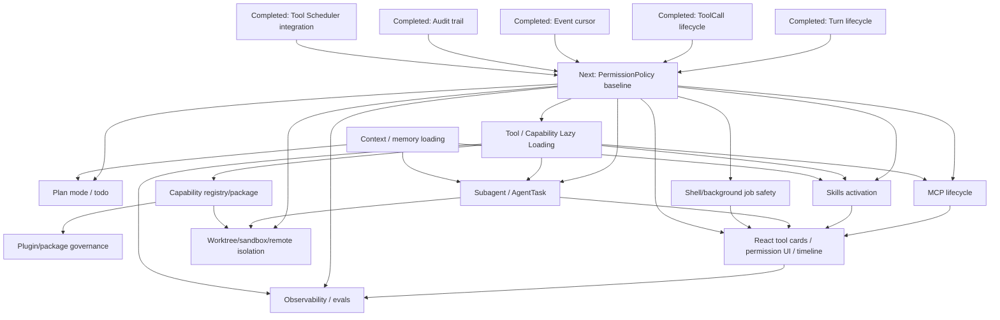

# Claude Code Alignment Next Roadmap

This roadmap updates Agent Builder planning after the completed P0 runtime
foundation and P1 Tool Scheduler integration. It is intended to be directly
usable by the next implementation session.

Hard constraints:

- Do not modify `charm.land/fantasy` for Agent Builder runtime work.
- Fantasy remains the provider/model/tool protocol abstraction.
- Do not recreate provider clients, model stream handling, or model-facing tool
  protocol outside fantasy.
- React is presentation and local UI state only.
- Go runtime is the source of truth for sessions, turns, tools, permissions,
  capabilities, events, audit, and recovery.
- Wails is an adapter, not a business boundary.
- Do not restore TUI/CLI as the main product path.

## Inputs Checked

Active planning references:

- [`docs/client-runtime-architecture-review.md`](./client-runtime-architecture-review.md)
- [`docs/client-architecture-and-core-flow.md`](./client-architecture-and-core-flow.md)
- [`docs/phase-2-runtime-api-boundary.md`](./phase-2-runtime-api-boundary.md)
- [`docs/turn-task-run-model.md`](./turn-task-run-model.md)
- [`docs/tool-scheduler-design.md`](./tool-scheduler-design.md)
- [`docs/permission-policy-model.md`](./permission-policy-model.md)
- [`docs/client-state-recovery.md`](./client-state-recovery.md)
- [`docs/desktop-runtime-boundary.md`](./desktop-runtime-boundary.md)
- [`docs/architecture-decisions.md`](./architecture-decisions.md)

Historical references:

- [`docs/archive/crush-claude-code-gap-analysis.md`](./archive/crush-claude-code-gap-analysis.md)
- [`docs/archive/reference-analysis/claude-code.md`](./archive/reference-analysis/claude-code.md)
- [`docs/archive/reference-analysis/comparison.md`](./archive/reference-analysis/comparison.md)

Implementation areas checked:

- `internal/runtime/*`
- `internal/tools/scheduler/*`
- `internal/permission/*`
- `internal/agent/*`
- `internal/agent/tools/*`
- `internal/skills/*`
- `internal/agent/tools/mcp/*`
- `client/src/runtime/*`
- `client/src/features/*`

## Completed Capability Baseline

The current codebase has enough runtime spine to move the roadmap forward.

| Capability | Status | Notes |
| --- | --- | --- |
| Durable Turn lifecycle | Completed foundation | `RuntimeTurn` store, status transitions, turn query/cancel APIs, active turn listing, interrupted recovery hooks. `requestID == turnID` remains a compatibility bridge. |
| Durable ToolCall lifecycle | Completed foundation | Scheduler-backed `RuntimeToolCall` store, query APIs, idempotent message backfill, cancellation on turn cancel. |
| Runtime event cursor | Completed foundation | Runtime events include `sequence`; list/SSE support cursor-style recovery and snapshot-required behavior. |
| Audit trail | Completed foundation | Append-only runtime audit events, turn audit summary, tool/permission linkage, inventory snapshot for skills/MCP. |
| Session recovery foundation | Completed foundation | Recovery status exposes active turns, interrupted turns, pending permissions, last event sequence. |
| Tool Scheduler integration | Completed P1 baseline | Agent tools are wrapped by `schedulerTool`; runtime recorder writes `tool.call.*` events, ToolCall records, and audit. |
| PermissionPolicy baseline | Partial | `PolicyMode`, `Risk`, static policy, and risk classifier exist, but policy API, persisted mode, scoped rules, decision audit, headless behavior, and shell safety are not complete. Future model-assisted policy should be advisory only, after deterministic enforcement exists. |
| Skills | Foundation | Discovery, config enable/disable, runtime panel, and prompt injection exist. Activation metadata, per-turn usage audit, and lazy skill loading are not complete. |
| MCP | Foundation | Server/tool/resource/prompt APIs and panels exist. Full lifecycle, policy-controlled activation, resource/prompt loading audit, and lazy connection semantics remain. |
| Context | Foundation | Prompt assembly, context paths, skills XML, and MCP instructions exist. Layered managed/user/project/local memory and read-file state are not complete. |
| Subagent | Foundation | `agent` and `agentic_fetch` tools exist. Persisted `AgentTask`, progress, scoped tools, recovery, and cancellation remain. |
| React runtime UI | Foundation | Client consumes runtime facade and has chat, settings, skills, MCP, capabilities, audit, and permission surfaces. Rich tool cards, policy UI, and session timeline remain. |

## Remaining Claude Code Gaps

The remaining gaps are runtime governance gaps, not terminal UI gaps.

| Area | Remaining Gap |
| --- | --- |
| PermissionPolicy / mode-aware + future model-assisted policy | Need persisted policy mode, scoped allow/ask/deny rules, headless behavior, policy reason, risk tags, decision audit, and runtime API. Claude Code also uses adaptive/model-assisted behavior, but Agent Builder should add that later as an advisory signal; final enforcement remains in Go runtime. |
| Tool / Capability Lazy Loading | Need metadata-only startup, on-demand capability load, capability states, events, audit, and runtime-owned activation. |
| Plan mode / todo | Need plan as runtime policy mode; todos should be recoverable turn/task state, not only tool output. |
| Context / memory loading | Need layered instruction loading, source precedence, read-file state, compact boundaries, and context-source audit. |
| Skills activation | Need activation rules, allowed tools metadata, turn-level invoked skills, audit, and lazy prompt/material loading. |
| MCP lifecycle | Need server/tool/resource/prompt lifecycle states, policy gate, lazy connection/tool discovery, redaction, and audit. |
| Subagent / AgentTask | Need persisted task entity with parent turn, child session, tool/model scope, cwd/worktree, progress, cancel, and result artifact. |
| Shell/background jobs | Need mode-aware shell safety, command risk classification, job lifecycle records, cancellable output, and audit. |
| React tool cards / permission UI / session timeline | Need thin rendering over runtime ToolCall/Permission/Turn/Task APIs, not message-part inference. |
| Provider/model configuration on fantasy | Need runtime-owned config, health checks, redaction, model capabilities, usage/audit, and policy. Fantasy remains unchanged. |
| Capability registry/package/plugin | Need stable registry and capability metadata before package/plugin work. Marketplace is out of scope. |
| Worktree/sandbox/remote isolation | Need policy and task foundations first; isolation semantics must stay separate: cwd, worktree, sandbox, remote. |
| Observability/evals | Need local structured metrics, audit queryability, and regression/eval harness after runtime contracts stabilize. |

## Dependency Graph



## Priority Map

| Priority | Module | Status | Blocked by |
| --- | --- | --- | --- |
| P0 | Durable Turn lifecycle | Completed | None |
| P0 | Durable ToolCall lifecycle | Completed | None |
| P0 | Runtime event cursor | Completed | None |
| P0 | Runtime audit trail | Completed | None |
| P0 | Session recovery foundation | Completed | None |
| P1 | Tool Scheduler integration | Completed | None |
| P1 | PermissionPolicy baseline | Next | Completed scheduler/event/audit |
| P1 | Tool / Capability Lazy Loading foundation | Next after policy; design can parallel | PermissionPolicy decision shape; capability registry DTO |
| P1 | Capability registry metadata | Parallel | Runtime API DTO stability |
| P1 | React policy/permission UI refresh | Parallel after policy API | PermissionPolicy API |
| P2 | Plan mode / todo runtime state | Blocked by policy | PermissionPolicy baseline |
| P2 | MCP lifecycle hardening | Parallel after lazy registry | Capability registry/lazy loading |
| P2 | Skills activation metadata | Parallel after lazy registry | Capability registry/lazy loading |
| P2 | Shell/background job management | Blocked by policy | PermissionPolicy baseline |
| P2 | Context / memory loading | Parallel | Context precedence spec; audit schema |
| P2 | Subagent / AgentTask | Blocked by policy and registry | PermissionPolicy, capability registry |
| P2 | React tool cards/session timeline | Blocked by APIs | Tool/permission/task APIs |
| P2 | Provider/model configuration on fantasy | Parallel | No fantasy changes |
| P3 | Capability package/plugin | Blocked by registry | Stable capability registry/lazy loading |
| P3 | Worktree/sandbox/remote isolation | Blocked by policy/task | PermissionPolicy, AgentTask |
| P3 | Observability/evals | Parallel after audit fields | Stable event/audit schema |

## Tool / Capability Lazy Loading

### Why It Matters In Claude Code

Claude Code avoids loading every possible tool, plugin, MCP resource, skill,
agent, and background capability as active execution state at startup. That
keeps startup fast, limits context bloat, reduces accidental tool exposure, and
lets policy decide which capabilities are available in a given mode, workspace,
agent, or task.

The important product behavior is not just performance. Lazy loading is a
governance boundary: the runtime knows what exists, but only loads executable
or prompt-bearing material when a turn, policy, and context require it.

### Agent Builder Goal

Agent Builder should introduce a runtime-owned capability registry that starts
metadata-only and loads capability implementations or heavy metadata on demand.

Startup should discover lightweight metadata:

- id,
- kind,
- name,
- source,
- version/source path where relevant,
- enabled/disabled status,
- risk tags,
- load state,
- short description,
- policy scope hints.

Execution or context assembly should load on demand:

- built-in tool runtime wrapper,
- MCP server connection and tool schema,
- MCP resource or prompt content,
- skill instructions and allowed-tool metadata,
- context/memory file content,
- subagent definition,
- future plugin package contents.

React must not decide loading. React may request refresh or display state; Go
runtime decides discovery, loading, policy, and audit.

### Capability States

Use the following states in runtime DTOs:

```text
unavailable | disabled | unloaded | loading | loaded | failed
```

State meaning:

| State | Meaning |
| --- | --- |
| `unavailable` | Runtime knows the capability name/source but current platform, config, credentials, workspace, or policy makes it unavailable. |
| `disabled` | User/project/runtime config explicitly disabled it. |
| `unloaded` | Metadata is known; implementation or heavy content has not been loaded. |
| `loading` | Runtime is currently loading or connecting. |
| `loaded` | Runtime has loaded the implementation/content needed for use. |
| `failed` | Last load attempt failed; diagnostics are available. |

### Events

Add stable runtime events:

```text
capability.loading
capability.loaded
capability.failed
```

Event payload should include:

```text
capability_id
kind
source
state
turn_id optional
tool_call_id optional
reason
error optional
duration_ms optional
```

Events should be summaries. Full capability diagnostics should be queried
through runtime APIs.

### Audit

Each turn audit should record:

- capabilities available at turn start,
- capabilities actually loaded,
- capabilities actually used,
- policy decision that allowed/denied loading when applicable,
- load failures that affected the turn,
- MCP servers/tools/resources touched,
- skills activated or injected,
- context/memory sources loaded.

Audit payloads must redact secrets, env values, auth headers, and raw private
file contents unless the user explicitly requested a full local diagnostic
export.

### Dependencies

| Dependency | Relationship |
| --- | --- |
| Tool Scheduler | Scheduler executes loaded tool capabilities and records ToolCall lifecycle. Lazy loading happens before execution or during scheduler preparation. |
| PermissionPolicy | Policy decides whether a capability may be loaded or used under the current mode, cwd, source, risk, and task scope. |
| Skills | Skill metadata can be listed unloaded; instructions and allowed-tool metadata are loaded only when activation rules select the skill. |
| MCP | MCP server metadata can be known without all connections active; tool schema/resource/prompt content loads on refresh or first use. |
| Context | Context source metadata is known at startup; file contents load only during prompt assembly for the current turn. |
| Subagent | Agent definitions can be listed unloaded; role prompts, allowed tools, and child runtime setup load when the AgentTask starts. |

### Non-goals

Do not do these in the lazy loading foundation:

- marketplace,
- complex plugin package signing,
- remote plugin installation,
- React-controlled loading decisions,
- reimplementation of fantasy tools or providers,
- enterprise RBAC,
- full sandbox/worktree isolation.

## Recommended Implementation Order

After Tool Scheduler integration, implement `PermissionPolicy baseline` first.

Why policy before lazy loading:

- Lazy loading needs a decision boundary for `load` and `use`.
- Plan mode, shell safety, MCP activation, skill activation, and subagent scope
  all need consistent allow/ask/deny behavior.
- Without policy, lazy loading becomes only a performance feature and will need
  rework when governance is added.

What can run in parallel:

- Capability registry DTO design and metadata inventory.
- React read-only capability state rendering.
- Provider/model config redaction and health checks on top of fantasy.
- Context/memory precedence documentation.
- Observability field inventory.

What must wait for policy stability:

- Plan mode enforcement.
- Shell/background job management.
- MCP tool/resource/prompt activation decisions.
- Skill activation decisions that alter context or tool scope.
- Subagent allowed-tools and cwd/worktree scope.
- Worktree/sandbox/remote isolation.

What must wait for capability registry stability:

- Tool / Capability Lazy Loading executable foundation.
- Capability package/plugin manifest.
- Rich MCP lifecycle UI.
- Skill activation audit UI.
- Subagent registry and agent definition packaging.

## Core Module Boundaries

### PermissionPolicy Baseline

| Field | Boundary |
| --- | --- |
| Goal | Runtime-owned mode-aware allow/ask/deny policy with risk, reason, audit, and API. |
| Non-goals | Enterprise RBAC, external approval systems, full shell parser, full sandbox. |
| Go packages | `internal/permission`, `internal/runtime/runtime_permissions.go`, `internal/runtime/runtime_permission_store.go`, `internal/proto/permission.go`, `internal/tools/scheduler`. |
| React packages | `client/src/runtime/types.ts`, `client/src/features/permissions`, future settings/policy surface. |
| API/events | `GET/PUT /v1/policy`, existing permission APIs, `permission.requested`, `permission.decided`, `permission.policy.applied`, `audit.recorded`. |
| Data model | Persist policy mode; add rule list later; ensure permission rows include turn/tool/risk/status/reason/decision timestamps. |
| Tests | Policy mode tests, risk tests, permission store tests, runtime decision/audit tests, TS build. |
| Acceptance | UI only submits decisions; runtime computes risk/reason; pending permissions recover; plan mode blocks mutating tools; headless ask behavior is explicit. |
| Risks | Shell classification will be incomplete; default must fail conservative for unknown execute/destructive cases. |

PermissionPolicy has two stages:

1. Baseline deterministic policy. Runtime owns mode, risk, rule, decision,
   audit, and API. It supports `ask`, `auto_read`, `plan`, and `deny_all`.
   React does not infer risk. The model cannot approve its own tool use.
2. Future adaptive/model-assisted policy. A model or classifier may provide
   intent summaries, risk explanations, permission request wording, plan-exit
   proposals, or advisory scores. These signals must never bypass runtime
   enforcement. High-risk, destructive, secret, network, and execute actions
   default to ask or deny unless deterministic policy explicitly allows them.

### Tool / Capability Lazy Loading

| Field | Boundary |
| --- | --- |
| Goal | Metadata-only startup and runtime-owned on-demand loading for tools, MCP, skills, context, and subagents. |
| Non-goals | Marketplace, package signing, React-decided loading, full plugin system. |
| Go packages | `internal/runtime/runtime_capabilities.go`, new capability loader/registry files, `internal/skills`, `internal/agent/tools/mcp`, `internal/tools/scheduler`, `internal/permission`. |
| React packages | `client/src/runtime/types.ts`, `client/src/features/capabilities`, `client/src/features/skills`, `client/src/features/mcp`. |
| API/events | `GET /v1/capabilities`, future `POST /v1/capabilities/{id}/refresh`, `capability.loading`, `capability.loaded`, `capability.failed`. |
| Data model | Add capability state and diagnostics; optional per-turn capability load/use audit records. |
| Tests | Registry state tests, lazy load success/failure tests, policy denied load tests, audit redaction tests. |
| Acceptance | Startup lists capabilities without loading heavy content; first use loads through runtime; load/use are audited by turn; React only displays state. |
| Risks | Over-eager loading can reintroduce startup cost and context bloat; under-specified IDs can break audit correlation. |

### Plan Mode / Todo

| Field | Boundary |
| --- | --- |
| Goal | Plan mode as runtime policy mode and todos as recoverable turn/task state. |
| Non-goals | Project management app, React-only todo authority, complex planning workflow. |
| Go packages | `internal/permission`, `internal/agent/tools/todos.go`, `internal/runtime`, `internal/session`. |
| React packages | `client/src/features/chat`, policy mode UI, future todo/plan timeline components. |
| API/events | `GET/PUT /v1/policy`, future `GET /v1/turns/{id}/todos`, `policy.updated`, `todo.updated`. |
| Data model | Persist mode and turn/session todo linkage. |
| Tests | Plan blocks write/execute tests, todos persistence/recovery tests. |
| Acceptance | Mutating tools do not execute in plan mode; plan/todo state survives refresh. |
| Risks | If plan mode is only UI state, safety guarantees are false. |

### Context / Memory Loading

| Field | Boundary |
| --- | --- |
| Goal | Layered managed/user/project/local instructions and auditable context-source loading. |
| Non-goals | Full team memory sync, advanced compaction, remote memory service. |
| Go packages | `internal/agent/prompts.go`, `internal/agent/prompt`, `internal/config`, `internal/skills`, future `internal/runtime/runtime_context.go`. |
| React packages | Diagnostics/context read-only panels later. |
| API/events | Future `GET /v1/context/sources`; `context.loaded`, `context.failed` can follow lazy loading events. |
| Data model | Context source summaries, read-file state, compact boundary later. |
| Tests | Precedence tests, path traversal tests, prompt assembly tests, audit redaction tests. |
| Acceptance | Runtime can explain which instruction/context sources affected a turn; React does not inject context. |
| Risks | Ambiguous precedence can cause behavior drift; specify before implementation. |

### Skills Activation

| Field | Boundary |
| --- | --- |
| Goal | Move skills from discovery/display to policy-aware activation metadata and turn audit. |
| Non-goals | Public marketplace, frontend prompt injection, complex package management. |
| Go packages | `internal/skills`, `internal/runtime/runtime_skills.go`, `internal/runtime/runtime_capabilities.go`, `internal/config`. |
| React packages | `client/src/features/skills`, `client/src/features/capabilities`. |
| API/events | Existing skills APIs plus capability events; `skill.discovery.*`, `skill.enabled`, `skill.disabled`. |
| Data model | Skill state, activation reason, allowed tools metadata, per-turn invoked skills audit. |
| Tests | Discovery diagnostics, disable persists, disabled skills excluded, activation audit. |
| Acceptance | Runtime can list available/enabled/activated skills and audit which were used in a turn. |
| Risks | Skill metadata can alter tool scope; must pass through policy. |

### MCP Tool / Resource / Prompt Lifecycle

| Field | Boundary |
| --- | --- |
| Goal | Unify MCP lifecycle with capability registry, scheduler, policy, events, and audit. |
| Non-goals | OAuth, remote MCP administration, marketplace install. |
| Go packages | `internal/agent/tools/mcp`, `internal/runtime/runtime_mcp*.go`, `internal/runtime/runtime_capabilities.go`, `internal/config`. |
| React packages | `client/src/features/mcp`, `client/src/features/capabilities`, tool cards. |
| API/events | Existing MCP APIs, `mcp.server.*`, `mcp.tools.updated`, `mcp.resources.updated`, `mcp.prompts.updated`, capability events, `tool.call.*`. |
| Data model | MCP capability state, source metadata, redacted config, source=mcp ToolCalls. |
| Tests | Redaction tests, server state tests, MCP tool lifecycle tests, lazy load failure tests. |
| Acceptance | MCP tools use the same ToolCall/Permission/Audit path as builtin tools. |
| Risks | MCP env/header secrets must never leak into responses/events/audit. |

### Subagent / AgentTask

| Field | Boundary |
| --- | --- |
| Goal | Promote subagent calls to persisted AgentTask with progress, scope, cancel, recovery, and result artifact. |
| Non-goals | Agent teams, swarm, marketplace agents, remote fleet. |
| Go packages | `internal/agent/agent_tool.go`, `internal/agent/agentic_fetch_tool.go`, future `internal/runtime/runtime_tasks.go`, `internal/session`. |
| React packages | Future task panel and child task cards in `client/src/features/chat`. |
| API/events | `GET /v1/tasks/{id}`, `GET /v1/turns/{id}/tasks`, `POST /v1/tasks/{id}/cancel`, `task.started`, `task.progress`, `task.completed`, `task.failed`, `task.cancelled`. |
| Data model | `runtime_agent_tasks` with parent_turn_id, child_session_id, role, model, allowed_tools, cwd/worktree, status, progress, result summary. |
| Tests | Child session linkage, cancel, policy scope, recursion/concurrency limits. |
| Acceptance | Subagent work is visible, cancellable, auditable, recoverable, and summarized into parent turn. |
| Risks | Unbounded recursion/concurrency; require explicit limits and scoped policy. |

### Shell / Background Job Management

| Field | Boundary |
| --- | --- |
| Goal | Runtime-managed shell/job lifecycle with policy, cancellation, output refs, and audit. |
| Non-goals | Full OS sandbox, guarantee of system Bash/PowerShell/cmd availability. |
| Go packages | `internal/agent/tools/bash.go`, `job_output.go`, `job_kill.go`, `internal/shell`, `internal/permission`, `internal/tools/scheduler`. |
| React packages | Tool card stdout/stderr views, future background task panel. |
| API/events | ToolCall APIs, future task APIs, `tool.call.output`, `task.progress`. |
| Data model | stdout/stderr refs, process/job id mapping, command risk metadata. |
| Tests | Dangerous command classification, background lifecycle, cancel/kill tests. |
| Acceptance | Shell calls have visible status, policy decision, audit record, cancellable job, redacted output summary. |
| Risks | Shell safety is high risk; classify conservatively and keep portable shell semantics explicit. |

### React Tool Cards / Permission UI / Session Timeline

| Field | Boundary |
| --- | --- |
| Goal | Render runtime objects as thin UI: Turn, ToolCall, Permission, Task, Audit. |
| Non-goals | React risk inference, React tool status authority, React final turn state authority. |
| Go packages | No business logic; depends on runtime APIs. |
| React packages | `client/src/features/chat`, `client/src/features/permissions`, `client/src/features/audit`, `client/src/features/capabilities`. |
| API/events | Consume Turn, ToolCall, Permission, Audit, Task, Event APIs. |
| Data model | DTO-only changes as needed. |
| Tests | Frontend build, component tests where available, browser smoke for permission/tool/timeline. |
| Acceptance | Refresh restores UI from runtime APIs; permission modal recovers; tool detail opens runtime detail/audit. |
| Risks | Building UI before API stability forces React to infer business facts. |

### Provider / Model Configuration On Fantasy

| Field | Boundary |
| --- | --- |
| Goal | Runtime-owned model config, verification, redaction, capability display, usage/audit over fantasy. |
| Non-goals | Reimplement provider clients, stream engine, or model-facing message protocol. |
| Go packages | `internal/runtime/runtime_model*.go`, `internal/config`, fantasy integration points. |
| React packages | `client/src/features/settings/ModelSettingsDrawer.tsx`, usage/status readouts. |
| API/events | Model config APIs, `runtime.started`, `runtime.failed`, `usage.updated`. |
| Data model | Redacted config, provider health metadata, optional model capability cache. |
| Tests | Redaction, verify failure shape, frontend save/load build. |
| Acceptance | Secrets do not leak; runtime status shows provider/model; turn audit records provider/model/usage. |
| Risks | Do not create a second provider abstraction above fantasy beyond product policy/config. |

### Capability Registry / Package / Plugin

| Field | Boundary |
| --- | --- |
| Goal | Stable registry first; package/plugin governance later. |
| Non-goals | Marketplace in P1/P2, package signing in lazy loading foundation. |
| Go packages | `internal/runtime/runtime_capabilities.go`, future registry/package files, `internal/skills`, MCP config, hooks later. |
| React packages | `client/src/features/capabilities`, skills/MCP panels. |
| API/events | `GET /v1/capabilities`, capability events, future enable/disable/package APIs. |
| Data model | Capability id/kind/source/state/risk/version/diagnostics. |
| Tests | Registry normalization, enable/disable, source redaction, package manifest later. |
| Acceptance | Builtin, MCP, skill, context, and agent definitions have stable ids and source metadata. |
| Risks | Package/plugin work before stable registry will hard-code the wrong boundary. |

### Worktree / Sandbox / Remote Isolation

| Field | Boundary |
| --- | --- |
| Goal | Add isolation semantics after policy/task foundations: cwd override, worktree, sandbox, remote are separate. |
| Non-goals | Full cross-platform sandbox parity in the first pass. |
| Go packages | Future runtime isolation package, `internal/permission`, `internal/tools/scheduler`, `internal/agent`. |
| React packages | Future task/worktree status UI. |
| API/events | Future isolation fields on Task/ToolCall; `task.*`, `audit.recorded`. |
| Data model | cwd/worktree/remote/sandbox metadata on task/tool audit. |
| Tests | Policy enforcement, cleanup/preserve behavior, path safety, cancellation. |
| Acceptance | Isolation choice is visible, audited, cancellable, and not conflated into one boolean. |
| Risks | Destructive cleanup and path bugs; require conservative defaults and explicit audit. |

### Observability / Evals

| Field | Boundary |
| --- | --- |
| Goal | Local structured runtime metrics and regression/eval harness over stable events/audit. |
| Non-goals | Mandatory external telemetry, first-party analytics coupling. |
| Go packages | `internal/runtime/runtime_audit*.go`, future metrics/eval helpers. |
| React packages | Diagnostics/audit panels. |
| API/events | Audit APIs, event stream, optional metrics snapshot API. |
| Data model | Timing, counts, policy decisions, tool durations, load durations. |
| Tests | Golden audit/event tests, redaction tests, scenario smoke tests. |
| Acceptance | A turn can be evaluated for policy/tool/capability behavior from local structured data. |
| Risks | Metrics can leak prompt/tool inputs; default to summaries and redaction. |

## Commit-by-Commit Phase Plan

Recommended future implementation commits:

1. `docs: update claude code alignment roadmap`
   - This docs-only update.
2. `runtime: add permission policy API baseline`
   - Persist current mode, add DTOs, add `GET/PUT /v1/policy`, add tests.
3. `runtime: audit permission policy decisions`
   - Record `permission.policy.applied`, policy reason, risk, and decision audit.
4. `client: render runtime policy and permission reasons`
   - Thin UI for policy mode/reason without React-side risk inference.
5. `runtime: add capability registry states`
   - Add capability `state`, diagnostics, stable ids, metadata-only startup.
6. `runtime: add capability lazy loading events`
   - Emit `capability.loading`, `capability.loaded`, `capability.failed`; audit loaded/used capabilities by turn.
7. `runtime: gate mcp and skills activation through capabilities`
   - Apply registry/policy to MCP and skills activation.
8. `runtime: enforce plan mode baseline`
   - Make plan mode block mutating tools through policy.
9. `runtime: harden shell background job policy`
   - Add command risk baseline, job lifecycle records, cancel/audit behavior.
10. `runtime: introduce agent task persistence`
    - Persist subagent tasks after policy and registry are stable.

## First Recommended Implementation Module

Implement `PermissionPolicy baseline` first.

The code already has:

- `internal/permission/policy.go`,
- `Risk` and `PolicyMode`,
- permission request `turn_id`, `tool_call_id`, `risk`, and `status`,
- scheduler-generated ToolCall records,
- event/audit foundations.

The missing next layer is the runtime-owned contract:

- persisted policy mode,
- API shape,
- policy-applied event,
- decision audit,
- explicit headless behavior,
- conservative shell and mutating-tool classification,
- React display of runtime-provided mode/risk/reason only.

This first module is intentionally deterministic. It should create explicit
extension points for a later policy advisor only if doing so is low-risk, but it
must not call a model to self-approve tool execution. Model-assisted permission
behavior belongs after audit, policy mode, risk classification, and recovery
are reliable.

Lazy Loading should be the next runtime module after this baseline, with
capability registry state design allowed to proceed in parallel.
