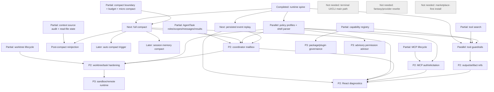

# Claude Code Alignment Next Roadmap

Status: refreshed on 2026-05-24 after a full runtime parity re-audit against
current Agent Builder `main` and the local Claude Code source snapshot.

Primary reference:

- [`docs/claude-code-full-parity-review.md`](./claude-code-full-parity-review.md)

Supporting docs:

- [`docs/claude-code-runtime-parity-audit.md`](./claude-code-runtime-parity-audit.md)
- [`docs/claude-code-next-implementation-plan.md`](./claude-code-next-implementation-plan.md)
- [`docs/claude-code-alignment-module-priority.md`](./claude-code-alignment-module-priority.md)
- [`docs/client-runtime-architecture-review.md`](./client-runtime-architecture-review.md)
- [`docs/turn-task-run-model.md`](./turn-task-run-model.md)
- [`docs/tool-scheduler-design.md`](./tool-scheduler-design.md)
- [`docs/permission-policy-model.md`](./permission-policy-model.md)
- [`docs/client-state-recovery.md`](./client-state-recovery.md)
- [`docs/archive/phase-2-runtime-api-boundary.md`](./archive/phase-2-runtime-api-boundary.md)
- [`docs/client-architecture-and-core-flow.md`](./client-architecture-and-core-flow.md)

## Fixed Principles

- Runtime first, then pages.
- Go runtime is the source of truth.
- React is presentation, input, diagnostics, and product workflow only.
- Wails and HTTP are adapters.
- `charm.land/fantasy` is the provider/model/tool protocol abstraction and must
  not be rewritten.
- Compact, tool discovery, policy, AgentTask, MCP/skills, worktree, audit, and
  replay are runtime primitives.
- Model-assisted permission is advisory-only and cannot self-approve high-risk
  tool use.
- Coordinator/agent communication is a runtime primitive, not UI event
  stitching.
- Provider/model config belongs above fantasy as product policy/config.

## Current Baseline

The current code is ahead of the older roadmap. Several items previously listed
as missing are now partial runtime foundations.

| Area | Status | Evidence |
| --- | --- | --- |
| Runtime spine: turns, ToolCalls, events, audit, recovery | Completed foundation | `internal/runtime/runtime_turns.go`, `runtime_tool_call_store.go`, `runtime_events.go`, `runtime_audit.go`, `runtime_recovery.go` |
| Tool scheduler integration | Completed foundation | `internal/tools/scheduler/*`, `internal/agent/scheduler_tool.go`, `runtime_scheduler_recorder.go` |
| Permission policy with scoped rules and shell safety | Partial implemented | `internal/permission/policy.go`, `internal/runtime/runtime_policy.go` |
| Compact boundary, budget, micro compact | Partial implemented | `internal/runtime/runtime_compact*.go`, `runtime_budget.go` |
| Tool search/discovery and guardrails | Partial implemented | `internal/agent/tool_search.go`, `internal/runtime/runtime_tool_search.go`, `internal/agent/loop_detection.go` |
| Capability registry and lazy refresh state | Partial implemented | `internal/runtime/runtime_capabilities.go` |
| MCP lifecycle and policy filtering | Partial implemented | `internal/runtime/runtime_mcp*.go`, `internal/agent/tools/mcp/*` |
| Skills activation metadata | Partial implemented | `internal/skills/*`, `internal/runtime/runtime_skill_activation.go` |
| AgentTask roles, scopes, messages, results | Partial implemented | `internal/runtime/runtime_agent_tasks.go`, `runtime_agent_roles.go`, `runtime_agent_task_scope.go`, `runtime_agent_task_comm_store.go` |
| Worktree lifecycle | Partial implemented | `internal/runtime/runtime_worktrees.go`, `runtime_worktree_store.go` |
| Replay export and scenario harness | Partial implemented | `internal/runtime/runtime_replay_export.go`, `runtime_scenario_harness_test.go` |
| React runtime boundary | Partial | `client/src/runtime/*`, `client/src/features/*` |

## Reordered Roadmap

The next phase is runtime hardening, not a React shell-first phase. React
diagnostics should follow runtime APIs.

| Priority | Module | Status | Why |
| --- | --- | --- | --- |
| P0 Completed | Runtime spine: Turn, ToolCall, Event, Audit, Recovery | Completed | Stable foundation already present. |
| P0 Completed | Tool scheduler baseline | Completed | Scheduler records lifecycle, policy, events, audit. |
| P0 Completed | Deterministic policy baseline | Completed foundation | Modes and scoped rules exist. |
| P1 Next | Full compact and post-compact reinjection | Next runtime | Builds on existing boundary/budget/micro compact; unlocks long sessions and compact-aware recovery. |
| P1 Next | Persisted event replay and expanded scenario harness | Next runtime | Current replay mixes audit store with bounded event buffer; needs durable event source and more fixtures. |
| P1 Parallel | Tool discovery hardening and scheduler guardrails | Parallel runtime | Tool search exists; needs stronger per-source recursion/concurrency/deadlock policy. |
| P1 Parallel | Policy profiles/headless semantics and shell parser hardening | Parallel runtime | Scoped rules exist; production safety needs profiles and fuller Bash/PowerShell coverage. |
| P2 | AgentTask coordinator mailbox and task tools | Blocked by compact/replay/policy hardening | Messages/results exist, but full SendMessage/coordinator semantics need stable transcript and policy boundaries. |
| P2 | Output/artifact ref store and background job entity | Blocked by compact/replay | ToolCall output compaction exists, but artifacts/jobs need durable refs. |
| P2 | MCP auth/elicitation lifecycle | Runtime after policy hardening | MCP inventory/lifecycle exists; auth and elicitation are missing. |
| P2 | Worktree integration hardening | After AgentTask/policy hardening | Worktree lifecycle exists; needs deeper task/cwd/shell integration. |
| P2 Later | React compact/task/policy/replay diagnostics | After runtime APIs | React should expose runtime facts only. |
| P3 Later | Sandbox and remote runtime | Later | Depends on shell policy, worktree, task scope. |
| P3 Later | Capability package/plugin governance | Later | Needs stable registry, tool search, scoped policy, MCP/skills lifecycle. |
| P3 Later | Advisory permission advisor | Later | Must wait for deterministic scopes and evals. |
| Not needed | TUI/CLI UI, slash UI, provider rewrite, marketplace-first | Not needed | Explicitly excluded. |

## Dependency Graph



## First Recommended Module

```text
runtime: full compact and post-compact reinjection
```

This is the best next module because:

- current code already has compact boundaries, budget reports, and micro compact;
- Claude Code still has a deeper compact lifecycle in `src/services/compact/*`;
- long-session reliability depends on compact-aware context, replay, and
  reinjection;
- AgentTask/coordinator work will increase transcript volume and should wait
  for compact hardening;
- React compact diagnostics should render runtime compact state, not infer it.

## Page / React Deferral

React/page work is not the next priority. The current client can consume runtime
DTOs, but compact, replay, task mailbox, artifact refs, and policy diagnostics
need runtime-owned APIs first. Page work can proceed only as diagnostics over
existing APIs:

- compact panels after full compact/reinjection APIs,
- replay views after persisted event replay,
- task mailbox UI after runtime mailbox semantics,
- artifact drawer after durable output/artifact refs,
- policy rule editor after profile/headless semantics.

## Not Needed / Later

Not needed:

- Claude Code terminal UI / Ink / terminal layout,
- keybindings / Vim input state,
- slash command UI,
- CLI argument UX,
- Anthropic subscription/pass/growth surfaces,
- Claude.ai OAuth/product login surfaces,
- first-party telemetry sinks / GrowthBook / Datadog,
- marketplace-first plugin browsing/install,
- provider/model protocol rewrite,
- TUI/CLI main-path restoration.

Later/P3:

- model-assisted permission advisor,
- sandbox/remote runtime,
- local/signed plugin package governance,
- advanced memory taxonomy and session memory compact,
- provider/model health dashboards over fantasy.
