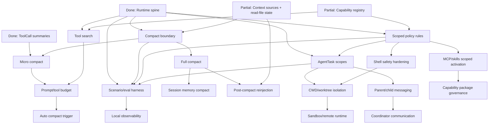

# Claude Code Alignment Next Roadmap

This roadmap supersedes the previous post-scheduler plan. It is based on the
current Agent Builder runtime on `main` and the full runtime parity audit in:

- [`docs/claude-code-runtime-parity-audit.md`](./claude-code-runtime-parity-audit.md)

Hard constraints:

- Do not modify `charm.land/fantasy`; it remains the provider/model/tool
  protocol abstraction.
- Do not recreate provider clients, model streaming, or model-facing tool
  protocol outside fantasy.
- Go runtime is the source of truth for sessions, turns, tools, permissions,
  capabilities, events, audit, recovery, tasks, and context.
- React is presentation and local UI state only.
- Wails and HTTP are adapters, not business boundaries.
- Do not restore TUI/CLI as the main product path.
- Model-assisted permission is advisory only. The model must never approve its
  own high-risk action.

## Current Baseline

The codebase is now past the older "PermissionPolicy is next" state. The
baseline has these implemented foundations:

| Area | Status | Evidence |
| --- | --- | --- |
| Durable turn lifecycle | Implemented foundation | `internal/runtime/runtime_turns.go`, `runtime_turn_store.go` |
| Durable ToolCall lifecycle | Implemented foundation | `internal/tools/scheduler/*`, `internal/agent/scheduler_tool.go`, `runtime_tool_call_store.go` |
| Runtime event cursor | Implemented foundation | `runtime_events.go`, `runtime_sse.go`, `client/src/runtime/types.ts` |
| Runtime audit | Implemented foundation | `runtime_audit.go`, `runtime_audit_writer.go` |
| Session recovery | Implemented foundation | `runtime_recovery.go`, `GET /v1/recovery/status` |
| PermissionPolicy baseline | Partial foundation | `internal/permission/policy.go`, `runtime_policy.go`, `runtime_permission_store.go` |
| Plan mode | Partial foundation | `PolicyModePlan` blocks non-read tool calls |
| Capability states/refresh | Partial foundation | `runtime_capabilities.go`, `capability.loading/loaded/failed` |
| Context source audit | Partial foundation | `internal/agent/prompt/prompt.go`, `runtime_context.go` |
| Skills/MCP panels and APIs | Partial foundation | `runtime_skills.go`, `runtime_mcp.go`, React feature panels |
| AgentTask persistence | Partial foundation | `runtime_agent_tasks.go`, `runtime_agent_task_store.go` |
| React runtime surfaces | Partial foundation | `client/src/runtime/*`, `features/chat`, `features/audit`, `features/permissions` |

The foundation is useful but incomplete. The next work should focus on runtime
governance and long-session behavior, not on restoring CLI/TUI or rebuilding
provider layers.

## Key Parity Conclusion

Agent Builder has a credible runtime spine. Claude Code is still ahead in:

- compact and prompt budget lifecycle,
- tool search/discovery and lazy tool exposure,
- scoped policy rules and shell safety,
- agent coordinator/communication and task roles,
- worktree/sandbox/remote isolation,
- scenario/eval harnesses and replayable diagnostics.

Therefore the next implementation batch should move from "create runtime
objects" to "govern long-running execution."

## Reordered Priority Map

| Priority | Module | Status | Depends on |
| --- | --- | --- | --- |
| P0 | Runtime spine: Turn, ToolCall, Event, Audit, Recovery | Done foundation | Maintain |
| P0 | Deterministic PermissionPolicy baseline | Partial foundation | Scheduler/audit |
| P0 | Capability registry states and refresh | Partial foundation | Runtime API |
| P1 | Compact lifecycle foundation | Next | Context sources, read-file state, audit |
| P1 | Micro compact for tool outputs | Next | Compact boundary, ToolCall output normalization |
| P1 | Prompt/tool budget accounting | Next | Context sources, capability registry |
| P1 | Tool search / capability discovery | Next | Capability registry, prompt budget |
| P1 | Scoped policy rules | Next | Permission baseline, scheduler |
| P1 | Shell policy hardening | Next | Scoped policy rules |
| P1 | AgentTask scope and role definitions | Next | AgentTask store, scoped policy |
| P2 | Parent/child agent messaging | After task scopes | AgentTask roles |
| P2 | MCP/skills scoped activation | After policy scopes | Capability registry |
| P2 | Background job entity and output/artifact refs | After scheduler hardening | ToolCall/task stores |
| P2 | Full compact and post-compact reinjection | After micro compact | Context/read-file state |
| P2 | Worktree isolation | After task scopes + shell policy | AgentTask cwd/worktree fields |
| P2 | React compact/task/policy diagnostics | After APIs | Runtime DTOs |
| P3 | Session memory compact and auto compact | Later | Full compact and prompt budget |
| P3 | Sandbox and remote runtime | Later | Isolation API and shell policy |
| P3 | Capability package/plugin governance | Later | Registry, scopes, skills/MCP lifecycle |
| P3 | Observability/eval harness | Parallel after scenarios | Stable audit/events |

## Recommended Next Modules

### 1. Compact Lifecycle Foundation

Goal: introduce compact as a runtime primitive, split into separate lifecycle
stages instead of a single summary command.

Required split:

- micro compact,
- full compact,
- session memory compact,
- auto compact trigger,
- post-compact reinjection.

Initial acceptance:

- compact boundary record exists,
- compact events and audit records exist,
- ToolCall/message references survive compaction,
- no React-owned compact state,
- no provider/fantasy changes.

### 2. Micro Compact For Tool Outputs

Goal: reduce context pressure deterministically before full summarization.

Initial acceptance:

- old/high-cost tool outputs can be replaced by summaries or refs,
- tool-use/tool-result invariants are preserved,
- full output remains available through runtime/audit refs where appropriate,
- compact decisions are auditable.

### 3. Tool Search And Prompt Budget

Goal: avoid exposing every tool, MCP tool, skill, and plugin candidate in every
turn.

Initial acceptance:

- capability metadata includes model-facing searchable descriptions,
- runtime can select/discover tools on demand,
- prompt budget reports messages, context sources, tool schemas, skills, MCP,
  and tool outputs,
- selection and omission are audited.

### 4. Scoped Policy Rules And Shell Safety

Goal: evolve the deterministic policy baseline into a scoped rule engine.

Scope:

- tool and capability IDs,
- MCP server/tool/resource/prompt,
- skill activation,
- subagent/task scope,
- cwd/path,
- shell command prefix or regex,
- headless behavior.

Model-assisted policy remains future-only and advisory. It may summarize
intent, explain risk, or suggest a decision, but Go runtime policy enforces the
final allow/ask/deny decision.

### 5. AgentTask Scope, Roles, And Communication

Goal: turn the current AgentTask persistence foundation into managed subagent
runtime work.

Initial acceptance:

- agent definitions/roles are runtime objects,
- allowed tools/model/cwd/capability scope are enforced,
- parent/child messaging is structured,
- task result and artifact refs are durable,
- cancellation and interrupted recovery are auditable.

### 6. Scenario/Eval Harness

Goal: make runtime regressions visible before broadening the capability surface.

Scenarios:

- plan mode blocks writes and shell,
- auto_read allows reads and asks on writes,
- shell destructive commands are denied or ask,
- MCP refresh and disabled tools are audited,
- skill allowed_tools metadata does not grant permission,
- AgentTask cancellation and recovery,
- event cursor snapshot-required behavior,
- compact boundary and micro compact invariants.

## Dependency Graph

## Module Boundaries

### Compact

| Field | Boundary |
| --- | --- |
| Goal | Runtime-owned compact boundaries, summaries, replacement records, and reinjection. |
| Non-goals | Provider rewrite, React-owned summaries, remote memory service. |
| Go packages | Future `internal/runtime/runtime_compact*.go`, `internal/agent/prompt`, `internal/message`, `internal/db`. |
| React packages | Read-only timeline/audit rendering after API exists. |
| Events | `compact.boundary`, `compact.micro`, `compact.full`, `compact.failed`, future exact names to add to `internal/runtimeapi`. |
| Tests | Boundary store tests, message invariant tests, audit redaction tests. |

### Tool Search / Budget

| Field | Boundary |
| --- | --- |
| Goal | Runtime-mediated discovery of tools/capabilities and prompt budget accounting. |
| Non-goals | Marketplace, React-selected tools, model self-approval. |
| Go packages | `internal/runtime/runtime_capabilities.go`, future budget/search files, `internal/permission`. |
| React packages | Capability diagnostics only. |
| Tests | Selection/audit tests, budget accounting tests, policy-denied search tests. |

### Scoped Policy

| Field | Boundary |
| --- | --- |
| Goal | Deterministic scoped rules for tools, commands, MCP, skills, subagents, cwd, and headless profiles. |
| Non-goals | Enterprise RBAC, model-approved permissions, full OS sandbox. |
| Go packages | `internal/permission`, `internal/runtime/runtime_policy.go`, scheduler recorder. |
| React packages | Policy diagnostics/rule editor later. |
| Tests | Policy regression table tests and runtime scenario tests. |

### AgentTask Scope / Communication

| Field | Boundary |
| --- | --- |
| Goal | Managed subagent roles, enforced scopes, structured parent/child messaging, durable outputs. |
| Non-goals | Swarm product UI, marketplace agents, remote fleet. |
| Go packages | `internal/agent/agent_tool.go`, `internal/runtime/runtime_agent_tasks.go`, future role registry. |
| React packages | Task panel and timeline rendering only. |
| Tests | Scope enforcement, cancellation, child session linkage, result/artifact audit. |

### Isolation

| Field | Boundary |
| --- | --- |
| Goal | Keep cwd override, worktree, sandbox, and remote runtime separate in API and audit. |
| Non-goals | First-pass cross-platform sandbox parity. |
| Go packages | Future runtime isolation package, `internal/permission`, scheduler, AgentTask. |
| Tests | Path safety, cleanup/preserve behavior, policy enforcement, cancellation. |

## Product Coupling To Exclude

Do not bring these Claude Code surfaces into Agent Builder:

- terminal UI / Ink components,
- terminal keybindings and Vim input state,
- slash command UI,
- CLI argument UX,
- subscription/product-specific Anthropic UI,
- first-party GrowthBook/Datadog/Anthropic telemetry sinks,
- Claude.ai OAuth and pass/subscription flows,
- marketplace-first plugin install flows.

Borrow only runtime semantics: state machines, policy shapes, compact
lifecycle, task protocol, extension governance, audit discipline, and recovery
semantics.

## Commit-by-Commit Phase Plan

Recommended future implementation commits:

1. `runtime: record compact boundaries`
   - Store compact boundary metadata, events, and audit.

2. `runtime: add micro compact output replacement`
   - Replace old tool outputs with summaries/refs while preserving protocol
     invariants.

3. `runtime: add prompt and tool budget accounting`
   - Count context, messages, tool schemas, skills, MCP, and tool outputs.

4. `runtime: add tool search capability metadata`
   - Expose model-facing searchable tool descriptions and audit selection.

5. `runtime: add scoped permission rules`
   - Deterministic rules for tools, MCP, skills, subagents, cwd, and shell
     prefixes/regex.

6. `runtime: harden shell policy classification`
   - Move beyond regex-only destructive detection for common Bash/PowerShell
     shapes.

7. `runtime: enforce agent task scopes`
   - Enforce model/tool/cwd/capability scope on child sessions.

8. `runtime: add parent child agent messaging`
   - Structured task progress/result/artifact protocol.

9. `runtime: add full compact and reinjection`
   - Summary generation path, compact boundary replay, read-file/context
     reinjection.

10. `runtime: add scenario eval harness`
    - Golden local scenarios for policy, compact, MCP, skills, tasks, recovery,
      and audit.

11. `runtime: add worktree isolation`
    - Explicit worktree lifecycle with audit and cleanup/preserve behavior.

12. `runtime: add local capability package governance`
    - Local/managed package manifest and trust state. No marketplace first.

## First Recommended Implementation Module

Implement `Compact lifecycle foundation` next.

Reason:

- The runtime spine, scheduler, policy baseline, context source audit, and
  AgentTask persistence are now present.
- Claude Code's largest remaining runtime advantage is context economy:
  micro compact, full compact, session memory compact, auto compact, and
  post-compact reinjection.
- Tool search, prompt budget, and long-running AgentTasks all depend on a
  compact boundary model.

The first compact pass should be conservative: add durable boundary records,
events, audit, and tests before changing model-loop behavior.
