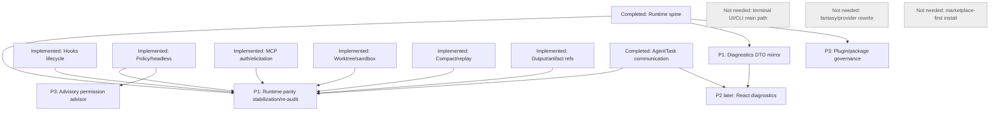

# Claude Code Full Parity Review

Date: 2026-05-27

Scope: full runtime parity re-audit of Agent Builder current `main` against the
local Claude Code source snapshot at
`C:\Users\ytq\work\ai\myclaw\claude-code`.

This review intentionally excludes Claude Code terminal UI, Ink layout,
keybindings, Vim input, slash command UI, CLI argument UX, Anthropic
subscription/pass/growth surfaces, Claude.ai OAuth/product login surfaces,
first-party telemetry sinks, GrowthBook, Datadog, marketplace-first plugin
install, provider/model protocol rewrites, `charm.land/fantasy` changes, and
TUI/CLI main-path restoration.

## Executive Summary

Agent Builder has materially advanced beyond the older roadmap. The runtime
spine exists and several former gaps are now runtime foundations:

- compact boundary, budget, and reinjection,
- tool search/discovery,
- scoped policy rules, headless semantics, and shell destructive classification,
- AgentTask roles/scopes/messages/results plus parent-child/coordinator
  follow-up, stop, output, replay, recovery, and model-facing task tools,
- worktree lifecycle and sandbox boundary records,
- hooks lifecycle records,
- MCP auth/elicitation records,
- output/artifact refs,
- replay export,
- scenario harness coverage.

The remaining parity work is no longer "create the runtime boundary" or
"complete AgentTask communication." It is stabilization and re-audit over the
runtime primitives that now exist, followed by React diagnostics over stable
runtime APIs:

- broader scenario/eval fixtures and runtime parity re-audit,
- richer shell parser fixtures,
- React diagnostics over runtime APIs,
- remote runtime later.

First recommended module:

```text
runtime: parity stabilization and re-audit
```

Runtime remains prior to page work because React must display runtime facts. It
must not infer compact, task, artifact, permission, replay, or worktree state
from local reducers or message parsing.

## Evidence Inputs

Agent Builder docs reviewed:

- `AGENTS.md`
- `docs/claude-code-runtime-parity-audit.md`
- `docs/claude-code-alignment-next-roadmap.md`
- `docs/claude-code-next-implementation-plan.md`
- `docs/claude-code-alignment-module-priority.md`
- `docs/client-runtime-architecture-review.md`
- `docs/turn-task-run-model.md`
- `docs/tool-scheduler-design.md`
- `docs/permission-policy-model.md`
- `docs/client-state-recovery.md`
- `docs/archive/phase-2-runtime-api-boundary.md`
- `docs/client-architecture-and-core-flow.md`

Agent Builder code sampled:

- `internal/runtime/*`
- `internal/agent/*`
- `internal/agent/prompt/*`
- `internal/agent/tools/*`
- `internal/agent/tools/mcp/*`
- `internal/tools/scheduler/*`
- `internal/permission/*`
- `internal/skills/*`
- `internal/hooks/*`
- `internal/session/*`
- `internal/message/*`
- `internal/db/*`
- `client/src/runtime/*`
- `client/src/features/*`

Claude Code runtime reference sampled:

- `src/QueryEngine.ts`, `src/query.ts`, `src/Tool.ts`, `src/tools.ts`
- `src/services/tools/*`, `src/tools/*`
- `src/tools/AgentTool/*`, `src/tools/Task*Tool/*`
- `src/tools/SendMessageTool/*`, `src/tools/ToolSearchTool/*`
- `src/tools/BashTool/*`, `src/tools/PowerShellTool/*`
- `src/tools/MCPTool/*`, `src/tools/ListMcpResourcesTool/*`
- `src/tools/ReadMcpResourceTool/*`
- `src/services/compact/*`, `src/context.ts`, `src/utils/claudemd.ts`
- `src/memdir/*`, `src/utils/permissions/*`, `src/services/mcp/*`
- `src/skills/*`, `src/utils/plugins/*`, `src/tasks/*`
- `src/coordinator/*`, `src/utils/worktree.ts`, `src/utils/sandbox/*`
- `src/services/analytics/*`, `src/services/vcr.ts`
- `docs/20-coordinator-swarm-and-teammate-collaboration.md`
- `docs/32-harness-and-eval-runtime.md`
- `docs/45-telemetry-and-reporting-rules-audit.md`

## Current Capability Matrix

| Area | Status | Agent Builder evidence | Claude Code evidence | Gap / decision |
| --- | --- | --- | --- | --- |
| Query engine / turn lifecycle | Completed foundation | `internal/runtime/runtime_turns.go`, `runtime_turn_store.go`, `runtime_lifecycle.go`, `runtime_service.go`, `internal/agent/agent.go` | `src/QueryEngine.ts`, `src/query.ts` | Durable turn lifecycle exists. Remaining gap is full continuation after interruption and richer headless projection. |
| Tool protocol / scheduler / output normalization | Completed foundation | `internal/tools/scheduler/*`, `internal/agent/scheduler_tool.go`, `internal/runtime/runtime_scheduler_recorder.go`, `runtime_tool_call_store.go` | `src/Tool.ts`, `src/services/tools/*`, `src/tools.ts` | Lifecycle/audit, output refs, and artifact refs exist. Remaining work is richer model-visible vs UI-visible fixture coverage. |
| Tool search / discovery / deadlock avoidance | Implemented foundation | `internal/agent/tool_search.go`, `internal/runtime/runtime_tool_search.go`, `internal/agent/loop_detection.go`, `internal/runtime/runtime_scenario_harness_test.go` | `src/tools/ToolSearchTool/ToolSearchTool.ts`, `src/utils/toolSearch.ts`, `src/tools.ts` | Runtime search, selected/omitted budgets, repeated-search and concurrency guardrails exist. Need broader scenario coverage and per-source recursion fixtures. |
| Compact / context budget lifecycle | Implemented foundation | `internal/runtime/runtime_compact.go`, `runtime_compact_store.go`, `runtime_budget.go`, `runtime_compact_test.go`, migration `20260524020000_add_runtime_compact_boundaries.sql` | `src/services/compact/*` | Boundary, budget, compact summaries, recovery, replay refs, and post-compact reinjection exist. Remaining work is broader fixtures and diagnostics. |
| Context / memory / CLAUDE.md / AGENTS / read-file state | Implemented foundation | `internal/agent/prompt/prompt.go`, `internal/agent/prompt/context_sources_test.go`, `internal/runtime/runtime_context.go`, `internal/db/read_files.sql.go` | `src/context.ts`, `src/utils/claudemd.ts`, `src/memdir/*` | Context audit, AGENTS/CLAUDE loading, read-file state, and compact reinjection exist. Remaining work is richer memory taxonomy. |
| Permission policy / plan mode / scoped rules / shell safety | Implemented foundation | `internal/permission/policy.go`, `policy_test.go`, `internal/runtime/runtime_policy.go`, `runtime_permission_store.go` | `src/utils/permissions/*`, `src/tools/EnterPlanModeTool/*`, `src/tools/ExitPlanModeTool/*`, Bash/PowerShell tools | Scoped rules, profiles, headless fail-closed, and shell destructive classification exist. Remaining work is fuller Bash/PowerShell/cmd parser fixture parity. |
| Model-assisted permission advisor | Missing | No advisor package/events | Claude Code permission classifier/adaptive behavior in permission utilities | Later only. Must remain advisory and never approve high-risk actions. |
| MCP lifecycle / resources / prompts / tools / auth / elicitation | Implemented foundation | `internal/runtime/runtime_mcp.go`, `runtime_mcp_config.go`, `internal/agent/tools/mcp/*`, `list_mcp_resources.go`, `read_mcp_resource.go` | `src/services/mcp/*`, `src/tools/MCPTool/*`, `McpAuthTool`, list/read resource tools | Server/tool/resource/prompt APIs, policy filtering, lazy refresh, auth/elicitation lifecycle records, and redaction exist. Remaining work is broader protocol fixtures. |
| Skills / allowed tools / activation / plugin metadata | Partial implemented | `internal/skills/*`, `internal/runtime/runtime_skills.go`, `runtime_skill_activation.go`, `runtime_capabilities.go` | `src/skills/*`, `src/utils/plugins/*` | Skill metadata and allowed_tools hints are preserved. Plugin/package governance is missing; marketplace-first is not needed. |
| AgentTask / subagent roles / parent-child messaging / coordinator | Completed local runtime primitive | `internal/runtime/runtime_agent_tasks.go`, `runtime_agent_task_tools.go`, `runtime_agent_roles.go`, `runtime_agent_task_scope.go`, `runtime_agent_task_comm_store.go`, `internal/agent/agent_tool.go`, `internal/agent/task_tools.go`, `internal/agent/coordinator.go` | `src/tools/AgentTool/*`, `src/tools/Task*Tool/*`, `src/tools/SendMessageTool/*`, `src/tasks/*`, `src/coordinator/*` | Local parent-child/coordinator communication is runtime-owned and durable: message sequence, created/delivered/processed/rejected states, follow-up delivery to child sessions, stop/cancel records, output/artifact refs, replay, recovery, HTTP/Wails DTOs, and model-facing task tools exist. Remote teammate/fleet remains P3/later. |
| Worktree / cwd isolation / sandbox / remote | Implemented foundation | `internal/runtime/runtime_worktrees.go`, `runtime_worktree_store.go`, `runtime_agent_task_scope.go`, sandbox records | `src/utils/worktree.ts`, `src/tools/EnterWorktreeTool/*`, `ExitWorktreeTool`, `src/utils/sandbox/*` | Git worktree lifecycle, cleanup/recovery, task cwd scope, and sandbox execution records exist. Remote remains later. |
| Audit / replay / eval harness / local observability | Implemented foundation | `internal/runtime/runtime_audit*.go`, `runtime_replay_export.go`, `runtime_scenario_harness_test.go` | `src/services/vcr.ts`, `docs/32-harness-and-eval-runtime.md`, `docs/45-telemetry-and-reporting-rules-audit.md` | Persisted replay events, audit, replay export, and scenarios exist. Need broader fixture packs. Do not import first-party telemetry sinks. |
| Provider/model configuration on fantasy | Partial | `internal/runtime/runtime_model*.go`, `client/src/features/settings/ModelSettingsDrawer.tsx` | Claude Code provider/product config modules | Correct layer: above fantasy. Need health/capability/per-mode policy; no provider rewrite. |
| React runtime boundary / diagnostics / recovery | Partial | `client/src/runtime/*`, `client/src/features/*`, `internal/runtime/runtime_http.go`, `runtime_sse.go`, `runtime_recovery.go` | Claude Code structured/headless output and message components as runtime references only | React consumes runtime DTOs. Diagnostics must wait for runtime compact/replay/task/artifact APIs. |
| Data model / migrations / persistence / recovery | Implemented foundation | `internal/db/migrations/20260523*.sql`, `202605240*.sql`, `20260524100000_add_runtime_hook_executions.sql`, `internal/runtime/*_store.go` | Claude Code task/memory/VCR persistence patterns | Runtime stores exist for main primitives, including hook executions, refs, persisted replay events, and recovery summaries. |
| Hooks integration | Implemented foundation | `internal/hooks/*`, `internal/agent/hooked_tool.go`, `internal/runtime/runtime_hooks.go` | Claude Code hooks/plugin integrations | Pre-tool, post-tool, and post-error hooks are runtime lifecycle records. Hook allow is advisory; deterministic policy/headless/scope/sandbox/MCP remain authority. |
| Background jobs / shell jobs / artifacts / output refs | Implemented foundation | `internal/agent/tools/bash.go`, `job_output.go`, `job_kill.go`, scheduler shell metadata, migration `20260524000000_add_shell_job_tool_call_metadata.sql`, `runtime_refs.go` | `src/tasks/LocalShellTask/*`, `src/tools/BashTool/*`, `PowerShellTool/*` | Shell job tools, output refs, artifact refs, and replay summaries exist. Remaining work is richer diagnostics. |

## Completed Foundations

- Runtime Turn and ToolCall lifecycle.
- Runtime event cursor, SSE, audit store, and recovery status.
- Tool scheduler wrapper with permission/audit integration.
- Permission modes: `ask`, `auto_read`, `plan`, `deny_all`.
- Scoped policy rules for tool, capability, MCP, skill, subagent/task, cwd/path,
  shell prefix/regex.
- Shell destructive classifier for common Bash/PowerShell/cmd/git/delete
  patterns.
- Capability registry with states, schema summaries, search text, policy
  filtering, and lazy refresh.
- Tool search and deferred disclosure.
- Compact boundaries, budget reports, full summaries, and post-compact
  reinjection.
- Context source audit, AGENTS/CLAUDE loading, and read-file table foundation.
- Skills/MCP inventory, enablement, refresh, auth/elicitation, redaction, and
  policy filtering.
- AgentTask store, role definitions, scope checks, task messages/results,
  delivery/processed/rejected message states, follow-up delivery, stop/cancel,
  model-facing task tools, artifact/output refs, replay, and recovery.
- Git worktree lifecycle store/API/events/audit and recovery/cleanup records.
- Persisted replay events and replay export.
- Hook lifecycle records, APIs, audit, replay, and recovery for pre-tool,
  post-tool, skipped, blocked, failed, context-injected, and input-rewritten
  paths.
- Runtime scenario harness covering policy, shell, tool discovery, compact,
  recovery, cancellation, worktree, redaction.
- React runtime DTO consumption for chat, permissions, audit, settings,
  capabilities, skills, MCP, tasks, compact/worktree API bindings.

## Partial / Hardening Areas

- Tool search guardrail breadth and per-source recursion/concurrency fixtures.
- Bash/PowerShell parser parity beyond destructive heuristics.
- Runtime parity stabilization and re-audit fixture breadth.
- Skill allowed_tools enforcement through policy scopes rather than prompt hints.
- React diagnostics over compact/replay/task/policy/artifacts/hooks after
  runtime APIs.

## Missing Runtime Primitives

- Model-assisted permission advisor, intentionally later and advisory-only.
- Remote runtime.
- Capability package/plugin governance with trust/signing.
- Full Claude Code memory taxonomy/session memory compact.

## Not Needed

- Terminal UI / Ink / terminal layout.
- Keybindings / Vim input state.
- Slash command UI.
- CLI argument UX.
- Anthropic subscription/pass/product growth surfaces.
- Claude.ai OAuth/product login surfaces.
- First-party telemetry sinks / GrowthBook / Datadog integrations.
- Marketplace-first plugin browsing/install.
- Provider/model protocol rewrite.
- Changes to `charm.land/fantasy`.
- TUI/CLI main-path restoration.

## Gap Classification

### Runtime Blockers

No current core runtime blocker remains for the local Claude Code parity scope.
AgentTask/coordinator communication is now a completed local runtime primitive.
Remaining work is stabilization, fixture breadth, diagnostics, and later product
optimization.

### Runtime Hardening

| Gap | Risk | Acceptance |
| --- | --- | --- |
| Tool discovery guardrails | Repeated/nested tool search or large MCP/skill surfaces can still stress prompt/scheduler behavior. | Per-source recursion/concurrency limits and scenario tests pass. |
| Shell parser parity | Regex/token heuristics can miss shell edge cases. | Bash/PowerShell/cmd fixture pack covers destructive/read-only patterns. |
| Hook/policy/scope/AgentTask fixture breadth | Hooks, MCP, sandbox, worktree, compact, replay, refs, and AgentTask communication cross several authority boundaries. | Scenario fixtures prove deny/headless/scope/sandbox/MCP cannot be bypassed and task communication remains ordered/recoverable. |

### Page / React Diagnostics Later

- Compact budget and reinjection panels.
- Replay/export diagnostics.
- Policy profile/rule diagnostics.
- Task mailbox/coordinator panel.
- Artifact/output detail drawer.
- Worktree cleanup/status panel.

These depend on runtime APIs and persisted state. React must not synthesize them.

### Product Optimization Later

- Provider/model health and per-mode model policy over fantasy.
- Local/signed plugin package governance.
- Advisory permission explanations.
- Advanced memory taxonomy and session memory compact.

## Reordered Roadmap

| Priority | Module | Status |
| --- | --- | --- |
| P0 | Runtime spine, scheduler, event cursor, audit, recovery | Completed |
| P0 | Deterministic policy baseline and scoped rules | Completed foundation |
| P0 | Capability registry and MCP/skills inventory | Completed foundation |
| P1 Next | Runtime parity stabilization and re-audit | Next |
| P1 Parallel | Shell parser fixture expansion | Parallel |
| P2 | React diagnostics over stable runtime APIs | After stabilization |
| P3 | Sandbox/remote runtime | Later |
| P3 | Plugin/package governance | Later |
| P3 | Advisory permission advisor | Later |
| Not needed | Terminal UI, slash UI, provider rewrite, marketplace-first | Not needed |

## Dependency Graph



## Next Batch Recommendation

### 1. Runtime Parity Stabilization And Re-Audit

- Goal: prove cross-boundary runtime behavior across hooks, policy/headless,
  MCP auth/elicitation, AgentTask scope, sandbox/worktree, compact/replay, and
  refs, including completed AgentTask communication.
- Not doing: external analytics, first-party telemetry sinks.
- Go: `runtime_events.go`, `runtime_replay_export.go`, `runtime_audit*.go`,
  `runtime_scenario_harness_test.go`, `internal/hooks/*`, `internal/agent/*`.
- React: DTO/API mirror only; no React-owned runtime truth.
- API/events: stable replay/export over persisted event source.
- Data model: add `runtime_events` table if bounded buffer remains insufficient.
- Tests: restart replay, cursor gaps, redaction, compact/policy/MCP/task/worktree
  fixtures, task message ordering, rejected follow-up/control, and artifact refs.
- Acceptance: replay/recovery explain turn/session/task communication state.
- Risk: duplicated audit semantics, sensitive payload persistence.
- Blocked by: existing audit/event/replay foundation.
- Unlocks: React diagnostics and safer product hardening.

### 3. Policy Profiles And Shell Hardening

- Goal: deterministic headless/profile behavior and stronger shell parser.
- Not doing: model self-approval or enterprise RBAC.
- Go: `internal/permission/policy.go`, `internal/runtime/runtime_policy.go`,
  `runtime_permissions.go`, `runtime_scheduler_recorder.go`.
- React: later diagnostics/rule editor only.
- API/events: policy decision events include profile, rule, scope, shell risk.
- Data model: policy config plus audit should remain enough initially.
- Tests: policy tables, headless ask fail-closed, Bash/PowerShell/cmd fixtures.
- Acceptance: ambiguous non-interactive approvals fail closed and are replayable.
- Risk: shell false negatives, confusing rule precedence.
- Blocked by: scoped policy foundation exists.
- Unlocks: MCP auth, AgentTask fixture confidence, advisory permission later.

### 4. Tool Discovery Guardrails

- Goal: stronger recursion/concurrency/deadlock coverage for tool search.
- Not doing: React-selected tools or marketplace.
- Go: `runtime_tool_search.go`, `internal/agent/tool_search.go`,
  `internal/agent/loop_detection.go`, `internal/tools/scheduler`.
- React: later capability diagnostics.
- API/events: keep existing search/discovery/deadlock events.
- Data model: none expected.
- Tests: repeated search, max search, recursion, disabled/denied MCP, task
  scope.
- Acceptance: search omissions and guardrails are deterministic and auditable.
- Risk: over-blocking valid nested tool flows.
- Blocked by: capability/tool search/policy foundations exist.
- Unlocks: plugin governance and safer coordinator/product workflows.

### 5. React Diagnostics Later

- Goal: expose runtime compact/replay/task/policy/artifact/worktree facts.
- Not doing: frontend source of truth, frontend permission classifier.
- Go: runtime APIs above must exist first.
- React: `client/src/runtime/*`, `client/src/features/audit/*`,
  `client/src/features/chat/*`, `client/src/features/capabilities/*`,
  `client/src/features/permissions/*`.
- API/events: consume only runtime-owned APIs/events.
- Data model: none in React.
- Tests: client build and reload/recovery smoke.
- Acceptance: UI can be rebuilt from runtime APIs after reload.
- Risk: local reducers becoming business state.
- Blocked by: stabilization confidence over compact/replay/task/artifact/policy runtime APIs.
- Unlocks: product diagnostics.

## Self-Review Checklist

- All docs paths referenced above exist.
- Roadmap and audit point to this full review.
- Current code evidence is used instead of stale conclusions.
- Completed, Partial, Missing, Later, and Not needed are separated.
- Runtime blockers are separated from React diagnostics and P3 optimizations.
- Runtime remains prior to page work.
- `charm.land/fantasy` remains untouched.
