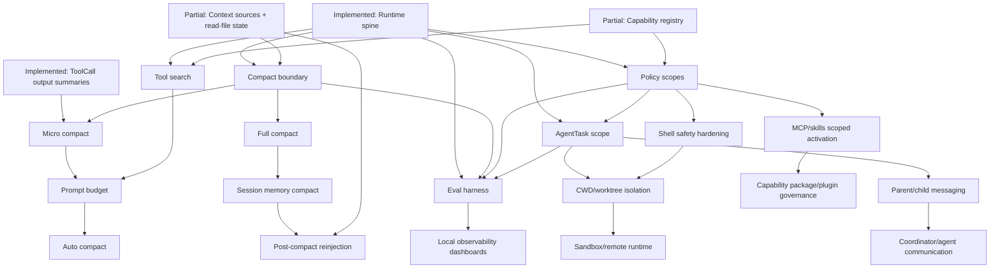

# Claude Code Runtime Parity Audit

This audit compares the current Agent Builder runtime on `main` with the local
Claude Code source snapshot at:

```text
C:\Users\ytq\work\ai\myclaw\claude-code
```

The comparison intentionally excludes terminal product UI. Agent Builder should
borrow runtime semantics and execution primitives, not Claude Code's Ink
components, keybindings, slash-command UI, terminal layout, CLI argument UX, or
Anthropic subscription/product surfaces.

Hard constraints for the next work remain unchanged:

- Do not modify `charm.land/fantasy`; it remains the provider/model/tool
  protocol abstraction.
- Go runtime is the source of truth for sessions, turns, tools, permissions,
  capabilities, events, audit, recovery, tasks, and context.
- React is a thin client surface. It must not become the business state source.
- Wails and HTTP are adapters, not business boundaries.
- Do not restore TUI/CLI as the main product path.
- Model-assisted permission can only be advisory. It must never let the model
  approve its own high-risk tool use.

## Inputs Checked

Agent Builder documents:

- `AGENTS.md`
- `docs/claude-code-alignment-module-priority.md`
- `docs/claude-code-alignment-next-roadmap.md`
- `docs/client-runtime-architecture-review.md`
- `docs/archive/crush-claude-code-gap-analysis.md`
- `docs/archive/reference-analysis/claude-code.md`
- `docs/archive/reference-analysis/comparison.md`
- `docs/tool-scheduler-design.md`
- `docs/permission-policy-model.md`
- `docs/turn-task-run-model.md`
- `docs/client-state-recovery.md`
- `docs/archive/phase-2-runtime-api-boundary.md`

Agent Builder code:

- `internal/runtime/*`
- `internal/agent/*`
- `internal/agent/tools/*`
- `internal/tools/scheduler/*`
- `internal/permission/*`
- `internal/skills/*`
- `internal/agent/tools/mcp/*`
- `internal/hooks/*`
- `internal/session/*`
- `internal/message/*`
- `internal/db/*`
- `client/src/runtime/*`
- `client/src/features/*`

Claude Code runtime reference:

- `C:\Users\ytq\work\ai\myclaw\claude-code\src\QueryEngine.ts`
- `C:\Users\ytq\work\ai\myclaw\claude-code\src\query.ts`
- `C:\Users\ytq\work\ai\myclaw\claude-code\src\Tool.ts`
- `C:\Users\ytq\work\ai\myclaw\claude-code\src\tools.ts`
- `C:\Users\ytq\work\ai\myclaw\claude-code\src\tools\*`
- `C:\Users\ytq\work\ai\myclaw\claude-code\src\tools\AgentTool\*`
- `C:\Users\ytq\work\ai\myclaw\claude-code\src\tools\BashTool\*`
- `C:\Users\ytq\work\ai\myclaw\claude-code\src\tools\PowerShellTool\*`
- `C:\Users\ytq\work\ai\myclaw\claude-code\src\services\compact\*`
- `C:\Users\ytq\work\ai\myclaw\claude-code\src\context.ts`
- `C:\Users\ytq\work\ai\myclaw\claude-code\src\utils\claudemd.ts`
- `C:\Users\ytq\work\ai\myclaw\claude-code\src\memdir\*`
- `C:\Users\ytq\work\ai\myclaw\claude-code\src\utils\permissions\*`
- `C:\Users\ytq\work\ai\myclaw\claude-code\src\services\mcp\*`
- `C:\Users\ytq\work\ai\myclaw\claude-code\src\skills\*`
- `C:\Users\ytq\work\ai\myclaw\claude-code\src\utils\plugins\*`
- `C:\Users\ytq\work\ai\myclaw\claude-code\src\tasks\*`
- `C:\Users\ytq\work\ai\myclaw\claude-code\src\utils\worktree.ts`
- `C:\Users\ytq\work\ai\myclaw\claude-code\src\utils\sandbox\*`
- `C:\Users\ytq\work\ai\myclaw\claude-code\src\services\analytics\*`
- `C:\Users\ytq\work\ai\myclaw\claude-code\docs\*`

## Current Agent Builder Runtime Capabilities

The current baseline is materially ahead of the older roadmap. Several items
previously marked "next" are now implemented as foundations or partial
runtime contracts.

| Capability | Status | Evidence | Remaining work |
| --- | --- | --- | --- |
| Durable turns | Implemented foundation | `internal/runtime/runtime_turns.go`, `runtime_turn_store.go`, `runtime_http.go`, `client/src/runtime/types.ts` | Resume is still interrupt/mark rather than full continuation. |
| Durable tool calls | Implemented foundation | `internal/tools/scheduler/*`, `internal/agent/scheduler_tool.go`, `internal/runtime/runtime_tool_call_store.go`, `runtime_scheduler_recorder.go` | Tool search, deadlock avoidance, richer output refs, and per-tool concurrency policy are missing. |
| Event cursor and recovery | Implemented foundation | `internal/runtime/runtime_events.go`, `runtime_sse.go`, `runtime_recovery.go`, `client/src/runtime/useRuntimeEventSubscription.ts` | Event replay is in-memory bounded; long-term event persistence/debug replay is missing. |
| Runtime audit | Implemented foundation | `internal/runtime/runtime_audit.go`, `runtime_audit_writer.go`, `runtime_audit_test.go` | Needs scenario-level queries, eval export, and local metrics aggregation. |
| Permission policy | Partial | `internal/permission/policy.go`, `internal/runtime/runtime_policy.go`, `runtime_permission_store.go` | Deterministic baseline exists; scoped rules, adaptive advisor boundary, richer shell parsing, headless profiles, and capability/task scopes remain. |
| Plan mode | Partial | `PolicyModePlan` in `internal/permission/policy.go`; `/v1/policy` API | It blocks non-read tool calls through policy, but plan/todo workflow, exit-plan approval, and model-visible mode transitions are not complete. |
| Shell/background jobs | Partial | `internal/agent/tools/bash.go`, `job_output.go`, `job_kill.go`, shell metadata in `RuntimeToolCall`, migration `20260524000000_add_shell_job_tool_call_metadata.sql` | Deep Bash/PowerShell parsing, per-command rules, sandbox routing, and durable background job model remain. |
| AgentTask/subagent persistence | Partial | `internal/runtime/runtime_agent_tasks.go`, `runtime_agent_task_store.go`, `internal/agent/agent_tool.go` | Task entity and events exist; role definitions, scoped tools/model/cwd enforcement, agent-to-agent messaging, resume, and artifacts remain partial. |
| Context source audit | Partial | `internal/agent/prompt/prompt.go`, `internal/runtime/runtime_context.go`, `runtime_context_test.go` | Layered AGENTS/CLAUDE/context source tracking exists; include/frontmatter, read-file reinjection, prompt budget, and compact lifecycle are missing. |
| Skills | Partial | `internal/skills/*`, `internal/runtime/runtime_skills.go`, `runtime_skill_activation.go`, `client/src/features/skills/*` | Allowed tools metadata is preserved as hints, but does not enforce scoped permissions. Activation is still broad prompt inclusion rather than precise selection. |
| MCP | Partial | `internal/agent/tools/mcp/*`, `internal/runtime/runtime_mcp*.go`, `client/src/features/mcp/*` | Server/tool/resource/prompt APIs exist; OAuth/elicitation, lazy lifecycle hardening, resource prompt audit, and policy scopes remain. |
| Capability registry/lazy loading | Partial | `internal/runtime/runtime_capabilities.go`, `client/src/features/capabilities/*` | States and refresh events exist; startup is not fully metadata-only, and executable lazy activation is not consistently enforced. |
| React/runtime boundary | Partial | `client/src/runtime/*`, `client/src/features/chat/TimelineItems.tsx`, `features/audit`, `features/permissions` | React consumes runtime DTOs, but richer task panels, policy diagnostics, replay/debug views, and compact/timeline UX remain. |
| Model/provider config over fantasy | Partial | `internal/runtime/runtime_model*.go`, `client/src/features/settings/ModelSettingsDrawer.tsx` | Keep on fantasy. Need capability/health diagnostics and policy-aware model selection. |
| Observability/evals | Partial | Runtime audit/events/tests | No dedicated eval harness, policy regression pack, or tool/capability scenario suite yet. |

## Claude Code Runtime Module Map

Only runtime-relevant modules are targets for Agent Builder. Paths below are
local source references from the checked snapshot.

| Runtime area | Claude Code modules | Runtime semantics to borrow |
| --- | --- | --- |
| Query engine and turn loop | `src\QueryEngine.ts`, `src\query.ts` | One conversation engine, per-submit turn lifecycle, abort handling, permission denials, compact boundaries, SDK/headless event projection. |
| Tool protocol | `src\Tool.ts`, `src\tools.ts`, `src\services\tools\toolExecution.ts`, `toolOrchestration.ts`, `StreamingToolExecutor.ts` | Tool use context, permission context, validation, progress, result shaping, MCP passthrough metadata, large-output normalization. |
| Tool search/discovery | `src\tools\ToolSearchTool\*`, `src\utils\toolSearch.ts`, tool `userFacingName`/capability metadata in `Tool.ts` | Keep huge tool surfaces out of initial prompt, discover tools on demand, avoid context bloat. |
| Permissions/policy | `src\utils\permissions\*`, `src\tools\EnterPlanModeTool\*`, `src\tools\ExitPlanModeTool\*` | Mode-aware policy, rules by source, dangerous-rule detection, plan mode, auto/adaptive classifier, denial tracking. |
| Shell safety | `src\tools\BashTool\*`, `src\tools\PowerShellTool\*`, `src\utils\sandbox\*` | Bash/PowerShell parsing, read-only validation, command semantics, destructive warnings, sandbox decision, path validation. |
| Context/memory | `src\context.ts`, `src\utils\claudemd.ts`, `src\memdir\*` | Managed/user/project/local instructions, CLAUDE.md and rules discovery, include handling, frontmatter globs, memory taxonomy, read-file state. |
| Compact | `src\services\compact\microCompact.ts`, `compact.ts`, `autoCompact.ts`, `sessionMemoryCompact.ts`, `postCompactCleanup.ts`, `apiMicrocompact.ts` | Micro compact, full compact, session-memory compact, auto trigger thresholds, post-compact reinjection, compact boundary metadata. |
| Subagents/tasks | `src\tools\AgentTool\*`, `src\tasks\*`, `src\hooks\useTasksV2.ts`, `src\tools\Task*Tool\*` | Agent roles, background agents, task list/get/update/stop/output, progress, resume, task notifications, parent/child transcripts. |
| Agent communication/coordinator | `src\coordinator\coordinatorMode.ts`, `src\tools\SendMessageTool\*`, `src\tasks\InProcessTeammateTask\*`, `docs\20-coordinator-swarm-and-teammate-collaboration.md` | Parent/child and teammate messaging, coordinator mode, shared task state, agent-to-agent communication. |
| Isolation | `src\utils\worktree.ts`, `src\tools\EnterWorktreeTool\*`, `src\tools\ExitWorktreeTool\*`, `src\utils\sandbox\*` | Separate cwd override, git worktree, sandbox, remote execution, cleanup/preserve rules. |
| MCP lifecycle | `src\services\mcp\*`, `src\tools\MCPTool\*`, `ListMcpResourcesTool`, `ReadMcpResourceTool`, `McpAuthTool` | Multi-transport MCP clients, OAuth/auth, resources/prompts/tools, large-result storage, elicitation, connection manager. |
| Skills/plugins | `src\skills\*`, `src\utils\plugins\*` | Skills with allowed tools/model/hooks/paths metadata; broad plugin package governance. Marketplace is not first for Agent Builder. |
| Observability/evals | `src\services\analytics\*`, `src\services\vcr.ts`, `docs\32-harness-and-eval-runtime.md`, `docs\45-telemetry-and-reporting-rules-audit.md` | Local structured metrics discipline, event redaction, scenario harness, VCR/eval runtime. |
| Client runtime boundary | `src\cli\structuredIO.ts`, `src\bridge\*`, `src\remote\*`, `src\components\messages\*` | Machine-readable events and control messages. UI rendering is not the protocol. |

## Explicit Exclusions

Not needed in Agent Builder roadmap:

- Terminal UI / Ink components: `src\components\*`, `src\screens\REPL.tsx`,
  `src\ink\*`, except where they document runtime DTO expectations.
- Keybindings, Vim state, terminal input layout: `src\vim\*`,
  `src\hooks\useGlobalKeybindings.tsx`, terminal input hooks.
- Slash command UI and CLI argument UX: `src\commands\*` as UI flows. Their
  runtime effect may inform APIs, but not the command surface.
- Subscription, pass, Claude.ai OAuth, Anthropic growth/product UI,
  provider-specific launch messaging, ant-only first-party telemetry and
  GrowthBook rollout semantics.
- Marketplace-first plugin distribution. Agent Builder should start with local
  capability registry/package governance, then managed/signed packages later.
- A global bootstrap singleton as product architecture. Agent Builder's Go
  service + SQLite runtime ownership is a better fit.

## Gap Matrix

Legend:

- Implemented: adequate foundation exists in Agent Builder runtime.
- Partial: implemented surface exists, but important Claude Code semantics are
  absent or not enforced.
- Missing: no meaningful runtime contract yet.
- Not needed: intentionally excluded.

| Area | Status | Evidence | Gap / decision |
| --- | --- | --- | --- |
| Turn orchestration | Implemented | `runtime_turns.go`, `runtime_turn_store.go`, `/v1/turns` | Continue hardening resume/replay. |
| Coordinator model | Partial | `internal/agent/coordinator.go`, backend session coordinator | Single-session coordination exists; multi-agent coordinator semantics are missing. |
| Agent communication | Missing | No equivalent to `SendMessageTool` or teammate mailbox | Needed after AgentTask scope. |
| Parent/child messaging | Partial | Child sessions and `RuntimeAgentTask.ChildSessionID` | No structured parent/child message channel or artifact return contract. |
| Task/subagent lifecycle | Partial | `runtime_agent_tasks.go`, `runtime_agent_task_store.go` | Add role definitions, scoped tools, resume, outputs, task notifications. |
| Cancellation/resume/recovery | Partial | Turn cancel, task cancel, recovery status | Resume means mark interrupted; full continuation is missing. |
| Tool registry | Implemented foundation | `internal/agent/tools/tools.go`, `runtime_capabilities.go` | Need stable metadata for every tool and source. |
| Tool lazy loading | Partial | Capability states and refresh | Not fully metadata-only; executable activation not uniformly lazy. |
| Tool search/discovery | Missing | No ToolSearch equivalent | High priority to reduce prompt/tool bloat before plugin expansion. |
| Deadlock avoidance | Partial | Context blocking safeguards are minimal; scheduler wraps tool calls | Missing explicit max turn/tool recursion, compact deadlock avoidance, agent recursion/concurrency rules. |
| Concurrency limits | Partial | Agent/tool execution has existing runtime behavior | Needs explicit scheduler policy and per-source limits. |
| Tool result normalization | Partial | `RuntimeToolCall` has model/structured/stdout/stderr | Needs output refs for large content, diffs, artifacts, binary/media refs. |
| Large output handling | Partial | Preview/truncation exists | Missing durable output storage and model-visible vs UI-visible refs. |
| Tool progress/events/audit | Implemented foundation | `tool.call.*`, `task.progress`, audit writer | Good baseline. Add richer query/replay. |
| Tool permission hooks | Partial | Hooks and permission service exist | Need unified hook result schema, policy precedence, and audit by source. |
| Deterministic policy | Partial | `internal/permission/policy.go` | Baseline modes exist; scoped rules not implemented. |
| Mode-aware policy | Partial | ask/auto_read/plan/deny_all | Add trusted/headless profiles, task/agent/capability scopes. |
| Model-assisted advisor | Missing | No advisor layer | Future only. Advisory signal cannot approve actions. |
| Plan mode | Partial | policy mode blocks non-read | Need enter/exit lifecycle, plan approval, todos as runtime state. |
| Shell safety | Partial | Regex destructive classifier | Need Bash/PowerShell parsers and command/path/resource rules. |
| MCP/skills/subagent scoping | Partial | Metadata exists | Not yet enforced as policy scopes. |
| Headless behavior | Partial | Ask fails closed when permission service unavailable | Needs explicit headless profile and API semantics. |
| Layered instructions | Partial | managed/user/project/local context kinds | Need include/frontmatter and precedence docs/tests around AGENTS/CLAUDE/rules. |
| AGENTS/CLAUDE/rules loading | Partial | `config.go`, `prompt.LoadContextSources` | AGENTS/CLAUDE basic path support exists; full Claude Code CLAUDE.md semantics missing. |
| Read-file state | Partial | `read_files` table and filetracker exist | Not integrated into compact/reinjection and context audit. |
| Prompt budget | Missing | Token estimates on context sources only | Need prompt budget service and enforcement. |
| Micro compact | Missing | No runtime compact module | High priority. |
| Full compact | Missing | No compact boundary model | High priority after compact metadata. |
| Session memory compact | Missing | No session memory compact | Later compact phase. |
| Auto compact trigger | Missing | No threshold-driven lifecycle | Later compact phase. |
| Post-compact reinjection | Missing | No reinjection path | Depends on read-file state and context source audit. |
| Context source audit | Partial | `runtime_context.go`, audit summary | Good foundation; needs compact/source replay. |
| Skill activation | Partial | activation metadata and turn summary | Activation is broad; no dynamic selection or scoped permission. |
| Allowed tools metadata | Partial | `RuntimeSkill.AllowedTools` | Preserved only; does not expand or restrict runtime permissions. |
| MCP lifecycle | Partial | server/tool/resource/prompt APIs | Needs auth/elicitation, connection lifecycle audit, lazy startup. |
| Capability registry/package | Partial | capability DTOs/states | Package/plugin governance missing. |
| Plugin governance | Missing | No package manifest/trust policy | Build after registry + policy scopes; marketplace excluded. |
| Hooks integration | Partial | `internal/hooks/*` | Needs runtime hook lifecycle/events/audit in scheduler path. |
| AgentTask persistence | Partial | Store/API/events exist | Great foundation; not yet full Claude Code task system. |
| Background shell tasks | Partial | shell job metadata and task.progress event | Needs durable job entity and output refs. |
| Task notifications | Missing | No notification runtime contract | Needed for background work panels. |
| Agent roles/definitions | Missing | Agent tool exists but no managed registry | Add role definitions before teams. |
| Allowed tools/model/cwd/worktree scope | Partial | fields exist on `RuntimeAgentTask` | Not enforced consistently. |
| Result/artifact handling | Partial | `ArtifactRefs` field | No durable artifact store/refs. |
| CWD override | Partial | task fields and shell cwd support | Needs policy/audit and UI. |
| Worktree isolation | Missing | No Agent Builder worktree runtime | Borrow semantics, not Claude Code product UI. |
| Sandbox | Missing | No OS/process sandbox runtime | Later, after shell policy and task scope. |
| Remote runtime | Missing | No remote runtime | Later; not blocking local-first parity. |
| Network/secret boundary | Partial | redaction and MCP config handling | Need policy/resource boundaries and tests. |
| Structured audit | Implemented foundation | `runtime_audit_events` | Needs scenario/eval export. |
| Telemetry local-first | Partial | local audit/events | Do not import first-party analytics; add local metrics snapshots. |
| Eval harness | Missing | No dedicated runtime eval harness | High priority after compact/policy scenarios. |
| Policy regression tests | Partial | unit tests exist | Need scenario fixtures across shell/MCP/skills/tasks. |
| Tool/capability scenario tests | Partial | runtime service tests | Add golden scenario harness. |
| Event replay/debuggability | Partial | cursor and audit | Needs persisted event log or replay export. |
| Timeline/tool cards | Partial | `TimelineItems.tsx` | Rich details exist, but compact/task/replay views missing. |
| Permission UI | Partial | modal and timeline item | Uses runtime shape; needs policy rule editor/diagnostics. |
| Task panels | Partial | timeline task item | Dedicated panels and notifications missing. |
| Audit diagnostics | Partial | audit drawer exists | Need searchable/debuggable audit and scenario export. |
| Recovery from API | Implemented foundation | `getRecoveryStatus`, startup loading | Continue reducing polling assumptions. |
| React as source of truth | Not needed | Architecture explicitly forbids | Keep this exclusion. |
| TUI/CLI main path | Not needed | Product direction excludes | Do not restore. |

## High-Priority Remaining Gaps

1. Compact lifecycle is the largest missing runtime primitive.
   Claude Code splits this into micro compact, full compact, session memory
   compact, auto compact trigger, and post-compact reinjection. Agent Builder
   currently has context source audit and read-file storage, but no compact
   boundary, summary, or reinjection runtime.

2. Tool search and prompt/tool budget governance are missing.
   Claude Code uses `ToolSearchTool` and tool metadata to avoid exposing every
   tool to every turn. Agent Builder has capability inventory and refresh, but
   no model-facing discovery workflow or prompt budget enforcement.

3. Agent coordinator and communication are still shallow.
   AgentTask persistence now exists, but Claude Code has richer AgentTool,
   task tools, parent/child messaging, teammate communication, and task
   notifications. Agent Builder needs scoped agent roles before adding teams.

4. Permission policy needs scoped rules and shell safety.
   The deterministic baseline is real, including plan mode. The next gap is
   not "add policy"; it is "add policy scopes": tool, MCP server, skill,
   subagent, cwd, command prefix/regex, headless profile, and audit. Model
   assistance can only summarize/advice.

5. Isolation semantics are missing.
   Claude Code keeps cwd override, worktree, sandbox, and remote runtime
   separate. Agent Builder has fields and audit slots but no worktree or
   sandbox runtime. Do not collapse these into one boolean.

6. Observability needs scenario/eval harnesses.
   Runtime audit and events are solid foundations. The missing layer is
   repeatable local scenarios: policy regression, shell safety, MCP lifecycle,
   skill activation, compact, subagent/task, and recovery replay.

## Reordered Roadmap

| Priority | Module | Status | Dependencies |
| --- | --- | --- | --- |
| P0 | Runtime spine: Turn, ToolCall, Event, Audit, Recovery | Implemented foundation | Keep stable |
| P0 | Deterministic PermissionPolicy baseline | Partial foundation | Existing scheduler/audit |
| P0 | Capability registry states and refresh | Partial foundation | Existing policy baseline |
| P1 | Compact lifecycle foundation | Next | Context source audit, read-file state, audit |
| P1 | Tool search and prompt/tool budget | Next | Capability registry, policy scopes |
| P1 | Policy scopes and shell safety hardening | Next | Permission baseline, scheduler |
| P1 | AgentTask scope, role definitions, parent/child messaging | Next | AgentTask store, policy scopes |
| P2 | MCP/skills activation enforcement | After scopes | Capability registry, policy scopes |
| P2 | Durable background job entity and output/artifact refs | After scheduler hardening | ToolCall store, task store |
| P2 | Worktree isolation | After AgentTask + policy scopes | Task cwd/worktree fields |
| P2 | React runtime panels for compact/task/policy diagnostics | After APIs | Runtime-only DTOs |
| P3 | Sandbox and remote runtime | Later | Shell policy, isolation API |
| P3 | Plugin/capability package governance | Later | Registry, scopes, signed/local package model |
| P3 | Observability/eval harness | Parallel after scenarios stabilize | Event/audit schema |

## Recommended Next Implementation Batch

1. `runtime: add compact boundary model`
   - Add compact boundary records/events/audit without changing model loop
     behavior yet.
   - Define micro/full/session-memory/auto compact DTOs and event names.

2. `runtime: implement micro compact for tool outputs`
   - Start with deterministic pruning/replacement of old tool outputs.
   - Preserve tool-use/tool-result invariants and write compact audit.

3. `runtime: add tool search metadata and budget`
   - Add model-facing tool discovery capability using existing capability
     registry metadata.
   - Gate tool search through policy and audit selected tools.

4. `runtime: add scoped policy rules`
   - Add deterministic rule matching for tool, MCP server/tool, skill,
     subagent, cwd, and shell command prefix/regex.
   - Keep model-assisted permission as a future advisory-only extension.

5. `runtime: harden AgentTask scope and communication`
   - Enforce allowed tools/model/cwd on child tasks.
   - Add parent/child message/result protocol and artifact refs.

6. `runtime: add policy/tool scenario harness`
   - Golden tests for plan mode, shell denial, MCP disabled/refresh, skill
     allowed_tools hints, agent task cancellation, event cursor, and audit.

## Module Dependencies

| Module | Depends on | Enables |
| --- | --- | --- |
| Compact boundary | Turn/message/audit/context source summaries | Micro/full/session compact, replay/debug |
| Micro compact | Compact boundary, ToolCall output normalization | Prompt budget, long-running sessions |
| Full compact | Compact boundary, model summary path, context source audit | Auto compact, session recovery with summaries |
| Session memory compact | Full compact, read-file state, session memory store | Better resume and long-running work |
| Auto compact | Prompt budget, compact failure policy | Reliable autonomous turns |
| Post-compact reinjection | Read-file state, context sources, compact boundary | Prevent loss of files/instructions after compact |
| Tool search | Capability registry, tool metadata, policy scopes | Lazy tool exposure and reduced prompt bloat |
| Scoped policy | Permission baseline, scheduler, capability IDs | MCP/skills/subagent enforcement, shell hardening |
| AgentTask roles | Task store, scoped policy | Subagent registry, communication, worktree |
| Parent/child messaging | AgentTask roles, session links | Coordinator/teammate workflows |
| Worktree isolation | AgentTask roles, cwd policy, shell safety | Safer high-risk implementation tasks |
| Plugin package | Capability registry, scoped policy, skills/MCP lifecycle | Local/managed plugin governance |
| Eval harness | Stable events/audit, policy scenarios | Regression safety before broadening runtime |

## Dependency Graph



## Commit-by-Commit Phase Suggestions

Recommended future implementation sequence:

1. `runtime: record compact boundaries`
   - Add compact boundary DTO/store/events/audit.
   - Add API read path and no-op boundary tests.

2. `runtime: add micro compact output replacement`
   - Replace old high-cost tool outputs with compact refs/summaries.
   - Preserve model protocol invariants.

3. `runtime: add prompt budget accounting`
   - Count context sources, tool schemas, messages, and tool results.
   - Emit budget diagnostics into audit.

4. `runtime: expose tool search metadata`
   - Add searchable tool/capability descriptions and selection audit.

5. `runtime: enforce scoped policy rules`
   - Add rule model and deterministic matcher.
   - Cover tool, MCP, skill, subagent, cwd, and shell prefix/regex.

6. `runtime: harden shell policy`
   - Replace regex-only classifier with structured command parsing where
     practical, starting with high-risk destructive/read-only checks.

7. `runtime: enforce agent task scopes`
   - Apply allowed tools/model/cwd/capability scope on child sessions.

8. `runtime: add parent child agent messaging`
   - Add structured task result, progress, artifact, and parent notification
     channel.

9. `runtime: add compact auto trigger`
   - Add threshold policy, failure circuit breaker, and post-compact
     reinjection.

10. `runtime: add scenario eval harness`
    - Golden local fixtures for policy, compact, MCP, skills, AgentTask,
      recovery, and audit replay.

11. `runtime: add worktree isolation`
    - Keep cwd override, worktree, sandbox, and remote as separate runtime
      fields and policies.

12. `runtime: add local capability package governance`
    - No marketplace. Start with local/managed package manifest, trust state,
      enable/disable, and audit.

## Product-Coupled Claude Code Modules Not Entering Roadmap

Claude Code modules with product or Anthropic-specific coupling should not be
ported:

- GrowthBook rollout logic and first-party analytics sinks under
  `src\services\analytics\*`.
- Claude.ai OAuth, passes, subscription, product notices, ant-only branches,
  model launch messaging, and first-party provider restrictions.
- Terminal REPL rendering, keybinding/vim hooks, and Ink layout components.
- Slash command UI as a user interaction model.
- Marketplace-first plugin browsing/installation.

Use these modules only as evidence of runtime requirements: redaction,
metadata discipline, policy regression, extension lifecycle, and machine
readable events.

## Overall Parity Conclusion

Agent Builder now has a credible runtime spine: durable turns, tool calls,
permissions, event cursor, audit, recovery, capability inventory, context
sources, policy baseline, and AgentTask persistence are all present as Go
runtime contracts.

The largest parity gap is no longer the basic runtime boundary. The largest
gap is long-session governance: compact, prompt budget, tool search,
scoped policy, agent communication, isolation, and eval-driven regression
coverage. Those should be the next roadmap center.
