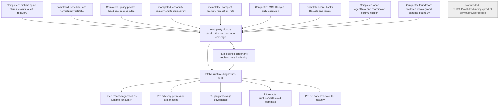

# Claude Code Runtime Parity Closure Review

Date: 2026-05-27

Agent Builder baseline: `d51590b76a680e683b9d5335797c7076c16a5b05`

Claude Code comparison source: `C:\Users\ytq\work\ai\myclaw\claude-code`

This is the current authority for Claude Code runtime functional and semantic
parity. Older audit and roadmap documents are historical background only where
they disagree with this review.

## Fixed Scope

- Go runtime is the source of truth for sessions, turns, tools, permissions,
  policy, context, compact, AgentTask, worktrees, sandbox decisions, hooks, MCP,
  audit, replay, and recovery.
- React is display, input, diagnostics, and product workflow only.
- Wails and HTTP are adapters, not business boundaries.
- `charm.land/fantasy` remains the provider/model/tool protocol abstraction.
- Provider/model configuration belongs above fantasy as product policy and
  configuration, not as a second provider abstraction.
- Model-assisted permission advice can only be advisory and cannot approve its
  own high-risk tool use.
- Coordinator and agent communication must be owned by runtime state and
  durable events, not stitched together by React.
- Remote runtime, remote teammate, SSH, cloud execution, marketplace-first
  distribution, Anthropic product growth surfaces, TUI/CLI paths, terminal UI,
  Ink layout, keybindings, Vim input, slash command UI, CLI argument UX,
  Claude.ai login surfaces, GrowthBook, Datadog, and first-party telemetry sinks
  are excluded from current core parity.

## Evidence Read

Agent Builder docs read as historical inputs:

- `AGENTS.md`
- `docs/claude-code-full-parity-review.md`
- `docs/claude-code-runtime-parity-audit.md`
- `docs/claude-code-alignment-next-roadmap.md`
- `docs/claude-code-next-implementation-plan.md`
- `docs/claude-code-alignment-module-priority.md`
- `docs/client-runtime-architecture-review.md`
- `docs/turn-task-run-model.md`
- `docs/tool-scheduler-design.md`
- `docs/permission-policy-model.md`
- `docs/frontend-runtime-ui-technical-plan.md`
- `docs/archive/phase-2-runtime-api-boundary.md`
- `docs/client-architecture-and-core-flow.md`

Agent Builder code sampled across the required modules:

- `internal/runtime/`
- `internal/runtimeapi/`
- `internal/workbench/`
- `internal/session/`
- `internal/message/`
- `internal/db/`
- `internal/db/migrations/`
- `internal/agent/`
- `internal/agent/prompt/`
- `internal/agent/tools/`
- `internal/agent/tools/mcp/`
- `internal/tools/scheduler/`
- `internal/permission/`
- `internal/hooks/`
- `internal/skills/`
- `client/src/runtime/`
- `client/src/features/`
- `desktop/`

Claude Code code sampled across the requested runtime references:

- `src/QueryEngine.ts`
- `src/query.ts`
- `src/context.ts`
- `src/utils/claudemd.ts`
- `src/memdir/`
- `src/services/compact/`
- `src/Tool.ts`
- `src/tools.ts`
- `src/services/tools/`
- `src/tools/`
- `src/tools/ToolSearchTool/`
- `src/tools/BashTool/`
- `src/tools/PowerShellTool/`
- `src/utils/permissions/`
- `src/hooks/toolPermission/`
- `src/utils/hooks/`
- `src/types/hooks.ts`
- `src/schemas/hooks.ts`
- `src/tools/MCPTool/`
- `src/tools/ListMcpResourcesTool/`
- `src/tools/ReadMcpResourceTool/`
- `src/services/mcp/`
- `src/skills/`
- `src/utils/plugins/`
- `src/tools/AgentTool/`
- `src/tools/TaskCreateTool/`
- `src/tools/TaskGetTool/`
- `src/tools/TaskListTool/`
- `src/tools/TaskUpdateTool/`
- `src/tools/TaskStopTool/`
- `src/tools/TaskOutputTool/`
- `src/tools/SendMessageTool/`
- `src/tasks/`
- `src/coordinator/`
- `src/utils/worktree.ts`
- `src/utils/sandbox/`
- `src/services/vcr.ts`
- `src/services/analytics/`
- `C:\Users\ytq\work\ai\myclaw\claude-code\docs\20-coordinator-swarm-and-teammate-collaboration.md`
- `C:\Users\ytq\work\ai\myclaw\claude-code\docs\32-harness-and-eval-runtime.md`
- `C:\Users\ytq\work\ai\myclaw\claude-code\docs\45-telemetry-and-reporting-rules-audit.md`

## Executive Judgment

| Scope | Current judgment | Basis |
| --- | --- | --- |
| Single main-agent core runtime | 92 percent complete | Turn lifecycle, scheduler, normalized tool calls, permissions, policy profiles, compact/reinjection, persisted replay, context/read-file state, MCP lifecycle, hooks, worktree/sandbox decisions, refs, recovery, HTTP/Wails contracts, and scenario tests exist. Remaining work is fixture breadth, shell parser hardening, and continuation edge cases. |
| Local multi-agent, AgentTask, coordinator runtime | 84 percent complete | Local task roles, scope, model-facing task tools, parent-child messages, follow-up delivery to child sessions, stop/cancel, output/artifact/compact refs, replay, recovery, worktree/cwd scope, and rejection semantics exist. Remaining work is scenario coverage and product diagnostics. Remote teammate/fleet/cloud is P3 and not a blocker. |
| Core Claude Code runtime parity excluding TUI/CLI/remote/product surfaces | 87 percent complete | The core local runtime primitives now exist in Go. Remaining gaps are hardening and coverage: shell parser parity, hook event breadth, plugin governance, advanced memory taxonomy, sandbox executor maturity, and stable diagnostics APIs. |

Current core runtime blocker status: no core runtime blocker remains for the
local desktop runtime parity scope. The project can enter runtime closure and
stabilization. The next step is not to keep adding arbitrary Claude Code
surfaces. It is to prove the current primitives with parity closure scenarios,
fixtures, docs consistency, and stable runtime diagnostics APIs before React
diagnostics deepen.

## Current Capability Matrix

| Module | Claude Code functional semantics | Agent Builder current status | Agent Builder code evidence path | Claude Code comparison path | Remaining gap | Risk or impact | Core runtime blocker? |
| --- | --- | --- | --- | --- | --- | --- | --- |
| Query engine / turn lifecycle | Owns turn execution, aborts, permission denials, context loading, compact boundary acknowledgement, headless projections, and structured output. | Completed | `internal/runtime/runtime_turns.go`; `internal/runtime/runtime_turn_store.go`; `internal/runtime/runtime_lifecycle.go`; `internal/agent/agent.go`; `internal/runtimeapi/contract.go` | `src/QueryEngine.ts`; `src/query.ts` | Full continuation after some interruption cases and richer headless projections remain hardening. | Incorrect resume or diagnostics gaps after interruption. | No |
| Session lifecycle / cancellation / interruption / recovery | Interrupts active execution, resumes from stored session messages, handles aborts and orphaned permission state. | Completed | `internal/runtime/runtime_lifecycle.go`; `internal/runtime/runtime_recovery.go`; `internal/runtime/runtime_turns.go`; `internal/session/`; `internal/message/` | `src/QueryEngine.ts`; `src/query.ts` | Broader recovery fixtures across tasks, hooks, MCP requests, and compact refs. | Weak evidence for rare restart combinations. | No |
| Tool protocol / scheduler / structured output normalization | Tools expose schema, permission behavior, progress/result semantics, UI/model output boundaries, and scheduler coordination. | Completed | `internal/tools/scheduler/`; `internal/agent/scheduler_tool.go`; `internal/runtime/runtime_scheduler_recorder.go`; `internal/runtime/runtime_tool_call_store.go`; `internal/db/migrations/20260523001000_add_runtime_tool_call_normalized_output.sql` | `src/Tool.ts`; `src/tools.ts`; `src/services/tools/`; `src/tools/` | More fixtures for model-visible versus diagnostics-visible output. | Output leakage or weak replay explanation if not covered. | No |
| Tool discovery / search / recursive guardrails / deadlock avoidance | Claude defers large tool surfaces and lets the model search/select tools while preventing loops and permission leaks. | Completed | `internal/agent/tool_search.go`; `internal/runtime/runtime_tool_search.go`; `internal/runtime/runtime_scenario_harness_test.go`; `internal/runtime/runtime_capabilities.go` | `src/tools/ToolSearchTool/`; `src/utils/toolSearch.ts`; `src/tools.ts` | Per-source recursion and concurrency fixture breadth. | Over-disclosure, under-disclosure, or repeated search loops. | No |
| Compact / context budget / micro compact / full compact / reinjection | Tracks context pressure, micro compacts tool outputs, performs full compact, records boundary messages, and reinjects required context. | Completed | `internal/runtime/runtime_compact.go`; `internal/runtime/runtime_compact_store.go`; `internal/runtime/runtime_budget.go`; `internal/runtime/runtime_context.go`; `internal/db/migrations/20260524020000_add_runtime_compact_boundaries.sql` | `src/services/compact/`; `src/query.ts`; `src/QueryEngine.ts` | More scenario fixtures around multiple compact boundaries and recovery. | Context loss or duplicate reinjection after restart. | No |
| Context / memory / CLAUDE.md / AGENTS / read-file state | Loads system/user context, layered memory files, read-file state, and context cache for prompt construction. | Partial | `internal/agent/prompt/prompt.go`; `internal/agent/prompt/context_sources_test.go`; `internal/runtime/runtime_context.go`; `internal/db/read_files.sql.go`; `internal/db/migrations/20260526000000_harden_read_file_state.sql` | `src/context.ts`; `src/utils/claudemd.ts`; `src/memdir/`; `src/QueryEngine.ts` | Agent Builder has AGENTS/CLAUDE/read-file/context-source hardening, but not full Claude Code memory taxonomy/session memory compact. | Advanced memory behavior differs, but core runtime prompt recovery is present. | No |
| Permission policy / profiles / plan/headless mode / scoped rules / shell safety | Deterministic policy modes, scoped allow/deny rules, shell risk classification, headless fail-closed behavior, and permission prompts. | Completed | `internal/permission/policy.go`; `internal/runtime/runtime_policy.go`; `internal/runtime/runtime_permissions.go`; `internal/runtime/runtime_permission_store.go`; `internal/runtime/runtime_scenario_harness_test.go` | `src/utils/permissions/`; `src/hooks/toolPermission/`; `src/tools/BashTool/`; `src/tools/PowerShellTool/` | Bash/PowerShell/cmd parser parity and more rule precedence fixtures. | False allow/deny on shell edge cases. | No |
| Model-assisted permission advisor | Claude has classifier/advisor style code for permissive modes and explanations. | Later | No runtime advisor package or approval path by design. | `src/utils/permissions/yoloClassifier.ts`; `src/utils/permissions/classifierDecision.ts`; `src/utils/permissions/permissionExplainer.ts` | Advisory explanations can be added later only after deterministic policy coverage. | Must not become model self-approval. | No |
| Hooks lifecycle / hook policy precedence / hook replay/recovery | Rich hook events can modify inputs, deny/halt, inject context, run permission hooks, session hooks, prompt hooks, file/worktree hooks, and plugin hooks. | Completed for local runtime core; Partial for Claude event breadth | `internal/hooks/`; `internal/agent/hooked_tool.go`; `internal/runtime/runtime_hooks.go`; `internal/runtime/runtime_hooks_test.go`; `internal/db/migrations/20260524100000_add_runtime_hook_executions.sql` | `src/types/hooks.ts`; `src/schemas/hooks.ts`; `src/utils/hooks/`; `src/hooks/toolPermission/` | Agent Builder covers PreToolUse, PostToolUse, and PostToolUseFailure runtime lifecycle. Claude events like UserPromptSubmit, SessionStart, PermissionRequest, Elicitation, FileChanged, and WorktreeCreate are later or not needed unless runtime workflows require them. | Hook event breadth and bypass fixtures need more coverage. | No |
| MCP lifecycle / resources / prompts / tools / auth / elicitation | Connects MCP servers, lists tools/resources/prompts, runs tools, handles auth and elicitation, and surfaces policy state. | Completed | `internal/runtime/runtime_mcp.go`; `internal/runtime/runtime_mcp_config.go`; `internal/runtime/runtime_mcp_requests.go`; `internal/runtime/runtime_mcp_request_store.go`; `internal/agent/tools/mcp/`; `internal/agent/tools/list_mcp_resources.go`; `internal/agent/tools/read_mcp_resource.go`; `internal/db/migrations/20260524080000_add_runtime_mcp_requests.sql` | `src/services/mcp/`; `src/tools/MCPTool/`; `src/tools/ListMcpResourcesTool/`; `src/tools/ReadMcpResourceTool/`; `src/components/mcp/ElicitationDialog.tsx` | Broader protocol fixtures and hosted/provider-specific behavior. | Auth/elicitation recovery edge cases. | No |
| Skills / allowed tools / activation / plugin metadata boundary | Loads skills, scopes instructions, supports allowed tool metadata, and integrates plugin/MCP skill sources. | Partial | `internal/skills/`; `internal/runtime/runtime_skills.go`; `internal/runtime/runtime_skill_activation.go`; `internal/runtime/runtime_capabilities.go` | `src/skills/`; `src/utils/plugins/`; `src/commands/skills/` | `allowed_tools` metadata is preserved but must not grant permissions. Plugin package governance is later. Marketplace-first distribution is not needed. | Capability trust and packaging are not closure blockers. | No |
| AgentTask / subagent roles / task tools | Spawns subagents, tracks roles, output, task status, follow-up, stop, and task list/get/update/output semantics. | Completed for local runtime | `internal/agent/agent_tool.go`; `internal/agent/task_tools.go`; `internal/agent/coordinator.go`; `internal/runtime/runtime_agent_tasks.go`; `internal/runtime/runtime_agent_task_tools.go`; `internal/runtime/runtime_agent_roles.go`; `internal/runtime/runtime_agent_task_scope.go`; `internal/runtime/runtime_agent_task_store.go` | `src/tools/AgentTool/`; `src/tools/TaskCreateTool/`; `src/tools/TaskGetTool/`; `src/tools/TaskListTool/`; `src/tools/TaskUpdateTool/`; `src/tools/TaskStopTool/`; `src/tools/TaskOutputTool/` | More scenario fixtures for ordering, stop races, and restart. | Local multi-agent confidence depends on coverage. | No |
| Parent-child messaging / coordinator-worker communication | Coordinator can send messages to named/background agents and consume task output. | Completed for local runtime | `internal/runtime/runtime_agent_tasks.go`; `internal/runtime/runtime_agent_task_comm_store.go`; `internal/runtime/runtime_agent_task_tools.go`; `internal/agent/task_tools.go`; `internal/agent/coordinator.go`; `internal/db/migrations/20260527000000_harden_agent_task_messages.sql` | `src/tools/SendMessageTool/`; `src/tools/AgentTool/`; `src/coordinator/`; `src/tasks/` | Remote teammate/fleet messaging is P3. More local mailbox scenario fixtures needed. | If untested, task control may regress under restart or cancellation. | No |
| Worktree / cwd isolation / sandbox | Creates isolated worktrees, validates paths, scopes child agents, records sandbox decisions, and can fail closed on risky shell. | Partial | `internal/runtime/runtime_worktrees.go`; `internal/runtime/runtime_worktree_store.go`; `internal/runtime/runtime_agent_task_scope.go`; `internal/runtime/runtime_sandbox.go`; `internal/runtime/runtime_sandbox_store.go`; `internal/db/migrations/20260524040000_add_runtime_worktrees.sql`; `internal/db/migrations/20260524090000_add_runtime_sandbox_decisions.sql` | `src/utils/worktree.ts`; `src/utils/sandbox/`; `src/tools/AgentTool/` | Runtime decision boundary and fail-closed semantics exist. OS-level sandbox executor maturity is later/hardening. | Without executor maturity, isolation relies on policy decisions and worktree/cwd scope. | No |
| Remote runtime | Claude Code includes remote agent and SSH/cloud product paths in some builds. | Later | No direct local runtime dependency found. | `src/tools/AgentTool/AgentTool.tsx`; `src/hooks/useRemoteSession.ts`; `src/hooks/useSSHSession.ts` | Treat as P3 product optimization unless a future local runtime dependency appears. | Not relevant to local closure. | No |
| Audit / durable events / replay / eval harness / local observability | Claude has VCR/test fixtures, analytics, and harness assumptions; runtime can replay/evaluate execution facts. | Completed | `internal/runtime/runtime_event_store.go`; `internal/runtime/runtime_replay_export.go`; `internal/runtime/runtime_audit.go`; `internal/runtime/runtime_audit_writer.go`; `internal/runtime/runtime_scenario_harness_test.go`; `internal/db/migrations/20260524050000_add_runtime_events.sql` | `src/services/vcr.ts`; `C:\Users\ytq\work\ai\myclaw\claude-code\docs\32-harness-and-eval-runtime.md`; `C:\Users\ytq\work\ai\myclaw\claude-code\docs\45-telemetry-and-reporting-rules-audit.md`; `src/services/analytics/` | More parity closure scenario fixtures. Do not import first-party telemetry sinks. | Weak closure proof until fixture breadth expands. | No |
| Provider/model configuration above fantasy | Product policy chooses models/providers without replacing the protocol abstraction. | Partial | `internal/runtime/runtime_model.go`; `internal/runtime/runtime_model_config.go`; `client/src/features/settings/ModelSettingsDrawer.tsx` | Claude Code provider/product config modules and model selection references | Need model health/capability and per-mode policy above fantasy. | UX/config issue, not runtime blocker. | No |
| React runtime boundary / diagnostics / recovery consumption | UI consumes runtime APIs/events and can recover from runtime snapshots. It must not own business truth. | Partial | `client/src/runtime/types.ts`; `client/src/features/`; `internal/runtime/runtime_http.go`; `internal/runtime/runtime_sse.go`; `internal/runtime/runtime_recovery.go`; `desktop/` | Claude Code UI components and headless output are references only. | Deep compact/replay/task/policy/hook diagnostics should follow closure stabilization. | React could accidentally become source of truth if started too early. | No |
| Data model / migrations / persistence / recovery | Runtime facts are stored in durable tables and migrations support replay/recovery. | Completed | `internal/db/migrations/20260518000000_add_runtime_audit_events.sql`; `internal/db/migrations/20260523000000_add_runtime_turns_and_tool_calls.sql`; `internal/db/migrations/20260524050000_add_runtime_events.sql`; `internal/db/migrations/20260524070000_add_runtime_output_artifact_refs.sql`; `internal/db/migrations/20260524100000_add_runtime_hook_executions.sql`; `internal/db/migrations/20260527000000_harden_agent_task_messages.sql`; `internal/runtime/*_store.go` | Claude Code session, task, memory, and fixture persistence references | More migration contract checks and fixture coverage. | Schema drift could break recovery. | No |
| Background shell jobs / artifacts / output refs | Long-running shell tasks can be listed, killed, and read; outputs/artifacts can be referenced without replaying full payloads. | Completed | `internal/agent/tools/bash.go`; `internal/agent/tools/job_output.go`; `internal/agent/tools/job_kill.go`; `internal/runtime/runtime_refs.go`; `internal/runtime/runtime_refs_test.go`; `internal/db/migrations/20260524000000_add_shell_job_tool_call_metadata.sql`; `internal/db/migrations/20260524070000_add_runtime_output_artifact_refs.sql` | `src/tools/BashTool/`; `src/tools/PowerShellTool/`; `src/tasks/` | More diagnostics and shell fixture parity. | Large output leakage or poor observability. | No |
| Adapter boundary: HTTP / Wails | Adapters expose runtime contracts without owning business state. | Completed | `internal/runtime/runtime_http.go`; `desktop/runtime_bridge.go`; `internal/runtimeapi/contract.go`; `desktop/` | Claude Code CLI/UI surfaces are product adapters, not runtime boundaries. | Keep DTOs aligned with runtime-owned facts. | Adapter drift can confuse React. | No |
| Excluded Claude Code product/UI surfaces | Terminal UI, Ink, CLI UX, keybindings, slash command UI, product login/growth, GrowthBook, Datadog, marketplace-first install. | Not needed | Not implemented by design. | `src/ink/`; `src/hooks/useVimInput.ts`; `src/commands/`; `src/services/analytics/`; `src/utils/plugins/officialMarketplace.ts` | None for local desktop runtime parity. | Misclassification would waste runtime work. | No |

## Completed / Partial / Missing / Later Summary

| Classification | Items |
| --- | --- |
| Completed | Runtime spine; turn/session lifecycle; cancellation/interruption records; scheduler integration; ToolCall persistence; normalized output; tool discovery guardrails foundation; compact/micro/full/reinjection; policy profiles/headless/scoped rules; MCP lifecycle/auth/elicitation; output/artifact refs; worktree recovery; context/read-file hardening; persisted events; replay export; hook lifecycle foundation; local AgentTask/coordinator communication; HTTP/Wails adapter contracts. |
| Partial | Advanced context/memory taxonomy; full Claude hook event breadth; skills/plugin governance; OS-level sandbox executor maturity; provider/model health policy above fantasy; React deep diagnostics; shell parser fixture parity. |
| Missing | No core runtime blocker is missing in the local parity scope. There is no model-assisted permission advisor by design. |
| Later | Runtime closure scenario coverage; shell fixture expansion; diagnostics DTO stabilization; React diagnostics; advisory permission explanations; remote runtime/remote agent/SSH/cloud teammate; signed/local plugin package governance; advanced session memory compact. |
| Not needed | Terminal UI/Ink/terminal layout; keybindings/Vim input; slash command UI; CLI argument UX; Anthropic subscription/pass/growth; Claude.ai OAuth/product login; first-party telemetry sinks; GrowthBook; Datadog; marketplace-first browsing/install; provider/model protocol rewrite; `charm.land/fantasy` changes; TUI/CLI main path restoration. |

## Blocker Classification

| Class | Current items | Decision |
| --- | --- | --- |
| Runtime blocker | None | Core local runtime can enter closure/stabilization. |
| Runtime hardening | Scenario/eval fixture breadth; shell parser parity; hook/policy/scope/MCP/sandbox/AgentTask bypass fixtures; compact/replay/ref restart fixtures; migration contract checks. | Next work. |
| React/page diagnostics later | Compact budget/reinjection panels; replay export viewer; policy rule diagnostics; task mailbox/coordinator view; artifact/output drawer; hook/worktree diagnostics. | Allowed after stable runtime APIs and closure fixtures. |
| Product optimization later / P3 | Remote runtime; remote teammate; SSH/cloud execution; advisory permission advisor; plugin governance; provider/model health dashboard; OS sandbox executor maturity. | Not current blocker. |
| Not needed | TUI/CLI UI and product surfaces explicitly excluded above. | Do not implement for parity. |

## Hooks Closure

Agent Builder hooks are a completed local runtime foundation, with event breadth
partial relative to Claude Code.

Evidence:

- Runtime-owned lifecycle: `internal/agent/hooked_tool.go`,
  `internal/hooks/`, and `internal/runtime/runtime_hooks.go`.
- Persistence: `internal/db/migrations/20260524100000_add_runtime_hook_executions.sql`
  and hook execution store paths in `internal/runtime/runtime_hooks.go`.
- Event, audit, replay: `internal/runtime/runtime_hooks.go`,
  `internal/runtime/runtime_replay_export.go`, and
  `internal/runtime/runtime_hooks_test.go`.
- Recovery: `internal/runtime/runtime_lifecycle.go` and
  `internal/runtime/runtime_recovery.go` interrupt and expose running hook state.
- Policy precedence: deterministic policy, headless fail-closed, task scope,
  sandbox, and MCP request gates remain runtime authority. Hook allow is
  advisory and cannot overrule deterministic deny/headless/scope/sandbox/MCP
  gates.

Claude Code event breadth:

- Covered in Agent Builder core: `PreToolUse`, `PostToolUse`,
  `PostToolUseFailure`.
- Later if runtime workflows need them: `UserPromptSubmit`, `SessionStart`,
  `SubagentStart`, `PermissionRequest`, `Elicitation`, `ElicitationResult`,
  `FileChanged`, `WorktreeCreate`.
- Not needed as current blocker: plugin-driven UI menus and TUI-centric hook
  UX.

Closure judgment: no hooks core runtime blocker remains. Required next work is
fixture proof across policy/headless/scope/sandbox/MCP/AgentTask combinations.

## AgentTask And Coordinator Closure

AgentTask/coordinator communication is completed as a local runtime primitive.
It is not merely a table write or diagnostics shell.

Evidence:

- Model-facing tools: `internal/agent/task_tools.go` registers `task_list`,
  `task_get`, `task_message`, `task_stop`, and `task_output`.
- Coordinator wiring: `internal/agent/coordinator.go` adds runtime task tools
  when the runtime implements the task tool interface.
- Subagent execution: `internal/agent/agent_tool.go` creates child sessions,
  records progress/completion/failure, applies CWD/worktree scope, and updates
  parent accounting.
- Parent-child messages: `internal/runtime/runtime_agent_tasks.go` creates
  messages, assigns status, delivers follow-up through runtime
  `SendSessionMessage`, and records delivered, processed, or rejected outcomes.
- Control: `internal/runtime/runtime_agent_tasks.go` cancels child sessions via
  runtime `CancelSession` when available and persists cancellation details.
- Durable mailbox/results: `internal/runtime/runtime_agent_task_comm_store.go`
  and `internal/db/migrations/20260527000000_harden_agent_task_messages.sql`.
- Scope/worktree/sandbox: `internal/runtime/runtime_agent_task_scope.go`,
  `internal/runtime/runtime_worktrees.go`, and `internal/runtime/runtime_sandbox.go`.
- Refs/replay/recovery: `internal/runtime/runtime_refs.go`,
  `internal/runtime/runtime_replay_export.go`, `internal/runtime/runtime_recovery.go`,
  and task replay tests in `internal/runtime/runtime_service_test.go`.

Remaining gaps:

- More scenario fixtures for message ordering, stop races, restart replay,
  scope denial, sandbox/worktree interactions, and output refs.
- Remote teammate/fleet/cloud messaging is P3 and not a blocker.

Closure judgment: local AgentTask/coordinator runtime is complete enough for
closure/stabilization. Remote runtime is explicitly later.

## Reordered Roadmap

| Bucket | Items |
| --- | --- |
| Completed | Runtime spine; event/audit/recovery; scheduler; policy/headless/scoped rules; capability registry; tool discovery; compact/reinjection; context/read-file hardening; MCP auth/elicitation; output/artifact refs; worktree recovery; sandbox decision boundary; hooks lifecycle; local AgentTask communication; persisted replay. |
| Next | `runtime: run parity closure stabilization and scenario coverage`. |
| Parallel | Shell parser fixture expansion; diagnostics DTO consistency checks; migration/replay contract checks. |
| Blocked | React deep diagnostics are blocked on closure confidence and stable runtime APIs. No runtime blocker is blocking closure work. |
| Later | React diagnostics; advisory permission advisor; plugin package governance; advanced memory/session memory compact; OS sandbox executor hardening; remote runtime/SSH/cloud teammate. |
| Not needed | Terminal UI, Ink, keybindings, Vim input, slash command UI, CLI argument UX, Anthropic product growth/login, first-party telemetry sinks, GrowthBook, Datadog, marketplace-first install, provider protocol rewrite, `charm.land/fantasy` changes. |

## Dependency Graph



## Next Session Recommendation

Recommended unique next task:

```text
runtime: run parity closure stabilization and scenario coverage
```

Why this is first:

- No core local runtime blocker remains.
- The remaining risk is not a missing top-level primitive. It is insufficient
  proof across boundaries that now interact: hooks, policy/headless, MCP,
  AgentTask, sandbox/worktree, compact/replay, refs, recovery, and adapters.
- React diagnostics should wait until stable runtime facts and replay/recovery
  contracts are proven by scenarios.

Implementation brief for the next session:

| Field | Brief |
| --- | --- |
| Goal | Add parity closure scenarios and contract checks that prove runtime-owned behavior across hooks, policy/headless, MCP auth/elicitation, AgentTask communication, sandbox/worktree scope, compact/reinjection, output/artifact refs, replay, and recovery. |
| Why priority | It is the closure gate between implemented runtime primitives and React diagnostics. |
| Non-goals | Do not add remote runtime, SSH/cloud teammate, product telemetry, marketplace-first distribution, provider protocol rewrites, or React-owned business state. |
| Go packages/files | `internal/runtime/runtime_scenario_harness_test.go`; `internal/runtime/runtime_replay_export.go`; `internal/runtime/runtime_audit.go`; `internal/runtime/runtime_hooks.go`; `internal/runtime/runtime_agent_tasks.go`; `internal/runtime/runtime_sandbox.go`; `internal/runtime/runtime_worktrees.go`; `internal/runtime/runtime_mcp_requests.go`; `internal/permission/policy.go`; `internal/agent/task_tools.go`; `internal/agent/hooked_tool.go`. |
| React scope | None by default. Type-only DTO mirror is allowed if a runtime contract already exists and tests require it. |
| Runtime API/event schema | Prefer existing events. Add fields only when a scenario cannot explain a runtime decision from persisted facts. |
| Data model/migration | Avoid migrations unless a scenario proves a runtime-owned fact is not persistable or recoverable. |
| Tests | Hook allow cannot bypass deterministic deny/headless/scope/sandbox/MCP; headless ask fails closed; MCP pending/denied/recovered; AgentTask follow-up/stop/message order/reject path; task cwd/worktree scope denial; sandbox fail-closed path; compact reinjection and refs survive restart; replay redacts sensitive payloads and preserves event order. |
| Acceptance criteria | Scenario harness fails on cross-boundary regressions; replay/recovery explain decisions from persisted state; no React state is needed to reconstruct business facts; no secrets leak in replay/export. |
| Risks | Duplicating audit semantics, brittle fixtures, sensitive payload persistence, overfitting to one test harness. |
| Blocked by | Nothing in current local runtime scope. |
| Unlocks | Stable React diagnostics and later advisory/plugin/remote product work. |
| Recommended commit message | `runtime: run parity closure stabilization` |

## Self-Review Result

- All `Completed` items above have execution code plus persistence, audit,
  replay, recovery, or tests where the capability needs durability.
- `Partial` items are not runtime blockers because a local execution closure
  exists or the remaining part is product breadth/hardening.
- `Later` is reserved for product optimization or coverage after closure.
- `Not needed` is reserved for excluded Claude Code product/UI/provider
  surfaces.
- Remote runtime is P3/later and is not a current blocker.
- React diagnostics remain after runtime closure/stabilization.
- Hooks and AgentTask/coordinator are described from current code, not old
  roadmap status.
