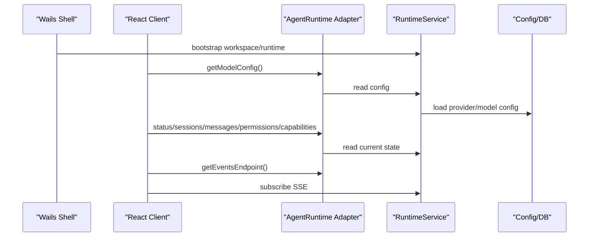
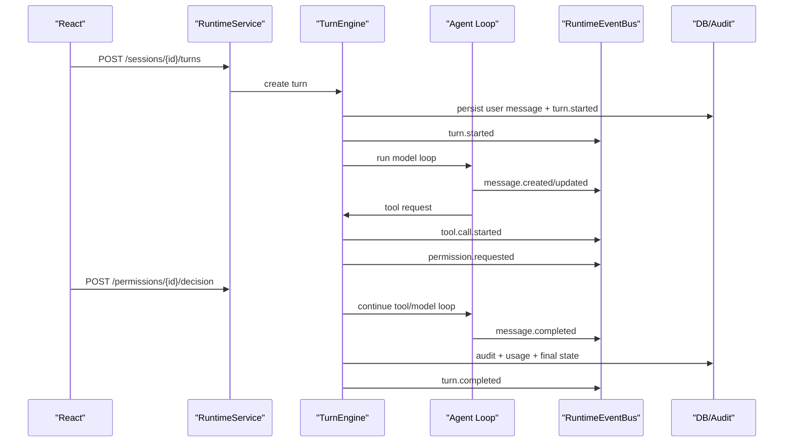

# 客户端整体架构与基本流程

本文是 Agent Builder 客户端化改造的主架构文档。它承接：

- `docs/archive/crush-claude-code-gap-analysis.md`
- `docs/client-first-runtime-refactor.md`
- `docs/archive/phase-2-runtime-api-boundary.md`

当前目标不是把 Crush 包一层桌面壳，也不是复刻 Claude Code 的 CLI/TUI，而是做一个 Codex 形态的桌面客户端：

```text
React/Wails Client -> Runtime API + Event Stream -> Go Agent Runtime
```

客户端是输入、展示、配置、审批和诊断界面。Go runtime 是 session、turn、message、tool、permission、audit、capability、context、model 调用的事实来源。

## 总体判断

Agent Builder 的主路径必须从 CLI/TUI 产品转为客户端产品。

需要保留 Crush 的核心：

- Go agent loop
- provider/model 调用
- session/message 存储
- built-in tools
- MCP
- skills
- hooks
- permission 基础
- workspace/config
- audit/logging 基础

需要隔离或逐步移出主路径：

- Bubble Tea / TUI 事件
- CLI command loop
- terminal prompt / keybinding / slash command 交互形态
- stdout/stderr 文本协议
- 以 `tea.Msg` 为 runtime event 的内部约束

Claude Code 提供设计蓝图，但不应直接迁移其 terminal UI。应吸收的是 turn lifecycle、tool protocol、permission model、plan mode、subagent/task、session recovery、context/memory、plugin/capability 等后台语义。

## 目标分层

目标分层如下：

```text
client/
  React UI
  AgentRuntime TypeScript interface
  Wails adapter
  HTTP adapter
  SSE subscription

desktop/
  Wails shell
  native window/menu/bootstrap
  local API startup
  desktop-only packaging

internal/runtime/
  RuntimeService
  TurnEngine
  ToolScheduler
  PermissionPolicy
  RuntimeEventBus
  AuditStore
  CapabilityRegistry
  StateRecovery

internal/agent/
  model loop
  context assembly
  tool execution implementation
  subagent execution

internal/adapters/
  wails adapter
  http adapter
  cli adapter
  tui adapter
```

当前代码还没有完全形成 `internal/runtime` 和 `internal/adapters`。现状是 `desktop/runtime_*` 已经承担了大量 runtime boundary 责任。后续应把通用 runtime 能力从 desktop 包迁移到 `internal/runtime`，让 Wails 只做 adapter。

## 核心架构决策

### 1. Runtime 是事实来源

React 不能拥有核心业务状态。以下状态必须来自 runtime API 或 runtime event：

- 当前 workspace
- model/provider config
- sessions
- messages
- turns
- tool calls
- permission requests
- skills
- MCP servers/tools/resources/prompts
- capabilities
- audit events
- active/cancelled/failed 状态

React 可以保留 UI 状态，例如当前打开的 drawer、选中的 tab、输入框内容、sidebar 折叠状态。

### 2. Wails 是桌面 adapter

Wails 不应成为长期产品协议。桌面客户端可以通过 Wails 调用 Go，但 Wails 方法必须委托到 transport-neutral runtime service。

长期形态：

```text
React -> AgentRuntime interface
  -> Wails adapter -> RuntimeService
  -> HTTP adapter  -> RuntimeService
```

HTTP + SSE 是稳定协议边界，方便未来支持 Web、本地 headless、自动化和测试。

### 3. API 是事实，事件是通知

事件流只负责告诉 UI “某些东西变了”。UI 收到事件后可以局部更新，也可以按需重新拉取事实数据。

```text
SSE event -> React reducer/update hint -> GET latest state
```

不要让 UI 只靠事件拼接还原完整事实状态。窗口刷新、客户端重启、SSE 断线后，必须能通过 API 恢复。

### 4. 所有用户请求进入 Turn

用户输入一句话，不应只是一次临时 `Chat()` 调用，而是创建一个 turn：

```text
Session
  Turn
    User Message
    Assistant Message
    Tool Calls
    Permission Requests
    Artifacts
    Audit Events
    Child Tasks
```

当前实现里 `requestID` 同时作为 turn id 使用，这是可接受的过渡方案。后续应明确 `Turn` 为 runtime 一等对象，并持久化关键状态。

### 5. 工具执行进入 Tool Scheduler

工具调用不能只散落在 agent loop 内部。客户端产品需要统一呈现、审批、取消、审计和恢复工具状态，所以需要 runtime 级 Tool Scheduler。

Tool Scheduler 负责：

- tool call lifecycle
- input validation
- permission policy
- concurrency control
- cancellation
- structured output
- diff/artifact extraction
- event emission
- audit recording

具体设计见 `docs/tool-scheduler-design.md`。

### 6. Permission 是一等对象

权限请求不是终端 prompt，也不是工具输出文本。它必须是 runtime object：

```text
PermissionRequest
  id
  session_id
  turn_id
  tool_call_id
  tool_name
  action
  risk
  target
  input_summary
  options
  status
```

客户端只负责展示审批 UI 和提交 decision。策略判断、持久化、审计都在 runtime。

### 7. Capability 统一内置工具、MCP、Skills、未来插件

客户端需要一个统一能力视图，而不是分别理解每种底层来源。

初始 capability kind：

- `builtin_tool`
- `mcp_tool`
- `mcp_prompt`
- `mcp_resource`
- `skill`

后续可扩展：

- `subagent`
- `script`
- `plugin_tool`
- `native_command`

## 客户端主流程

### 启动流程



启动后，UI 应拉取：

- `GET /v1/runtime/status`
- `GET /v1/config/model`
- `GET /v1/sessions`
- 当前 session messages
- `GET /v1/permissions`
- `GET /v1/capabilities`
- `GET /v1/skills`
- `GET /v1/mcp/servers`
- `GET /v1/events` 或 SSE

### 发送消息流程



UI 的行为：

- 发送后立即进入 active turn 状态。
- 通过 SSE 接收进度。
- 收到 message/tool/permission/turn 事件后拉取最新状态。
- 用户可取消 active turn。
- turn 完成后刷新 session、messages、audit、usage。

### 权限审批流程

```text
ToolCall requested
  -> Runtime policy evaluates
  -> safe: execute directly and audit
  -> needs approval: create PermissionRequest
  -> emit permission.requested
  -> React shows modal/drawer
  -> user chooses allow_once / allow_session / deny
  -> Runtime records decision
  -> ToolScheduler continues or fails tool call
```

客户端不能绕过 runtime 自己决定是否安全。

### 取消流程

```text
User clicks cancel
  -> POST /v1/turns/{turn_id}/cancel
  -> Runtime cancels turn context
  -> ToolScheduler cancels running tools
  -> Agent loop stops
  -> turn.cancelled event
  -> audit records cancellation
  -> UI refreshes messages/status/permissions
```

取消应以 turn 为单位，而不是只靠“当前 session busy”。

### 恢复流程

客户端重启、刷新或 SSE 断线后：

```text
React starts
  -> status
  -> sessions
  -> active session messages
  -> active/running turns
  -> pending permissions
  -> capability inventory
  -> audit/event cursor
  -> subscribe events after cursor
```

如果 runtime 发现有未完成 turn：

- 能继续的继续。
- 不能继续的标记为 interrupted。
- pending permission 必须可重新展示。
- audit 要记录恢复动作。

具体设计见 `docs/frontend-runtime-ui-technical-plan.md`。

## 页面与信息架构

客户端第一屏必须是 conversation-first，而不是配置页或营销页。

推荐主布局：

```text
Left Sidebar
  sessions
  search
  runtime feature navigation

Center Workspace
  chat timeline
  composer
  active turn status

Right Drawer / Modal
  model settings
  permission review
  audit
  tool detail
  MCP/Skill detail
```

一级视图：

- Chat
- Capabilities
- Skills
- MCP
- Audit/Diagnostics
- Settings

具体设计见 `docs/client-information-architecture.md`。

## 当前实现映射

当前已有的基础：

| 领域 | 当前位置 | 判断 |
| --- | --- | --- |
| TypeScript runtime contract | `client/src/runtime/types.ts` | 已有基础，需和 Go contract 自动校验 |
| React chat shell | `client/src/AssistantClient.tsx` | 已有可用形态 |
| 客户端状态 hook | `client/src/hooks/useAssistantClient.tsx` | 已有主流程，但状态恢复还需要加强 |
| SSE 订阅 | `client/src/hooks/useRuntimeEventSubscription.ts` | 已有基础，需要 cursor/reconnect 语义 |
| RuntimeService | `desktop/runtime_service_types.go` | 边界正确，但位置应迁移到 `internal/runtime` |
| HTTP adapter | `desktop/runtime_http.go` | 已有基础，需与 contract 文档保持一致 |
| Event translation | `desktop/runtime_events.go` | 可用过渡层，但仍依赖 Crush/TUI event 形态 |
| Permission bridge | `desktop/runtime_permissions.go` + `internal/permission` | 已有审批基础，需升级 policy model |
| Audit | `desktop/runtime_audit*.go` | 已有基础，需从文件/内存走向 runtime audit store |

## 需要冻结的基础流程

后续实现必须围绕这条 runtime spine：

```text
Turn -> ToolCall -> Permission -> Event -> Audit
```

每个 turn 必须能回答：

- 谁发起的？
- 使用哪个 session？
- 使用哪个 model/provider？
- 产生了哪些 message？
- 调用了哪些 tool？
- 哪些权限被请求和批准/拒绝？
- 哪些文件、diff、artifact 被产生？
- 是否取消、失败或完成？
- 消耗了多少 token/cost？
- 客户端重启后如何恢复？

如果某个功能不能挂到这条主线上，应先判断它是否是 UI-only 状态、legacy CLI/TUI 适配，还是需要新 runtime primitive。

## 实施顺序

建议按以下顺序推进：

1. 冻结客户端架构和核心流程文档。
2. 定义并持久化 `Turn` / `Task` / `Run` 模型。
3. 抽出 runtime-native event bus，减少 `tea.Msg` 对客户端路径的影响。
4. 抽出 Tool Scheduler。
5. 升级 permission policy model。
6. 加入 state recovery 和 event cursor。
7. 将 `desktop/runtime_*` 通用部分迁移到 `internal/runtime`。
8. 将 Wails、HTTP、未来 CLI/TUI 都改成 adapter。
9. 强化 React 页面信息架构和状态恢复。

## 非目标

当前阶段不做：

- 远程多用户 runtime
- 插件市场
- 企业 RBAC
- 完整 sandbox/worktree 隔离
- 全量复刻 Claude Code terminal 交互
- 继续扩大 TUI 主路径

这些可以在 runtime spine 稳定后再做。

