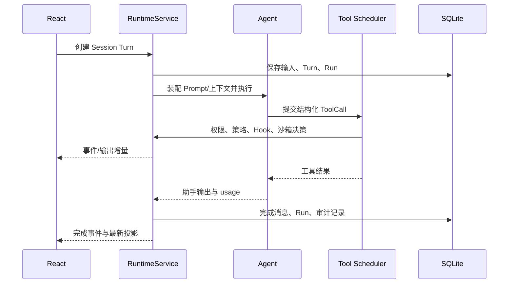

# 运行时

## 权威状态

`internal/runtime` 是客户端运行状态的权威边界。`RuntimeService` 初始化工具调度器、运行记录、权限请求、事件流、终端、子任务、Prompt 装配、worktree、沙箱和恢复存储，并由 Wails 桥接层暴露给 React。

运行时实现按功能拆为多个 `runtime_*.go` 文件，而不是单个大服务文件。公共契约集中在 `internal/runtime/runtime_contract_types.go`、`runtime_service_types.go` 和 `internal/runtimeapi/contract.go`。

## 核心对象

| 对象 | 含义 |
|---|---|
| Project | 工作目录及其会话、配置和项目记忆的归属范围 |
| Session | 连续对话和输出的容器 |
| Message | 用户、助手、工具等结构化消息 |
| Turn | 一次用户输入触发的执行边界 |
| Run | Turn 内可观察、可恢复的执行实例 |
| ToolCall | 一次结构化工具调用及其输出、状态和引用 |
| AgentTask | 由主 Agent 创建、通信、跟踪和取消的子任务 |
| Event | 对状态变化的追加式通知，用于 UI 刷新和审计 |

## 一次交互的主链路

## 工具执行与权限

工具不是直接从 UI 执行。Agent 产生工具请求后，由调度与运行时链路负责：

1. 规范化工具和参数并建立 ToolCall。
2. 应用工具发现、能力开关和策略规则。
3. 必要时创建权限请求，等待用户决定。
4. 执行 Pre/Post Hook 与沙箱决策。
5. 执行工具并持续记录结构化输出。
6. 对大输出进行截断、引用化或结果保护。
7. 更新事件、审计、Run 和前端投影。

`internal/permission` 提供权限与 policy 原语；运行时负责持久化请求和决策。任何新增危险工具都应接入这条链路，不能只在前端增加确认框。

## 上下文与压缩

Prompt 由系统指令、项目上下文、Skills、Hooks 注入、文件读取状态、项目记忆和对话历史等来源组装。运行时记录 Prompt assembly 和各 section，便于诊断实际发送给模型的内容。

上下文治理配置控制窗口使用和压缩行为。压缩是运行时操作，生成摘要消息并保留可追踪的 usage、边界和恢复信息；前端仅发起操作并展示结果。

## 输出、事件与恢复

- 会话输出支持快照、增量事件和流式订阅。
- Wails application events provide the runtime event stream to React.
- Run transition、ToolCall、permission、hook execution、sandbox decision 和 audit 均有独立记录。
- 中断、失败、compact 失败和 provider 错误可进入恢复分类与重试流程。

事件名称的权威清单位于 `internal/runtimeapi/contract.go`，新增或变更契约时必须同步 Wails 适配器与契约测试。
