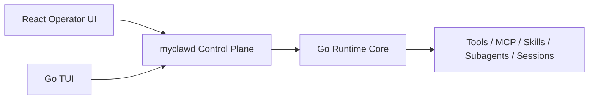

# React Operator UI Console Design

Date: 2026-04-25

## 1. Design Goal

Build the first React operator console for `myclaw` on top of `myclawd`.

This UI is not a visual clone of the Go TUI.

This UI is the primary rich interaction surface for capabilities that already exist in the runtime:

- chat and streaming messages
- tool calls and tool progress
- file read/write/edit/search
- shell execution
- SSH execution
- MCP inventory and actions
- skills inventory and invocation visibility
- subagent/task lifecycle
- approvals and permission state
- session/runtime status

## 2. Architecture Position

The target architecture remains:

The React UI must consume `myclawd` only.

It must not call Go runtime internals or duplicate permission, tool, MCP, skills, or subagent semantics in frontend code.

## 3. Ant Design X Fit

Ant Design X is a good fit for this module because it already provides React components for AI interaction surfaces:

- `Bubble` for chat transcript and streaming assistant output
- `Bubble.List` for message lists
- `Sender` for prompt input, structured slots, quick commands, and attachments
- `Conversations` for session list and conversation switching
- `Prompts` for contextual starter actions and suggested workflows
- `Attachments` for future file references and pasted files
- `ThoughtChain` or equivalent step/progress rendering for tool and task timelines when available
- `XProvider`, `useXAgent`, and `useXChat` patterns as references, while actual transport should be adapted to `myclawd`

The UI should also use regular Ant Design components where Ant Design X is not the right surface:

- `Layout`
- `Tabs`
- `Table`
- `Card`
- `Drawer`
- `Modal`
- `Descriptions`
- `Timeline`
- `Alert`
- `Tag`
- `Progress`
- `Tree`
- `Splitters` if needed for resizable panes

## 4. Product Shape

The first version should be an operator console, not a marketing page.

Primary layout:

- left rail: sessions and runtime connection state
- center: conversation with streaming transcript
- right rail: contextual panels for tools, approvals, subagents, MCP, skills, and runtime status
- bottom or fixed composer: Ant Design X `Sender`

## 5. Page Model

### A. Conversation

Purpose:

- chat with the agent
- display streaming assistant output
- display tool calls inline
- show structured tool results

Key UI:

- `Bubble.List` for messages
- `Sender` for prompts
- inline tool cards inside assistant/tool transcript
- status badges for running, waiting approval, failed, complete

Backend contract:

- `connect`
- `send_message`
- events: `assistant.delta`, `message.created`, `tool.called`, `tool.progress`, `tool.result`, `permission.required`, `run.error`

### B. Approvals

Purpose:

- centralize all pending approval requests
- allow approve/reject with feedback
- show decision context

Key UI:

- pending approval cards
- approve/reject buttons
- expandable tool input and policy reason
- history table

Backend contract:

- `approval_list`
- `approval_approve`
- `approval_reject`
- `approval_clear`
- events: `permission.required`, `approval.updated`, `approval.cleared`

### C. Tools And Execution

Purpose:

- show tool lifecycle across file, shell, SSH, MCP, and Skill tool calls
- make execution observable without moving runtime semantics into UI

Key UI:

- running tool timeline
- tool result drawer
- structured content viewer
- stdout/stderr/result metadata sections

Backend contract:

- tool events from runtime stream
- structured `tool.result` payload including `structured_content` and `meta` where available

### D. Files

Purpose:

- expose current file capability effects from runtime conversations
- show file operations that have occurred
- optionally provide read-only project tree if `myclawd` exposes it later

Key UI:

- file operation timeline
- changed file list
- diff/preview placeholder for future

Backend contract:

- current version can derive from tool events for `Read`, `Write`, `Edit`, `MultiEdit`, `Glob`, `Grep`, `LS`
- richer file browser requires a future `myclawd` file/inventory API

### E. Subagents And Tasks

Purpose:

- inspect delegated work
- spawn, stop, steer, resume subagents
- show parent/child session identity

Key UI:

- task board grouped by status
- task detail drawer
- child session and output details
- controls for stop, steer, resume

Backend contract:

- `spawn_subagent`
- `subagent_list`
- `subagent_status`
- `subagent_stop`
- `subagent_steer`
- `subagent_resume`
- events: `subagent.updated`, `subagent.completed`

### F. MCP

Purpose:

- show MCP servers, tools, prompts, resources, and derived skills
- reconnect/authenticate servers

Key UI:

- MCP server table
- server detail drawer
- tool/prompt/resource/skill tabs
- reconnect/authenticate actions

Backend contract:

- `mcp_status`
- `mcp_reconnect`
- `mcp_authenticate`

### G. Skills

Purpose:

- show skills available to the runtime
- show skill listing attachments and invoked skills in transcript
- show MCP-derived skills as part of MCP inventory

Key UI:

- skills catalog
- skill source badges: bundled, plugin, dynamic, MCP
- invoked skill history
- transcript attachment rendering for skill listings and invoked skills

Backend contract:

- current version can observe skills through transcript attachments and MCP status
- likely needs a future `skills_status` or runtime inventory API for a complete catalog

### H. Runtime And Session Status

Purpose:

- expose runtime connection and session state
- show permission mode, model override, workspace roots, MCP/skills counts, active tasks

Key UI:

- status dashboard
- session detail
- permission/model controls
- connection health indicator

Backend contract:

- `session_status`
- `session_set_permission`
- `session_set_model`
- `mcp_status`
- `subagent_list`
- `approval_list`

## 6. Current Capability Mapping

| Capability | Go Status | myclawd Status | React UI First Version |
|---|---|---|---|
| Chat | Implemented | `connect`, `send_message`, stream events | Full conversation page |
| Tool lifecycle | Implemented | tool events exist | Inline tool cards and timeline |
| File tools | Implemented | observable through tool events | File operation feed, result detail |
| Shell | Implemented | observable through tool events | Execution cards with stdout/stderr |
| SSH | Implemented after SSH module | observable through tool events | SSH execution cards and approval-aware display |
| MCP | Implemented | status/reconnect/auth APIs exist | MCP page |
| Skills | Implemented in runtime | partially exposed through MCP/status/messages | Skills page with known protocol gaps |
| Subagents | Implemented | subagent APIs exist | Task/subagent page |
| Approvals | Implemented | approval APIs/events exist | Approval center |
| Session/model/permission | Implemented | session APIs exist | Runtime/session panel |
| Orchestration plan/history | Implemented | orchestration APIs exist | Optional Phase 2 operations panel |

## 7. Protocol Gaps To Track

The React UI should start with what `myclawd` already exposes, but the plan must track protocol gaps clearly.

Likely gaps:

- complete skills catalog API
- complete tools inventory API
- file tree/read-only browse API
- session message history API if reload must restore transcript
- normalized operation history API for file/shell/SSH tool runs
- richer structured result schemas for every tool

These are backend/control-plane tasks, not frontend-only work.

## 8. Non-Goals

Do not implement:

- direct runtime calls from React
- UI-inferred approval rules
- UI-inferred tool safety
- Docker or database as separate first-class React modules unless backend runtime semantics are explicitly added later
- Claude Code visual/TUI parity

Docker and database operations should appear as generic shell/MCP/tool executions until the runtime intentionally promotes them to first-class capabilities.
