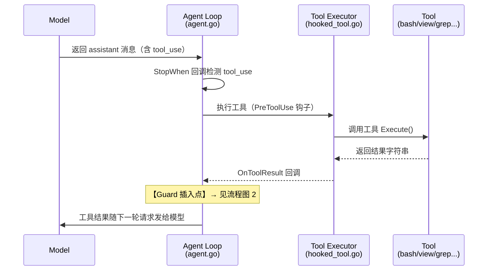
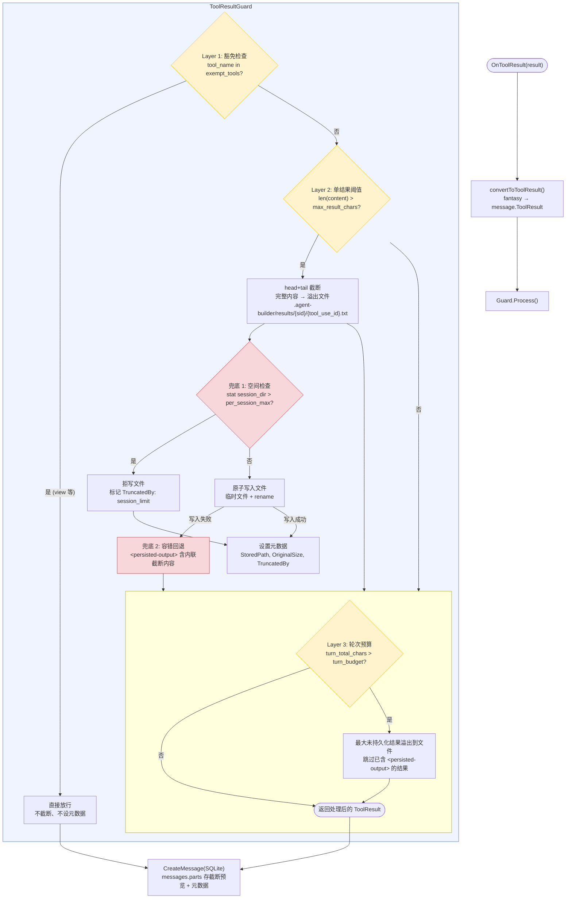
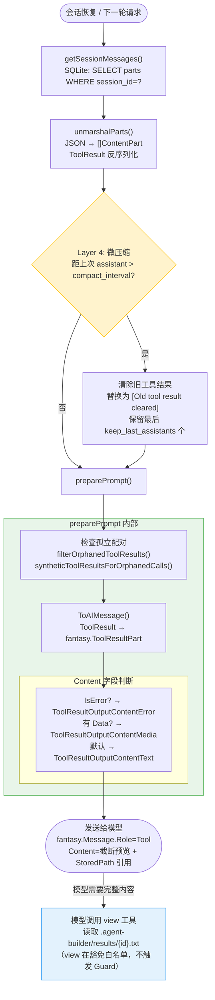

# ToolResultGuard 设计文档

**日期：** 2026-05-25
**状态：** 设计完成
**参考：** Hermes（`tools/tool_result_storage.py`、`tools/budget_config.py`，源码已确认）、Claude Code（`src/utils/toolResultStorage.ts`、`src/utils/cleanup.ts`，源码已确认）、OpenClaw（`session-tool-result-guard.ts`、`transcript-file-state.ts`）

---

## 一、背景与动机

### 1.1 现状

Agent Builder 当前工具结果处理流程（[agent.go:410](internal/agent/agent.go#L410)）：

```
OnToolResult → convertToToolResult → CreateMessage(SQLite)
```

- 所有工具结果**原样完整**存入 SQLite `messages.parts` JSON 列
- `ToolResult` 结构体无截断相关字段（[content.go:111](internal/message/content.go#L111)）
- 仅有的尺寸管理是会话级 `auto-summarize`（token 预算触发，让模型对历史做摘要），不是工具结果粒度的

### 1.2 问题

Agent Builder 运行时已经足够安全——所有 7 个核心工具都有尺寸防护：

| 工具 | 限制 | 截断方式 |
|---|---|---|
| bash | 30K 字符 | head+tail 截断 |
| grep | 100 结果 + 500 字符/行 | 截断+提示 |
| glob | 100 结果 | 截断+提示 |
| ls | 1000 文件 | 截断+提示 |
| view | 200KB + 2000 字符/行 + 200 行 | 报错/截断 |
| fetch | 100KB | 硬截断 |
| web_fetch | 50KB 软阈值 | 写临时文件（唯一切外） |

但在工程维护上存在三个结构性问题：

- **各工具截断方式不一致**：7 套截断逻辑各自实现，截断标记、阈值、行为各不相同，新加工具要记得重复实现
- **截断即丢弃**：bash 100K 输出截成 30K，中间 70K 永久消失，出问题时无法回溯"当时到底输出了什么"。只有 `web_fetch` 做了溢出到文件的处理
- **无全局兜底**：未来新增工具如果遗漏限制，没有统一的安全网拦截。依赖开发者自觉在每个工具里手动实现

三个参考 runtime 均有工具结果级截断/持久化机制，Claude Code 的方案尤为完整（五层管道），因此对比三家设计。

### 1.3 设计价值

**这个改造不是修 bug，是修架构。** 运行时已经很安全了，价值在其他维度：

| 维度 | 改造前 | 改造后 | 提升 |
|---|---|---|---|
| 运行时安全 | 已有工具级限制 | Guard 提供防御纵深 | 边际 |
| Agent 准确性 | bash 已有 head+tail | tail 优先保留错误/JSON | 边际 |
| **可维护性** | 7 套散落截断逻辑 | 一套统一 Guard | **显著** |
| **可审计性** | 截断 = 丢弃 | 溢出 = 持久化 | **显著** |
| **可配置性** | 阈值硬编码 | 可配置、按工具覆盖 | **从无到有** |

### 1.4 目标

1. **统一截断入口**：所有工具结果走同一个 Guard，截断行为一致，新工具自动受保护
2. **溢出即持久化**：超阈值内容写入磁盘文件，不丢弃，可审计

---

## 二、参考方案对比

### 2.1 Hermes（源码：[tool_result_storage.py](../hermes-agent/tools/tool_result_storage.py)、[budget_config.py](../hermes-agent/tools/budget_config.py)）

| 维度 | 实现 |
|---|---|
| 管道层级 | 3 层：工具内截断 → 单结果持久化 → 轮次预算 |
| 单结果阈值 | 默认 100,000 字符，优先级 pinned → tool_overrides → registry per-tool → default |
| 截断策略 | 首段预览（前 1,500 字符，截断在最后一个换行符处），完整内容溢出到沙箱文件 |
| 存储位置 | `/tmp/hermes-results/{tool_use_id}.txt` |
| 写入方式 | `env.execute()` + heredoc（避开 `MAX_ARG_STRLEN` 128KB 限制） |
| 轮次预算 | `enforce_turn_budget()`，默认 200,000 字符，只溢出尚未 `<persisted-output>` 包裹的结果 |
| 豁免保护 | `read_file` 钉选为 `float("inf")`，永不触发持久化 |
| 容错 | 沙箱写入失败时回退为 `[Truncated: ...]` 内联截断 |
| 磁盘清理 | 无 — 依赖 /tmp OS 重启回收 |
| 脱敏/钩子 | 无 |

### 2.2 Claude Code（源码：[toolResultStorage.ts](../claude-code-main/src/utils/toolResultStorage.ts)、[cleanup.ts](../claude-code-main/src/utils/cleanup.ts)、[query.ts](../claude-code-main/src/query.ts)）

| 维度 | 实现 |
|---|---|
| 管道层级 | **5 层**：单结果持久化 → 消息聚合预算 → 微压缩 → 上下文折叠 → 全压缩 |
| 单结果阈值 | 默认 50,000 字符（`DEFAULT_MAX_RESULT_SIZE_CHARS`），每工具可声明 `maxResultSizeChars` |
| 截断策略 | 首段预览（2KB），完整内容写入文件，消息中替换为 `<persisted-output>` 标记 + 文件路径 |
| 存储位置 | `<projectDir>/<sessionId>/tool-results/`（项目目录下，按 session 分） |
| 消息聚合预算 | `enforceToolResultBudget()`，默认 200,000 字符/用户消息（`MAX_TOOL_RESULTS_PER_MESSAGE_CHARS`） |
| 微压缩 | 基于时间清除旧工具结果 + API `cache_edits` 在 API 层删除，模型侧无感 |
| 全压缩 | 对话摘要，工具结果中的图片被 `[image]` 替换，文本保留发给摘要模型 |
| 豁免保护 | Read 工具设 `maxResultSizeChars: Infinity`，永不持久化 |
| 磁盘清理 | **30 天 TTL**（`cleanup.ts`），清理早于 `cleanupPeriodDays` 的工具结果文件 |
| 稳定缓存 | `ContentReplacementState` 确保相同内容始终得到相同处理（提示缓存友好） |

### 2.3 OpenClaw（源码分析：[openclaw_tool-result-persistence.md](openclaw_tool-result-persistence.md)）

| 维度 | 实现 |
|---|---|
| 管道层级 | 1 层：单结果截断 + 脱敏 + 钩子 |
| 单结果阈值 | 默认 16,000 字符（`DEFAULT_MAX_LIVE_TOOL_RESULT_CHARS`） |
| 截断策略 | 智能 head+tail 截断，内联存储于 JSONL，details 元数据上限 8,192 字节 |
| 存储位置 | `~/.openclaw/agents/<id>/sessions/<sessionId>.jsonl` |
| 上下文占比上限 | 截断后不超过上下文窗口 30% |
| 脱敏 | `api_key`、`token`、`secret`、`password` 等字段 |
| 钩子 | `tool_result_persist` 同步钩子 + `before_message_write` |
| 会话修复 | 修复孤立 tool_use/tool_result 配对 |
| 磁盘清理 | 完整维护机制 — `maxDiskBytes`、`highWaterBytes`、`pruneAfter`、`maxEntries`、`rotateBytes` |

### 2.4 本方案取舍

**从每家拿什么：**

| 来源 | 拿什么 | 不拿什么 |
|---|---|---|
| **Hermes** | 文件溢出架构、轮次预算、豁免白名单、容错回退 | head-only 预览（丢尾部）、/tmp 存储（不适合审计） |
| **Claude Code** | 200K 消息预算、项目目录存储、原子写入 | 微压缩（v2）、上下文折叠（v1 过度复杂） |
| **OpenClaw** | head+tail 截断、16K 默认阈值、截断标记格式 | JSONL 存储（Agent Builder 已有 SQLite）、脱敏+钩子（v2） |

### 2.5 v1 vs v2 范围

| 能力 | v1 | v2 |
|---|---|---|
| 三层管道（豁免 → 单结果截断 → 轮次预算） | ✓ | ✓ |
| head+tail 截断 + 文件溢出 | ✓ | ✓ |
| 轮次预算 200K | ✓ | ✓ |
| 磁盘两级限制（per_session 限流 + 30 天 TTL） | ✓ | ✓ |
| 30 天 TTL 清理（清理过期工具结果文件） | ✓ | — |
| 微压缩（时间清除旧工具结果，上下文内替换为占位符） | ✓ | — |
| 容错回退（写文件失败 → 内联截断） | ✓ | — |
| 脱敏（api_key、token 等字段） | — | ✓ |
| 插件钩子 tool_result_persist | — | ✓ |
| per_tool 运行时声明阈值 | — | ✓ |

---

## 三、架构设计

### 3.1 总体架构：四层管道 + 两层兜底

**写入时（ToolResultGuard）：**

```
工具执行 → 返回结果(字符串)
    │
    ▼
┌─────────────────────────────────────────────┐
│ Layer 1: 豁免检查         ← Hermes pinned / CC Infinity │
│   view 等白名单直接放行                      │
└─────────────────────────────────────────────┘
    │ 非豁免
    ▼
┌─────────────────────────────────────────────┐
│ Layer 2: 单结果截断 + 溢出  ← Hermes 溢出 + OpenClaw h+t │
│   超 16K → head+tail 截断                    │
│   完整内容 → .agent-builder/results/{id}.txt         │
└─────────────────────────────────────────────┘
    │
    ▼
┌─────────────────────────────────────────────┐
│ Layer 3: 轮次聚合预算      ← Hermes + CC 200K budget  │
│   当前 turn 总字符 > 200K → 最大结果溢出      │
└─────────────────────────────────────────────┘
    │
    ▼
写入 SQLite（截断预览 + StoredPath + OriginalSize + TruncatedBy）
```

**读出时（微压缩，preparePrompt 前）：**

```
从 SQLite 加载消息
    │
    ▼
┌─────────────────────────────────────────────┐
│ Layer 4: 微压缩（microcompact） ← CC microcompact   │
│   距离上次 assistant 消息 > TTL_interval      │
│   → 旧工具结果替换为 [Old tool result cleared] │
│   保留最后 N 个 assistant 的工具结果          │
└─────────────────────────────────────────────┘
    │
    ▼
preparePrompt → 发送给模型
```

**兜底（写入时）：**

```
┌─────────────────────────────────────────────┐
│ 兜底 1: 磁盘空间限制       ← OpenClaw + CC TTL       │
│   per_session: 500MB（超限拒写）              │
│   global: 2GB（30 天 TTL 清理过期文件）       │
└─────────────────────────────────────────────┘
    │
    ▼
┌─────────────────────────────────────────────┐
│ 兜底 2: 容错回退           ← Hermes fallback         │
│   文件写入失败 → 内联 [Truncated: ...]        │
└─────────────────────────────────────────────┘
```

### 3.2 拦截点

在 `OnToolResult` 和 `CreateMessage` 之间插入 `ToolResultGuard`，Guard 放在 `internal/agent/agent.go` 的 `OnToolResult` 回调中，改动集中在一个调用点。

### 3.3 处理流程

1. **豁免检查** — `view` 等白名单工具直接放行，不截断
2. **单结果截断** — 超过 `max_result_chars` 阈值时，head+tail 截断，完整内容写入溢出文件
3. **轮次预算检查** — 当前 turn 所有工具结果字符总数超过 `turn_budget` 时，从最大的结果开始溢出
4. **空间检查** — `stat` 目录大小，超 session 限额拒写（即时）；后台 30 天 TTL 清理过期文件（异步）
5. **设置元数据** — 填充 `StoredPath`、`OriginalSize`、`TruncatedBy`
6. **写入 SQLite** — 截断后的预览内容 + 文件路径引用存入 `messages.parts`；若文件写入失败则回退内联截断

### 3.4 微压缩（Layer 4，参考 Claude Code microcompact）

**触发时机：** 在 `preparePrompt()` 中，加载消息后、发送给模型前。

**逻辑（完全对齐 Claude Code `evaluateTimeBasedTrigger`）：**
- 从消息历史中找最后一条 assistant 消息，读取其 `CreatedAt` 时间戳
- 计算空闲间隔：`time.Now().Unix() - lastAssistant.CreatedAt`
- 当空闲超过 `compact_interval`（默认 60 分钟，对齐 Claude Code `gapThresholdMinutes: 60`），清除旧工具结果
- `COMPACTABLE_TOOLS` 集合中的工具（bash、grep、glob、view、fetch、web_fetch 等），除最后 N 个结果外全部替换为 `[Old tool result content cleared]`
- 保留最后 `keep_last_assistants`（默认 3）个 assistant 消息的工具结果不受影响

**与 Claude Code 的关键对齐点：**
- 使用消息自身时间戳计算间隔（非单独跟踪的变量），与 CC 的 `messages.findLast(m => m.type === 'assistant')` 一致
- 默认 60 分钟间隔，与 CC 的 `gapThresholdMinutes: 60` 一致
- CC 支持 API `cache_edits` 在 API 层删除，模型无感知；v1 使用消息内容替换，模型可见占位符

### 3.5 组件划分

```
internal/agent/
├── tool_result_guard.go      # Guard 入口：Layer 1-3 流程编排、轮次状态跟踪
├── tool_result_truncate.go   # head+tail 截断算法（Layer 2）
├── tool_result_persist.go    # 文件写入、空间限制与 TTL 清理（兜底 1+2）
├── tool_result_microcompact.go  # 微压缩：基于消息 CreatedAt 的旧结果清除（Layer 4，对齐 CC）
└── agent.go                  # OnToolResult 插入 Guard.Process()；preparePrompt 前调用 Compact()（修改）
```

Guard 持有当前 turn 的结果计数器（内存），每轮开始时重置。微压缩持有 `COMPACTABLE_TOOLS` 集合和最后 assistant 时间戳。

### 3.6 完整数据流

#### 流程图 1：工具调用流程（现状不变）



#### 流程图 2：存储工具结果流程（ToolResultGuard，新设计）



#### 流程图 3：加载工具结果流程（重放路径 + Layer 4 微压缩）



| 流程 | 触发时机 | 新增/现有 |
|---|---|---|
| 流程 1：工具调用 | 模型生成 tool_use → Agent 执行 | 现有，不变 |
| 流程 2：存储结果 | OnToolResult 回调中 | **新增** Guard.Process() |
| 流程 3：加载结果 | 会话恢复 / 下一轮准备 prompt | 加载路径现有，**新增** Layer 4 微压缩 |

---

## 四、阈值策略

### 4.1 三层控制

| 层级 | 配置项 | 默认值 | 说明 |
|---|---|---|---|
| 单结果阈值 | `max_result_chars` | 16,000 | 单个结果超此值则截断 |
| 轮次聚合预算 | `turn_budget` | 200,000 | 当前 turn 所有结果总字符上限 |
| 豁免白名单 | `exempt_tools` | `["view"]` | 白名单工具永不截断 |

### 4.2 优先级

```
per_tool 覆盖 > max_result_chars > 硬编码默认值
```

### 4.3 轮次边界

一个 "turn" 定义为：一次 assistant 消息中所有 tool_use 对应的 tool_result 集合。Guard 通过跟踪当前 assistant 消息的 tool_use 数量来判断 turn 边界。

---

## 五、截断算法

### 5.1 head+tail 保留策略

```
total_chars = len(content)

if total_chars <= max_result_chars:
    不截断，原样返回

head_size = max_result_chars * 70%
tail_size = max_result_chars * 30%

if 尾部包含错误关键词(Error:, fatal:, panic:, traceback, etc.)
   or 尾部是有效 JSON:
    tail_size = min(max_result_chars * 50%, tail实际需要)
    head_size = max_result_chars - tail_size

preview_body = content[:head_size] + content[-tail_size:]
has_more = (head_size + tail_size < total_chars)

// 构建 <persisted-output> 块（参考 Hermes build_persisted_message + CC buildLargeToolResultMessage）
result = "<persisted-output>\n"
       + "This tool result was too large ({total_chars:,} characters, {size_kb}).\n"
       + "Full output saved to: {stored_path}\n"
       + "Use the view tool with offset and limit to access specific sections of this output.\n\n"
       + "Preview (head {head_size} + tail {tail_size} chars):\n"
       + preview_body
       + (has_more ? "\n...\n" : "\n")
       + "</persisted-output>"
```

### 5.2 边界安全

- 截断点落在 UTF-8 多字节字符中间时，向前回退到合法字符边界
- `<persisted-output>` XML 标签同时作为截断边界标记，Layer 3 轮次预算可通过检查是否已含 `<persisted-output>` 跳过已处理结果

### 5.3 对比

| | Hermes | Claude Code | OpenClaw | 本方案 |
|---|---|---|---|---|
| 策略 | 纯 head 1.5K | 纯 head 2KB | head+tail | head+tail |
| 预览大小 | 固定 1,500 | 固定 2KB | 按阈值比例 | 按阈值比例 |
| 包装格式 | `<persisted-output>` | `<persisted-output>` | 截断 banner | `<persisted-output>` |
| 指令 | 明确："Use read_file with offset and limit" | 简洁："Full output saved to: {path}" | — | 明确："Use the view tool with offset and limit" |

选择 `<persisted-output>` XML 格式的理由：
- Hermes 和 Claude Code 都用同一种格式，模型训练数据中见过大量 `<persisted-output>` 块
- XML 标签是明确的截断边界，`enforce_turn_budget()` 可直接判断是否已持久化
- 选择 Hermes 风格的显式指令，因 Agent Builder 使用 `view` 工具读文件（非 Hermes 的 `read_file`），需明确告知模型用哪个工具

---

## 六、存储设计

### 6.1 ToolResult 结构体扩展

在 [content.go:111](internal/message/content.go#L111) 中新增三个字段：

```go
type ToolResult struct {
    // 现有字段不变
    ToolCallID string `json:"tool_call_id"`
    Name       string `json:"name"`
    Content    string `json:"content"`
    Data       string `json:"data"`
    MIMEType   string `json:"mime_type"`
    Metadata   string `json:"metadata"`
    IsError    bool   `json:"is_error"`
    // 新增
    StoredPath   string `json:"stored_path,omitempty"`   // 溢出文件路径，空=未截断
    OriginalSize int64  `json:"original_size,omitempty"`  // 原始字节数，0=未截断
    TruncatedBy  string `json:"truncated_by,omitempty"`   // "single" | "turn_budget"
}
```

`omitempty` 保证向后兼容 — 未截断的结果不产生额外 JSON 字段。

### 6.2 文件路径

```
.agent-builder/results/{session_id}/{tool_call_id}.txt
```

- 按 session 分目录，session 删除时可一并清理
- `tool_call_id` 全局唯一，直接用做文件名
- 写入时先写临时文件再 rename（原子操作）

### 6.3 SQLite

- **无需 schema migration** — 新字段在 JSON 列中，不走 DDL
- 查询溢出文件关联：`WHERE parts LIKE '%"stored_path"%'`（审计场景低频使用）
- 现有索引（`session_id`）已满足查询需求

### 6.4 清理与空间限制

**各 runtime 对比：**

| | Hermes | Claude Code | OpenClaw | 本方案 |
|---|---|---|---|---|
| 存储位置 | `/tmp/hermes-results/` | `<project>/<session>/tool-results/` | `~/.openclaw/.../sessions/` | `.agent-builder/results/` |
| 清理策略 | 无（OS 回收 /tmp） | 30 天 TTL（`cleanup.ts:unlinkIfOld`） | `maxDiskBytes`+`pruneAfter`+`maxEntries` | 写入时 per-session 限流 + 后台 30 天 TTL |
| 原因 | /tmp 天然短命 | 项目目录需主动清理 | JSONL 无限增长 | 项目目录不是 /tmp，必须自己管 |

**本方案设计（参考 Claude Code `cleanupOldSessionFiles()`）：**

**第一层：写入时 per-session 限流**

| 限制 | 默认值 | 超限行为 |
|---|---|---|
| `per_session_max_bytes` | 500 MB | 拒绝写入，标记 `TruncatedBy: "session_limit"` |

空间检查在写入前进行（`stat` 目录大小，O(1)）。单 session 不可能在 30 天内打满磁盘，per-session 限流作为即时防护。

**第二层：后台 TTL 清理（参考 Claude Code `unlinkIfOld()`）**

```
cleanupOldResultFiles():
    cutoffDate = time.Now().Add(-ttlDays * 24h)
    
    for each sessionDir in .agent-builder/results/:
        // Session 级目录按 mtime 判断
        if sessionDir.mtime < cutoffDate:
            os.RemoveAll(sessionDir)
            continue
        
        // Session 未过期：逐文件检查 mtime
        for each file in sessionDir:
            if file.mtime < cutoffDate:
                os.Remove(file)
        
        // 尝试删除空目录
        tryRmdir(sessionDir)
```

- 触发时机：Agent Builder 启动时 + 会话结束时在后台 goroutine 执行（不阻塞 agent 循环）
- 清理粒度：按文件 `mtime`，非 LRU
- 容错：目录不存在（ENOENT）静默跳过；单个文件删除失败不影响其他文件
- Session 删除时级联清理整个 session 目录

**为什么不选 LRU：** 工具结果文件是审计日志，不是缓存。旧 session 的日志可能正是需要回溯的。TTL 提供可预测的保留窗口（"30 天内可查"），LRU 没有这个保证。

---

## 七、配置设计

### 7.1 配置块

```go
type ToolResultGuardConfig struct {
    Enabled            bool           `yaml:"enabled"`
    MaxResultChars     int            `yaml:"max_result_chars"`
    TurnBudget         int            `yaml:"turn_budget"`
    ResultsDir         string         `yaml:"results_dir"`
    PerSessionMaxBytes int64          `yaml:"per_session_max_bytes"`
    GlobalMaxBytes     int64          `yaml:"global_max_bytes"`
    TTLDays            int            `yaml:"ttl_days"`
    CompactInterval    string         `yaml:"compact_interval"`
    KeepLastAssistants int            `yaml:"keep_last_assistants"`
    ExemptTools        []string       `yaml:"exempt_tools"`
    PerTool            map[string]int `yaml:"per_tool"`
}
```

### 7.2 默认值

| 字段 | 默认值 |
|---|---|
| `enabled` | `true` |
| `max_result_chars` | `16000` |
| `turn_budget` | `200000` |
| `results_dir` | `.agent-builder/results` |
| `per_session_max_bytes` | `524288000` (500 MB) |
| `global_max_bytes` | `2147483648` (2 GB) |
| `ttl_days` | `30`（超过此天数的工具结果文件被清理） |
| `compact_interval` | `"60m"`（微压缩触发间隔，对齐 Claude Code `gapThresholdMinutes: 60`） |
| `keep_last_assistants` | `3`（微压缩保留的最后 N 个 assistant 消息的工具结果） |
| `exempt_tools` | `["view"]` |
| `per_tool` | `{}` |

### 7.3 示例

```yaml
tool_result_guard:
  enabled: true
  max_result_chars: 16000
  turn_budget: 200000
  per_session_max_bytes: 524288000
  global_max_bytes: 2147483648
  ttl_days: 30
  compact_interval: "5m"
  keep_last_assistants: 3
  exempt_tools:
    - view
  per_tool:
    bash: 8000
    grep: 32000
```

### 7.4 向后兼容

- `enabled: false` 或整个配置块缺失时，行为完全不变
- `ToolResult` 新字段为 `omitempty`，旧数据反序列化不受影响

---

## 八、实现范围

### 8.1 文件清单

| 文件 | 类型 | 职责 |
|---|---|---|
| `internal/agent/tool_result_guard.go` | 新增 | Guard 入口，Layer 1-3 流程编排，轮次状态跟踪 |
| `internal/agent/tool_result_truncate.go` | 新增 | head+tail 截断算法，UTF-8 安全边界（Layer 2） |
| `internal/agent/tool_result_persist.go` | 新增 | 溢出文件写入，目录管理，空间限制与 TTL 清理（兜底） |
| `internal/agent/tool_result_microcompact.go` | 新增 | 微压缩：时间清除旧工具结果（Layer 4） |
| `internal/message/content.go` | 修改 | ToolResult 新增 3 个字段 |
| `internal/config/config.go` | 修改 | 新增 ToolResultGuardConfig |
| `internal/agent/agent.go` | 修改 | OnToolResult 插入 Guard.Process()；preparePrompt 前调用微压缩 |

### 8.2 不变更

- SQLite schema（无 DDL migration）
- 现有工具实现（各工具的截断逻辑保留不动；Guard 阈值低于各工具自身限制时提前介入，高于时工具自身截断兜底）
- `auto-summarize`（独立机制，互补共存）

**注意：** v1 中 Guard 无法恢复已被工具自身截断丢弃的内容。例如 bash 自身已将 100K 输出截为 30K 后，Guard 只能持久化这 30K。未来 v2 可考虑将截断逻辑从工具内移到 Guard 中，实现真正的端到端持久化。
- UI 渲染层（后续可迭代增加文件链接展示）

---

## 九、测试策略

### 9.1 单元测试

| 测试对象 | 覆盖点 |
|---|---|
| `tool_result_truncate.go` | 正常截断、未超阈值不截断、UTF-8 边界、空内容、纯 ASCII、尾部错误检测、尾部 JSON 检测、截断标记格式 |
| `tool_result_persist.go` | 文件写入、目录惰性创建、原子 rename、session 目录清理 |
| `tool_result_guard.go` | 豁免白名单、单结果截断触发、轮次预算触发、turn 边界重置、`enabled=false` 跳过 |

### 9.2 集成测试

- 大文件 `view` 后确认未被截断（豁免生效）
- `bash` 输出超 16K 字符后确认结果被截断，文件存在
- 同一 turn 内多次工具调用超 turn_budget 后确认最大结果被溢出
- `enabled: false` 确认行为与改动前一致

---

## 十、风险与后续

### 风险

- **轮次边界判断**：需要准确跟踪 assistant 消息中的 tool_use 数量，边界错误会导致预算统计不准确
- **性能**：大结果（10MB+）写入文件时的 I/O 延迟 — 采用先写临时文件再 rename 的方式可保证原子性但不会减少延迟，超大数据写入可能阻塞 agent 循环
- **磁盘管理**：与 Hermes 不同（写入 `/tmp` 依赖 OS 回收），本方案存储在 `.agent-builder/results/` 下，必须主动管理空间。per-session 限流 + 后台 30 天 TTL 清理提供防护。TTL 清理在极端场景下仍可能清理掉正在被模型引用的文件（模型通过 `view` 读取溢出文件时），但因 TTL 窗口为 30 天，实际风险远低于 LRU

### 后续迭代（v2）

- OpenClaw 风格的**脱敏处理**（`api_key`、`token` 等字段自动遮盖）
- **插件钩子** `tool_result_persist`，允许插件在持久化前检查和修改结果
- UI 层渲染溢出文件链接，支持一键查看完整内容
- 各工具运行时声明自己的阈值（而非仅靠静态配置）
